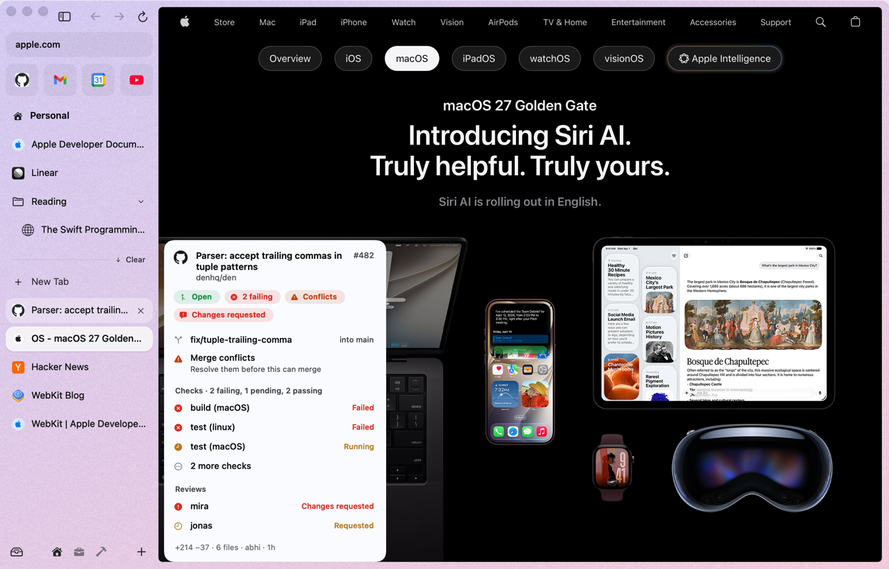

# den

A fast, native macOS browser built on WebKit, where everything is a plugin.

<p>
  <a href="https://github.com/abhishakenp/den/actions/workflows/ci.yml"></a>
  <a href="LICENSE"></a>
  
  
</p>

<p>
  <a href="docs/guide/">User guide</a> ·
  <a href="docs/guide/tips.md">Tips & hidden gems</a> ·
  <a href="ROADMAP.md">Roadmap</a> ·
  <a href="docs/">Design docs</a> ·
  <a href="#contributing">Contributing</a>
</p>

> [!IMPORTANT]
> den is in early development. It browses the web with an Arc-style sidebar, spaces, split view and a command bar, but there are no downloads, import or sync yet. The first pre-release, [0.1.0-alpha.1](https://github.com/abhishakenp/den/releases/tag/v0.1.0-alpha.1), is out; see [Getting started](docs/guide/getting-started.md).

<p align="center"></p>

## What is den?

den is an open-source browser for macOS 26 Tahoe and later, built on the WebKit engine that ships with the system. It takes the interface people love from Arc, the connected workflow from Dia, and the openness of Zen, and puts them in a browser that stays light and starts instantly.

It exists because the browsers with the best interfaces are heavy, closed, or no longer actively developed, and the lightweight ones don't feel good to use.

## Principles

- **Plugin-based.** The core is a small host. Tabs, the sidebar, split view and connections are all plugins.
- **Hot-swappable.** Any plugin can be loaded, unloaded, updated or replaced while the browser runs, without losing your tabs.
- **Lazy by default.** Nothing loads until you need it: plugins, connections, web pages.
- **Minimal footprint.** Idle tabs should cost close to nothing. Memory and energy regressions are treated as bugs.

## Planned features

- Arc-style interface: vertical sidebar tabs, spaces, split view, command bar, link previews
- Connections to Slack, GitHub and more, with a daily briefing that turns them into a todo list, and a personalized feed
- On-device AI via Apple Intelligence, used only for the briefing and feed. No chat, nothing sent to the cloud
- Chrome and Firefox extension support
- Native macOS integration: passkeys, Keychain, Shortcuts, iCloud sync

Much of this already works (below). What's still in progress is in [Coming soon](docs/guide/coming-soon.md).

## Roadmap and status

| # | Step | Status |
|---|------|--------|
| 1 | Research Arc, Dia, Zen, WebKit, extension support, plugin design | ✅ |
| 2 | Feature and architecture design | 🟡 Thin-host migration planned, not started |
| 3 | Plugin host and app skeleton | ✅ |
| 4 | Core browsing: tabs, sidebar, spaces, profiles | 🟡 Tabs, sidebar, spaces, split view, Peek, Settings done; profiles work without a UI; downloads and windows queued |
| 5 | Extensions and content blocking | 🟡 Chrome/Firefox extensions and store installs done; built-in blocker queued |
| 6 | Connections, daily briefing, personalized feed | 🟡 Slack, GitHub, briefing and feed done (verified against local fakes); auto-connect and more connections queued |
| 7 | First public release | 🟡 Pre-release 0.1.0-alpha.1 with OTA updates; not notarized yet |

✅ shipped · 🟡 in progress or partly shipped · ⏳ queued. The full checklist is in [ROADMAP.md](ROADMAP.md). What's being built now is in [Coming soon](docs/guide/coming-soon.md).

## What works today

Each item is covered by `swift test` or a `--scenario` run of the real app. The [user guide](docs/guide/) has the details, and [Tips & hidden gems](docs/guide/tips.md) has everything you won't find by looking.

- **[Sidebar & tabs](docs/guide/sidebar-and-tabs.md):** favorites, pinned tabs that remember their page, nested folders, Today tabs that archive after 24 h, a searchable Library, ⌃Z undo, drag and drop (onto folders, spaces, the page, and a tab onto another for a split), a speaker to mute a tab, idle tabs discarded after 5 min in the background (their process exits; a snapshot on disk makes the restore instant)
- **[Spaces & themes](docs/guide/spaces-and-themes.md):** a theme per space, two-finger swipe, the space menu, footer drag-reorder, a separate profile (logins, cookies) per space
- **[Command bar](docs/guide/command-bar.md):** tabs in every space, the archive, URLs, web search, site keywords, every command, and settings you can flip right from the bar (⌘T / ⌘L)
- **[Peek, split view & Little Arc](docs/guide/peek-split-little-arc.md):** ⇧-click any link to Peek, 2–4 panes by dragging a tab onto the page, an opt-in mini window for links from other apps
- **Mini player:** leave a playing video (another tab, another app, a covered or minimized window) and it follows you in a floating player with den's own controls
- **[Hover previews](docs/guide/hover-previews.md):** rest on a tab for its PR checks and reviews, next meeting, unread mail, or a snapshot
- **[Connections & briefing](docs/guide/connections-and-briefing.md):** Slack and GitHub through your own session in den, a morning briefing with todos, on-device summaries
- **[Extensions](docs/guide/extensions.md):** Chrome Web Store and Firefox Add-ons ("Add to den"), popups, per-site access; uBlock Origin Lite, Dark Reader verified
- **[Privacy & passwords](docs/guide/privacy-and-passwords.md):** dark mode for every website, Google sign-in, a Touch ID password vault in your Keychain
- **[Page tools](docs/guide/page-tools.md):** Reader with read aloud, on-device translation, capture (⇧⌘2), Zap and "Remove Sticky Headers", Copy Link to Highlight, find, per-site zoom, print, save, copy as Markdown, readable error pages
- **[Keyboard shortcuts](docs/guide/shortcuts.md):** Arc's, all in the menu bar, all remappable
- **Settings** (⌘,) with sections contributed by plugins; every default and why is in [docs/defaults.md](docs/defaults.md). Every dialog, bar, card and toast follows the space's colors with legible contrast
- **Plugins:** the features are Embedded Swift plugins (`spaces`, `tabs`, `commandbar`, `peek`, `previews`, `theme`, `quit`, `darkmode`, `passwords`, `extensions`, `pagetools`, `connections`, `slack`, `github`, `briefing`, `updates`) loaded from `den.app/Contents/PlugIns`
- **[`~/.den`](docs/guide/den-home.md):** your plugins (even plain `.swift` files), themes and `config.toml`, applied live
- **[Updates](docs/guide/updates.md)** that hot-swap plugins, and **[performance](docs/guide/performance.md)** measured, not claimed: 20 MB idle, about 210 ms to first window (on a loaded machine)

<p align="center">
  
  
</p>
<p align="center">
  
  
</p>

## Build and run

Requires macOS 26, Xcode 26 (Swift 6.2+), and a Swift toolchain with the Embedded Swift stdlib for the plugins (from swift.org or `swiftly`). SwiftPM fetches the `cordis-swift` package. Step by step: [Getting started](docs/guide/getting-started.md).

```sh
scripts/run.sh --demo        # build build/den.app, then launch it with demo spaces and tabs
scripts/bundle.sh            # only build and sign build/den.app
scripts/make-signing-identity.sh  # once: stable local signing identity (Keychain/TCC survive rebuilds)
swift test                   # host service tests
scripts/snapshots.sh         # regenerate docs/screenshots
scripts/measure-memory.sh main   # memory of den + its WebKit processes
```

Useful flags: `--demo`, `--appearance light|dark`, `--scenario <name>`, `--snapshot out.png`, `--measure-launch`, `--no-den-home`.

```sh
scripts/install.sh           # verified build (bundle + swift test) -> /Applications/den.app -> relaunch with your tabs
scripts/dev-sync.sh          # keep the installed den on the latest code: plugins hot-swap, host changes reinstall
```

Updates: release channels (Sparkle for the app, signed hot-swapped plugins) or, for developers, `scripts/updater.sh install` to follow `main`. See [docs/updates.md](docs/updates.md).

Extend den from `~/.den`: drop in plugins (prebuilt `.dylib` or a folder of `.swift` files den compiles), themes and `config.toml`. Changes apply live. See [docs/den-home.md](docs/den-home.md).

The host API that plugins code against is in [docs/host-api.md](docs/host-api.md).

## Design docs

- [Feature comparison](docs/FEATURES.md): what Arc, Dia and Zen do, and what den is going for
- [Research notes](docs/research/)

## Contributing

den is early, and design feedback is the most useful contribution right now. Open an issue to discuss an idea or challenge a decision.

## License

[MIT](LICENSE)
