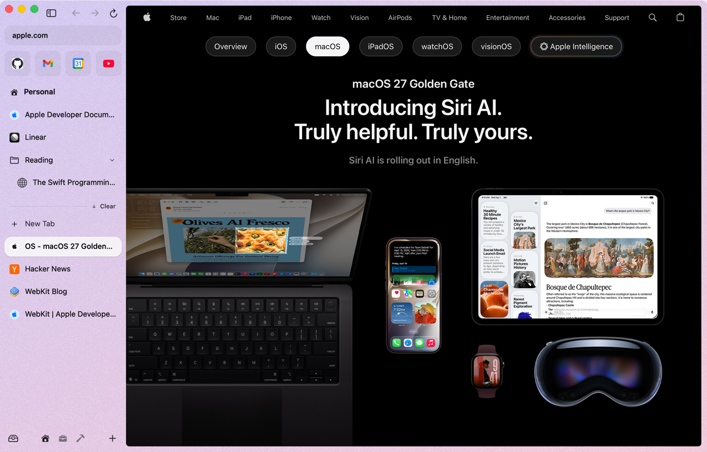
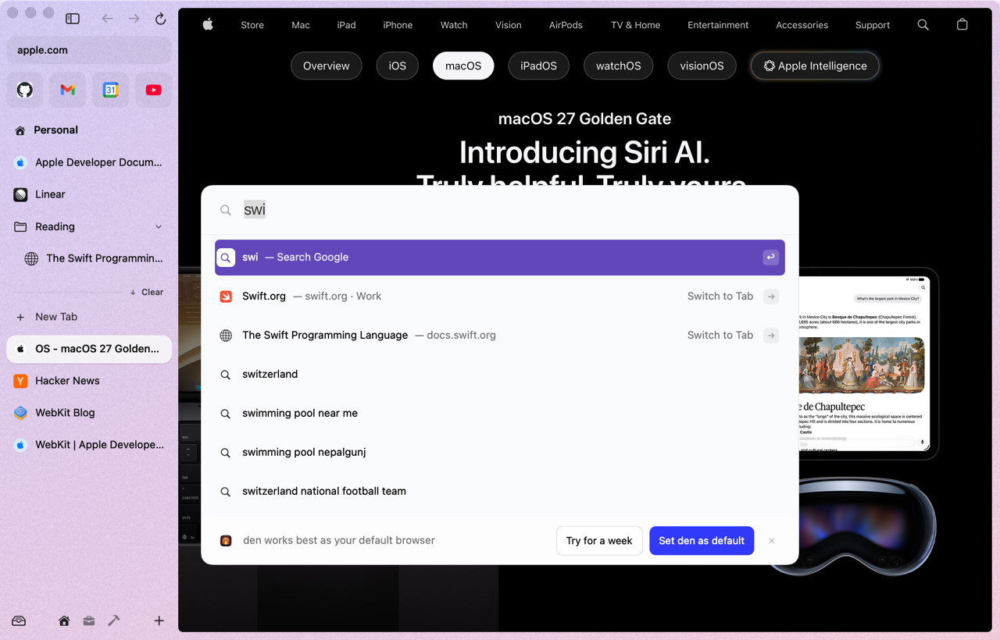
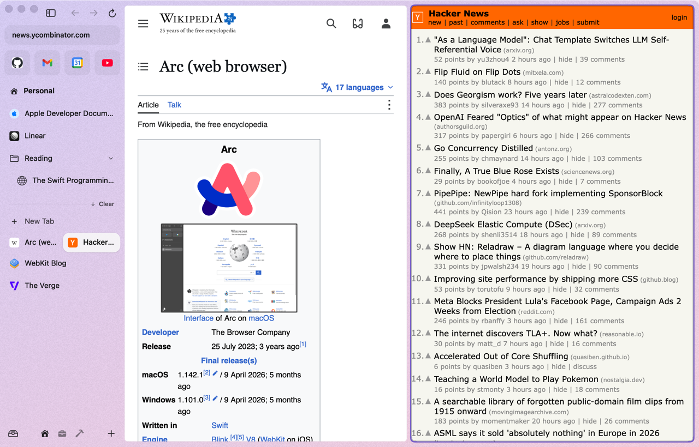
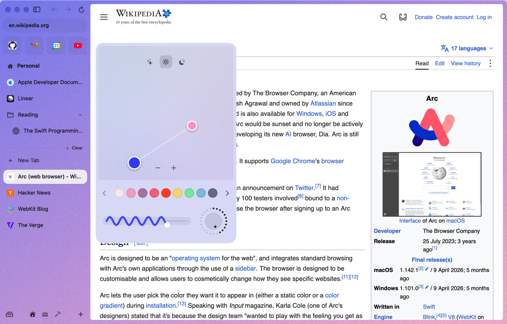
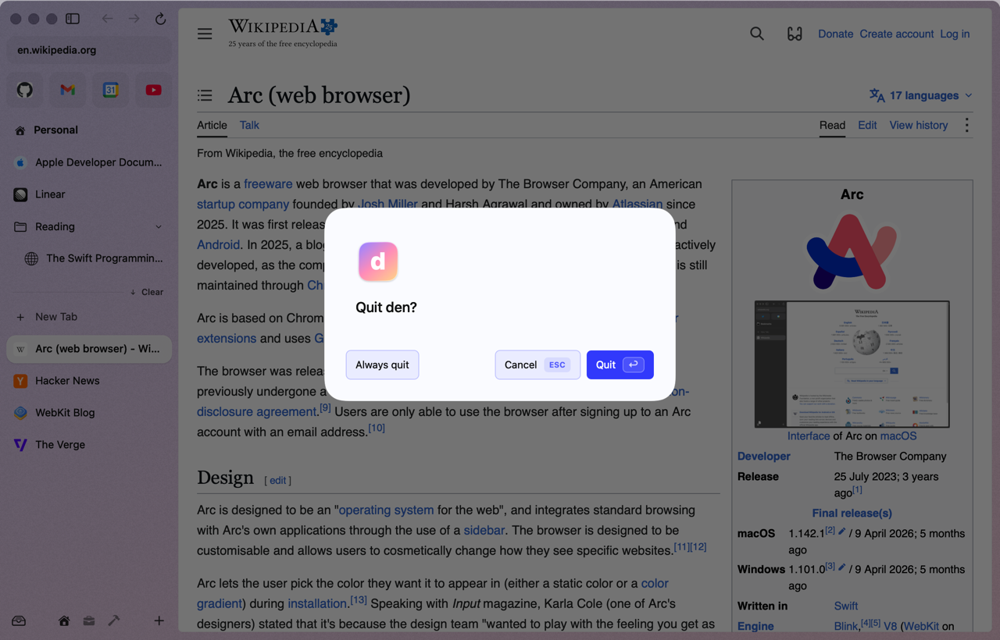

# den

A fast, native macOS browser built on WebKit, where everything is a plugin.

<p>
  <a href="LICENSE"></a>
  
  
</p>

<p>
  <a href="#principles">Principles</a> ·
  <a href="ROADMAP.md">Roadmap</a> ·
  <a href="docs/">Design docs</a> ·
  <a href="#contributing">Contributing</a>
</p>

> [!IMPORTANT]
> den is in early development. It browses the web with an Arc-style sidebar, spaces, split view and a command bar, but there are no profiles, extensions, downloads or sync yet.

<p align="center"></p>

## What is den?

den is an open-source browser for macOS 26 Tahoe and later, built on the WebKit engine that ships with the system. It takes the interface people love from Arc, the connected workflow from Dia, and the openness of Zen, and puts them in a browser that stays light and starts instantly.

It exists because the browsers with the best interfaces are heavy, closed, or no longer actively developed, and the lightweight ones don't feel good to use.

## Principles

- **Plugin-based.** The core is a small host. Tabs, the sidebar, split view and connections are all plugins.
- **Hot-swappable.** Any plugin can be loaded, unloaded, updated or replaced while the browser runs, without losing your tabs.
- **Lazy by default.** Nothing loads until you need it: plugins, connections, web pages.
- **Minimal footprint.** Idle tabs should cost close to nothing. Memory and energy regressions are treated as bugs.

## Planned features

- Arc-style interface: vertical sidebar tabs, spaces, split view, command bar, link previews
- Connections to Slack, GitHub and more, with a daily briefing that turns them into a todo list, and a personalized feed
- On-device AI via Apple Intelligence, used only for the briefing and feed. No chat, nothing sent to the cloud
- Chrome and Firefox extension support
- Native macOS integration: passkeys, Keychain, Shortcuts, iCloud sync

## Roadmap and status

| # | Step | Status |
|---|------|--------|
| 1 | Research Arc, Dia, Zen, WebKit, extension support, plugin design | ✅ |
| 2 | Feature and architecture design | 🟡 In progress |
| 3 | Plugin host and app skeleton | ✅ |
| 4 | Core browsing: tabs, sidebar, spaces, profiles | 🟡 Tabs, sidebar and spaces done; profiles next |
| 5 | Extensions and content blocking | ❌ |
| 6 | Connections, daily briefing, personalized feed | ❌ |
| 7 | First public release | ❌ |

The full checklist is in [ROADMAP.md](ROADMAP.md).

## What works today

Each item is covered by `swift test` or a `--scenario` run of the real app.

- **Sidebar:** favorites, pinned tabs and folders, today tabs; drag to reorder; double-click or right-click to rename in place
- **Spaces:** each with its own theme; switch by swiping or with the footer icons; drop a tab on a space's icon to move it there
- **Tabs:** archive on close, with auto-archive after 12 h, idle tabs suspended after 30 min, Ctrl-Z undo, and an archive searchable from the command bar
- **Split view:** 2–4 panes, created by dragging a tab onto the page; shown as one sidebar row
- **Command bar:** tabs, archive, spaces, actions, URLs and web search (Cmd-T / Cmd-L)
- **Peek** for links from pinned tabs, and **Little Arc** windows for links from other apps (Cmd-O moves one into a space)
- **Theme picker** per space, and the quit dialog
- **Plugins:** all of the above are six Embedded Swift plugins (`spaces`, `tabs`, `commandbar`, `peek`, `theme`, `quit`) loaded from `den.app/Contents/PlugIns`

<p align="center">
  
  
</p>
<p align="center">
  
  
</p>

## Build and run

Requires macOS 26 and Xcode 26 (Swift 6.2+). den depends on the `cordis-swift` package at `../cordis-swift`, so clone both side by side.

```sh
scripts/run.sh --demo        # build build/den.app, then launch it with demo spaces and tabs
scripts/bundle.sh            # only build and sign build/den.app
swift test                   # host service tests
scripts/snapshots.sh         # regenerate docs/screenshots
scripts/measure-memory.sh main   # memory of den + its WebKit processes
```

Useful flags: `--demo`, `--appearance light|dark`, `--scenario <name>`, `--snapshot out.png`, `--measure-launch`, `--no-den-home`.

```sh
scripts/install.sh           # verified build (bundle + swift test) -> /Applications/den.app -> relaunch with your tabs
scripts/dev-sync.sh          # keep the installed den on the latest code: plugins hot-swap, host changes reinstall
```

Updates: release channels (Sparkle for the app, signed hot-swapped plugins) or, for developers, `scripts/updater.sh install` to follow `main`. See [docs/updates.md](docs/updates.md).

Extend den from `~/.den`: drop in plugins (prebuilt `.dylib` or a folder of `.swift` files den compiles), themes and `config.toml`. Changes apply live. See [docs/den-home.md](docs/den-home.md).

The host API that plugins code against is in [docs/host-api.md](docs/host-api.md).

## Design docs

- [Feature comparison](docs/FEATURES.md): what Arc, Dia and Zen do, and what den is going for
- [Research notes](docs/research/)

## Contributing

den is early, and design feedback is the most useful contribution right now. Open an issue to discuss an idea or challenge a decision.

## License

[MIT](LICENSE)
