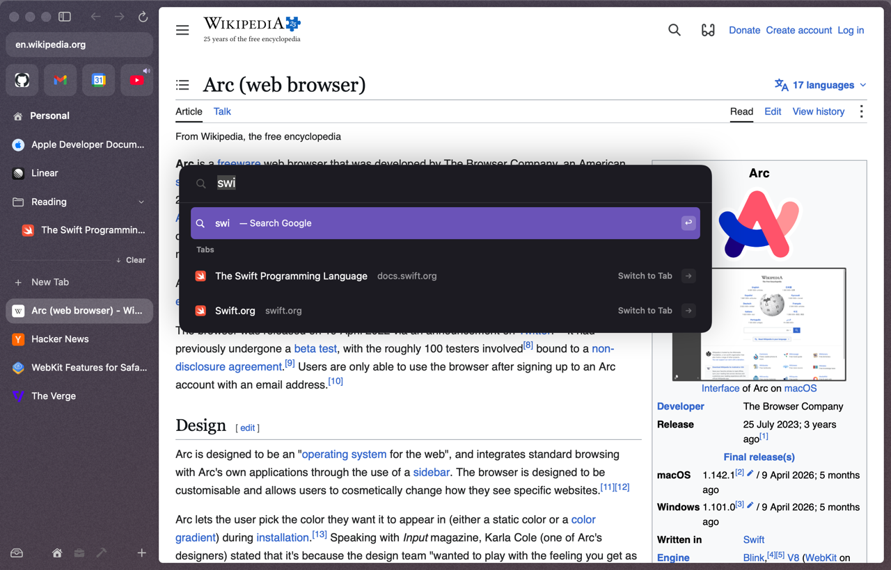
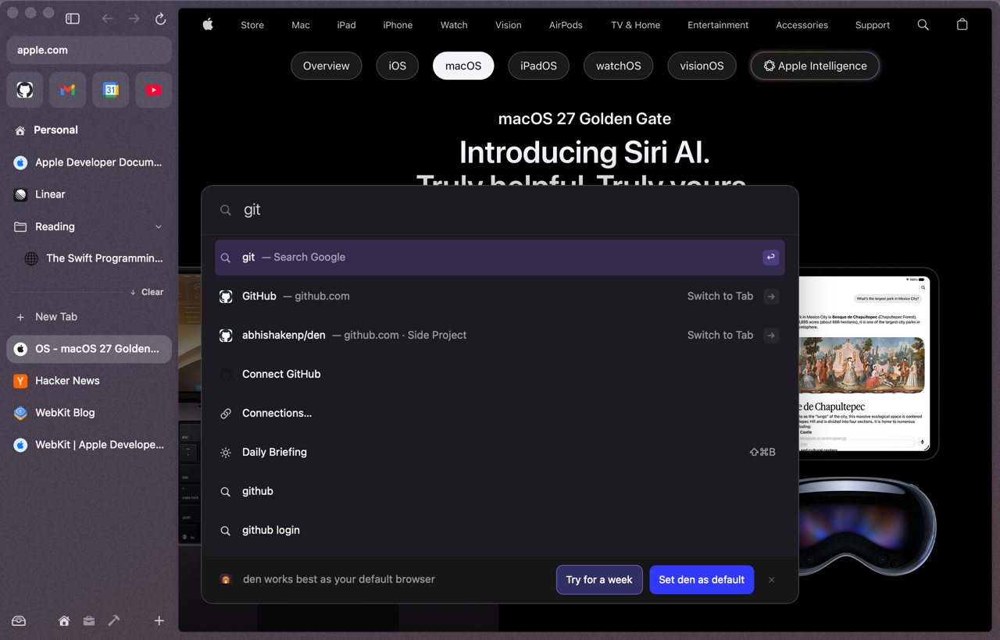
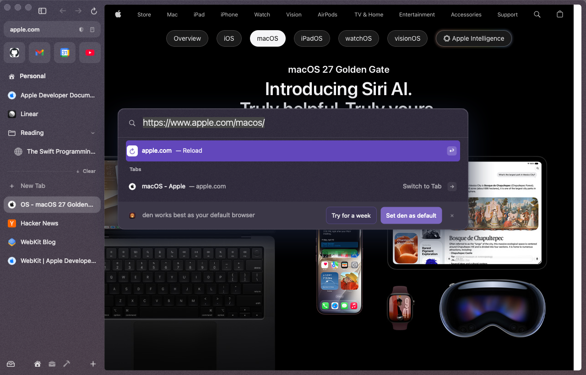
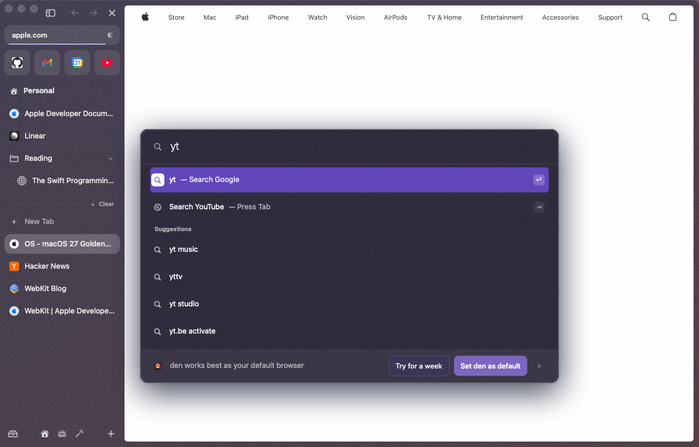
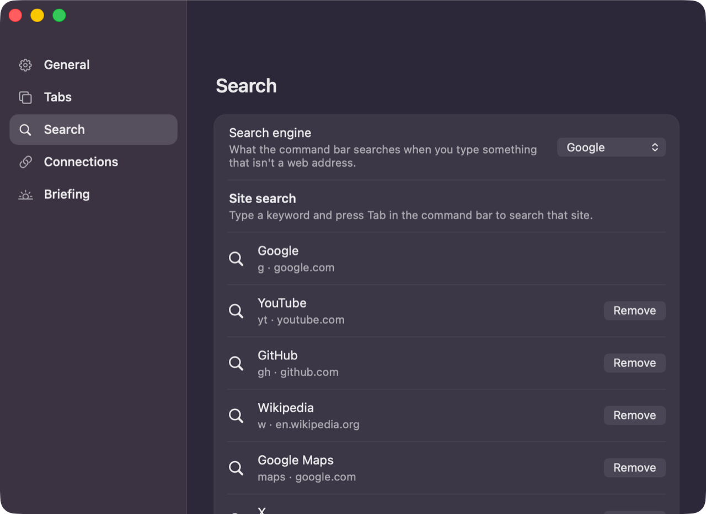
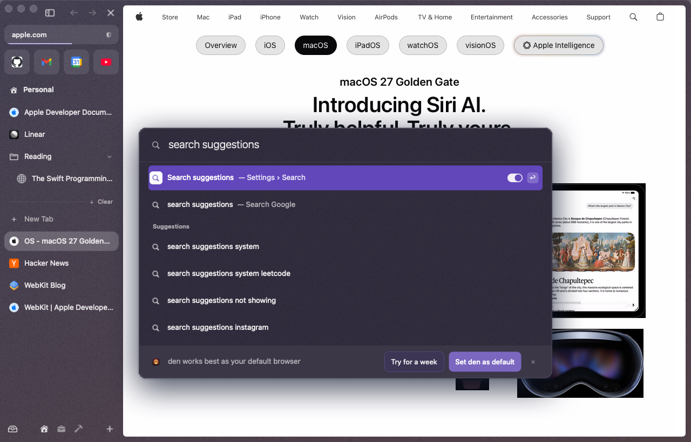
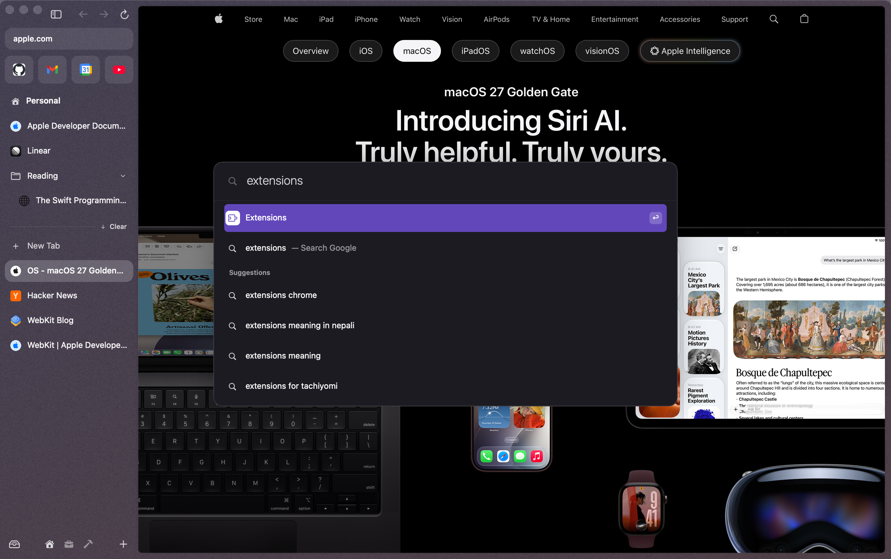

# Command bar & launcher

One box for everything: open a site, search the web, find a tab in any space, dig up something you closed, run a command, or flip a setting.

<p align="center"></p>

## Opening it

| Keys | Opens |
|---|---|
| ⌘T | the bar. What you open goes into a **new tab** |
| ⌘L | the bar with the current URL, selected. What you open **replaces** the current page |

Click the URL pill at the top of the sidebar for the ⌘L bar, or **New Tab** in the sidebar for the ⌘T one. Press the same shortcut again, or Esc, or click outside, to close it.

With nothing typed, ⌘T shows your recent tabs and a few commands.

## Typing

Results come in this order:

1. **Top hit**: a den command or setting whose name starts with what you typed (2+ characters).
2. **Go to URL** (or **Open URL**) if it looks like an address, then **Search Google**.
3. **den**: matching commands, with their shortcut on the right.
4. **Settings**: sections and individual settings.
5. **Tabs**: open tabs in *every* space. Pick one to switch to it, and to its space.
6. **History**: pages you've opened from the bar before, and archived tabs.
7. **Spaces**, and any open Little Arc windows.
8. **Suggestions** from Google.

Results you pick often and recently rank higher.

<p align="center"></p>

### Keys inside the bar

| Key | Does |
|---|---|
| ↑ / ↓ | move |
| Return | open the selected row |
| **⇧Return** | open the URL, search or archived tab in a [Peek](peek-split-little-arc.md) instead |
| **Tab** | on a setting or section: show its options. After a site keyword: search that site. Otherwise: show **actions only** |
| → (at the end of the text) | show the selected setting's options |
| ⌫ (in an empty box) | go back a level |
| Esc | close |

### Editing the address (⌘L)

<p align="center"></p>

Return on the unchanged address reloads. Type a new one and Return goes there, in the same tab.

## Site search keywords

Type a keyword, then **Tab**, then your search:

<p align="center"></p>

| Keyword | Searches |
|---|---|
| `g` | Google |
| `yt` | YouTube |
| `gh` | GitHub |
| `w` | Wikipedia |
| `maps` | Google Maps |
| `x` | X |

Add your own in **Settings ▸ Search ▸ Add a site search**: type the keyword, an optional name, then a URL with `%s` where the query goes, for example `ddg DuckDuckGo https://duckduckgo.com/?q=%s`. Or in `~/.den/config.toml`:

```toml
[search.keywords]
sf = { name = "Swift Forums", url = "https://forums.swift.org/search?q=%s" }
```

<p align="center"></p>

**Settings ▸ Search** also picks the default engine (Google out of the box) and turns off **Search suggestions**. Suggestions always come from Google, and what you type is sent to Google as you type. Turn them off and nothing leaves den until you press Return.

## Commands

Everything in den is a command you can type. The built-in ones:

**New Space**, **Rename Tab**, **Pin Tab** ⌘D, **Duplicate Tab**, **Copy URL** ⇧⌘C, **Copy URL as Markdown**, **Clear Today Tabs** ⇧⌘K, **View Archive**, **Toggle Sidebar** ⌘S, **Edit Theme**, **Reload Page** ⌘R, **Split Right**, **Quit den** ⌘Q, **Settings**, **Extensions**, **Library**, **Keyboard Shortcuts**, **About den**.

Plugins add more:

| Plugin | Commands |
|---|---|
| Theme | **Theme…**, **Use Recent Theme N**, **Theme: \<name\>** for each file in `~/.den/themes` |
| Dark mode | **Dark Mode: Follow den on This Site** / **Always Dark** / **Always Light** / **Off for This Site**, **Dark Mode for Websites: On/Off** |
| Passwords | **Passwords…** |
| Page tools | **Toggle Reader** ⌃⌘R, **Always Use Reader on This Site**, **Read Aloud**, **Translate Page**, **Show Original Page**, **Capture Region** ⇧⌘2 / **Element** / **Visible Area** / **Full Page**, **Copy Captures to Clipboard**, **Save Captures to Folder…**, **Zap Elements**, **Remove Sticky Headers**, **Show Zapped Elements on This Site**, **Copy Link to Highlight**, **Share…**, **QR Code for This Page** |
| Extensions | **Get Extensions**, **Install Extension from File…** |
| Connections | **Connections…**, **Connect GitHub**, **Connect Slack** (or **Disconnect …**) |
| Briefing | **Daily Briefing** ⇧⌘B |
| Quit | **Ask Before Quitting** |
| Updates | **Check for Updates…** |

**Keyboard Shortcuts** lists every shortcut right in the bar. Pick one to run it. Press **Tab** to narrow the results to actions ("Search actions…").

Rename Tab, View Archive, Split Right and Keyboard Shortcuts stay inside the bar and take you to their next step there.

## Settings from the bar

You don't need the Settings window for most things. Type a setting's name:

- A **switch** shows its state. Return flips it, and a toast confirms (e.g. "Search suggestions: Off").
- A **choice** (like the archive time) shows its value. Return, Tab or → lists the options.
- A **section** ("Tabs — Settings") opens its settings inside the bar.

<p align="center"></p>

<p align="center"></p>

## The default-browser banner

Until den is your default browser, a banner sits under the results: **Try for a week** or **Set den as default**. × hides it for good. Settings ▸ Search can bring it back. See [Getting started](getting-started.md#make-den-your-default-browser).
