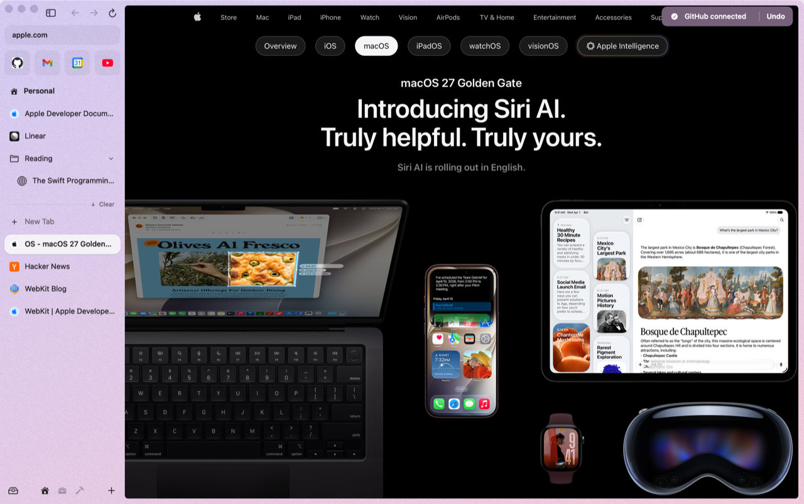
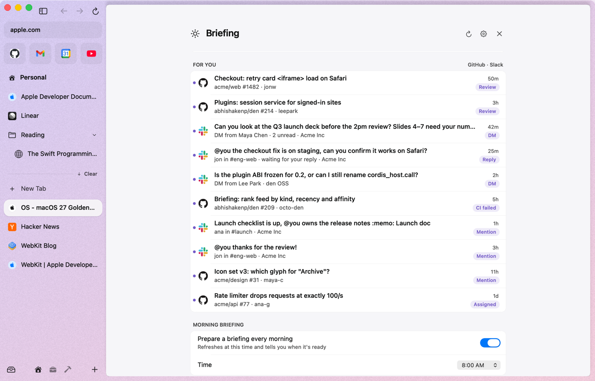

# Connections & daily briefing

Connect Slack and GitHub, and den turns what's waiting for you into a short morning briefing with a todo list. There are no den accounts, no OAuth apps and no den servers: den reads each service through the session you signed in to **inside den**, from your Mac.

> [!NOTE]
> Connections are tested end to end against local fake Slack and GitHub servers. A first sign-in against the real services hasn't been verified yet. If something's off, please [open an issue](https://github.com/abhishakenp/den/issues).

## Connecting

From any of:

- **Settings ▸ Connections**: **Connect** next to Slack or GitHub.
- The command bar: **Connect Slack**, **Connect GitHub**, or **Connections…**.
- The briefing page, while nothing's connected.

What happens:

1. If you're already signed in to that site in den, it connects straight away.
2. If not, den opens the sign-in page in a tab. Sign in as usual.
3. den notices the session and shows **"Slack connected"** (or GitHub). It gives up if you close the tab or after 15 minutes.

Connect uses the current space's [profile](spaces-and-themes.md#profiles-separate-logins-per-space), so a Work space can connect your work accounts.

### Or just sign in

You don't have to press Connect. **Sign in to github.com or Slack in den, now or any time later, and the connection turns itself on**, with a toast: **"GitHub connected · Undo"**. If you'd rather not, press **Undo**: den disconnects and stops doing it for that service until you press Connect yourself.

  
  

A pull request card for a private repository has a **Connect GitHub** button of its own, and fills in as soon as you're signed in ([Hover previews](hover-previews.md#the-github-pr-peek)).

This costs nothing while you browse: den doesn't check on a timer. It notices because signing in changes that site's cookies in den (a cookie-store observer, plus the page load that ends every sign-in), and only then looks at whether you're signed in. It works in your default profile; for another space's profile, use Connect.

If you sign out of the site later, den notices, removes the connection and tells you: "Signed out of GitHub. Connect again to keep it in your briefing". Disconnect any time from Settings or the command bar (**Disconnect Slack**).

### Several Slack workspaces

Every workspace you're signed in to is read. When there's more than one, a sheet lets you choose which show up in your briefing ("Shown in your briefing"). Change it later with **Workspaces…** in Settings ▸ Connections.

## What den reads

| | Reads |
|---|---|
| **Slack** | unread DMs, @mentions from the last two days, and threads where you might owe a reply. About 20 requests per workspace per refresh |
| **GitHub** | review requests, failing CI on your PRs, issues assigned to you, and mentions: 4 searches on github.com |

Each connection plugin can only reach its own site (`slack.com` or `github.com`); den blocks anything it didn't declare.

## The briefing

Open it with **⇧⌘B** or **Daily Briefing** in the command bar.

- **Summary**: a short paragraph, written by Apple's on-device model.
- **Todos**: one per thing that needs you. Click one to jump to the exact message, PR or thread. Check it off; checked todos disappear after a day. They're kept across launches.
- **For you**: a feed of up to 25 items across connections, ranked by kind, then how recent it is, then how often you open things from that person or place.

### When it runs

- Every morning at **8:00**, with a toast: "Your morning briefing is ready ⇧⌘B". If your Mac was asleep or den wasn't running, it catches up at wake or launch.
- While something's connected, it refreshes every 15 minutes and when your Mac wakes. Opening the briefing refreshes it if it's more than 5 minutes old.
- **Nothing is scheduled at all until you connect something.** No timers, no toast, no requests.

Settings ▸ Briefing turns the morning briefing off, sets its time (5:00 AM to 12:00 PM), and changes the shortcut.

### Important channels and repos

Mark the Slack channels and GitHub repos that matter most, and they come first:

- Their items rank **above everything else** in **For you**, whatever their kind or age.
- They're **never left out**: not cut from the 25-item feed, always in the summary's input and in the todo list's candidates.

Where to set them:

- **Settings ▸ Briefing ▸ Important channels and repos**: the ones you marked (**Remove**), then channels and repos from your current feed (**Mark Important**).
- The command bar: **Mark #design as Important**, **Unmark denhq/den as Important**, for channels and repos in your feed (the 30 most recent), and **Important Channels and Repos…**, which opens that Settings section.

With several Slack workspaces, channels carry the workspace name ("#general · Acme"), and a channel is marked in its own workspace only. DMs aren't channels; they already rank near the top.

## Privacy

- **Nothing leaves your Mac except requests to the service itself.** den fetches your Slack and GitHub data the same way the site does in a tab, with your cookies.
- Session tokens are read when needed and kept in memory only. den never writes cookies back, and caches nothing to disk.
- **Summaries run on your Mac**, with Apple's Foundation Models. There's no chat, no cloud model, and the model can't click, send or open anything: it only writes text and todos.
- **Without Apple Intelligence** (older Mac, or turned off), you get a plain summary like "2 review requests and 3 unread DMs.", every actionable item becomes a todo, and the page tells you why there's no written summary.
