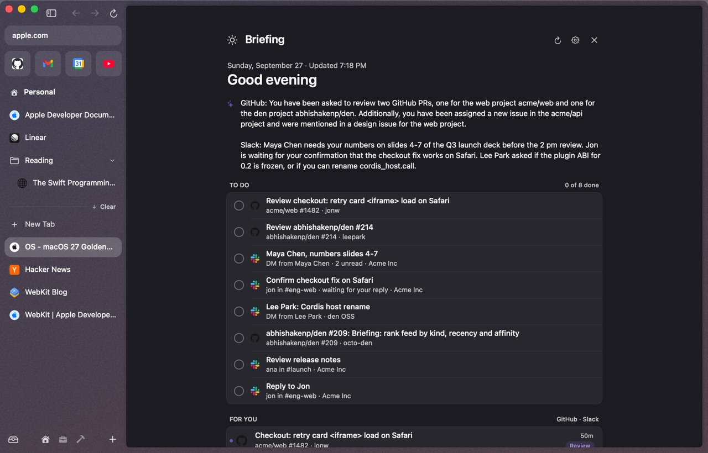
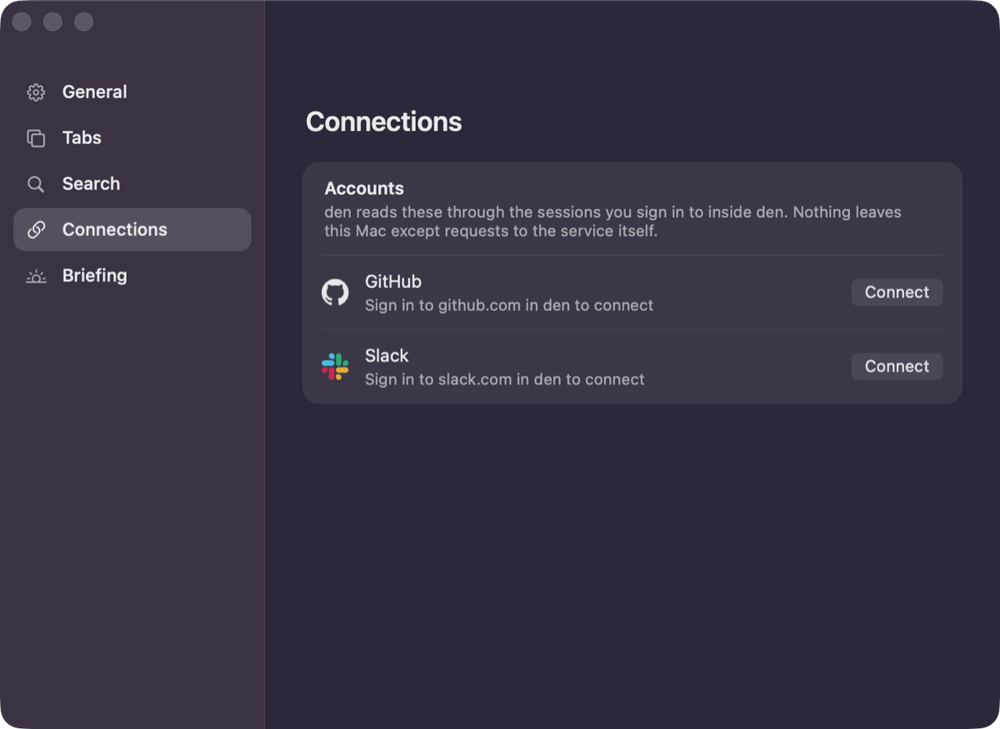
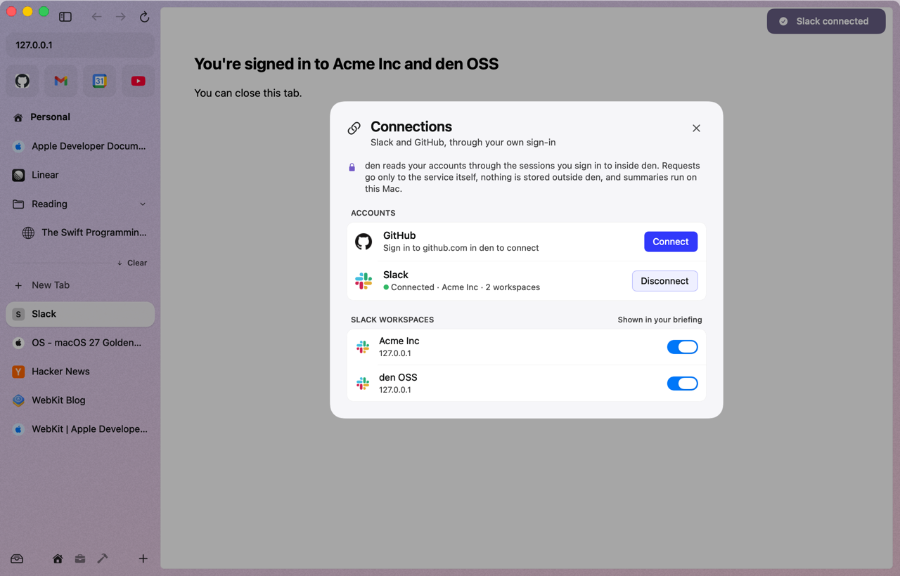
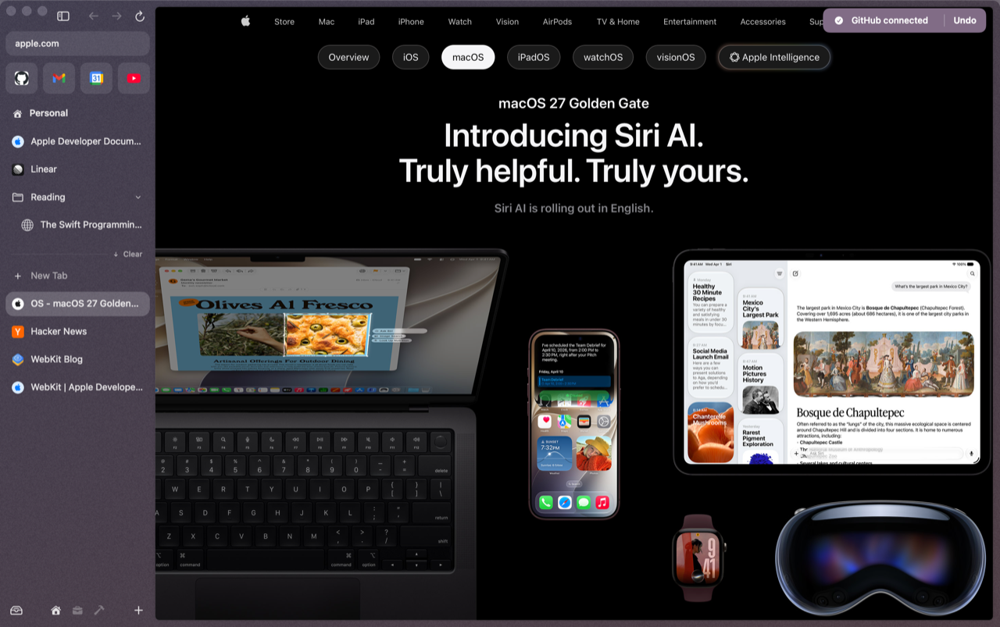
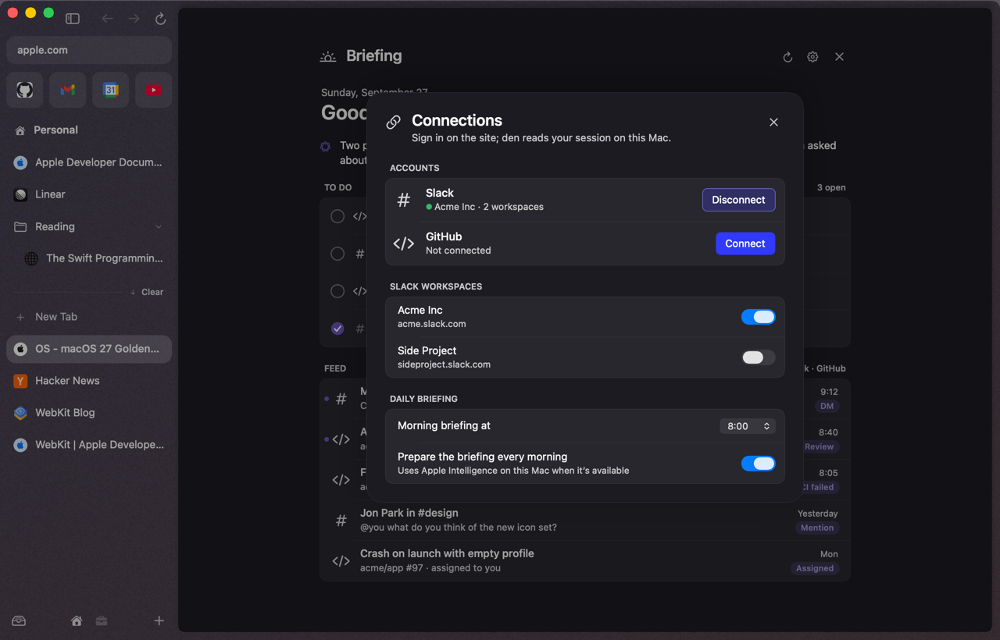
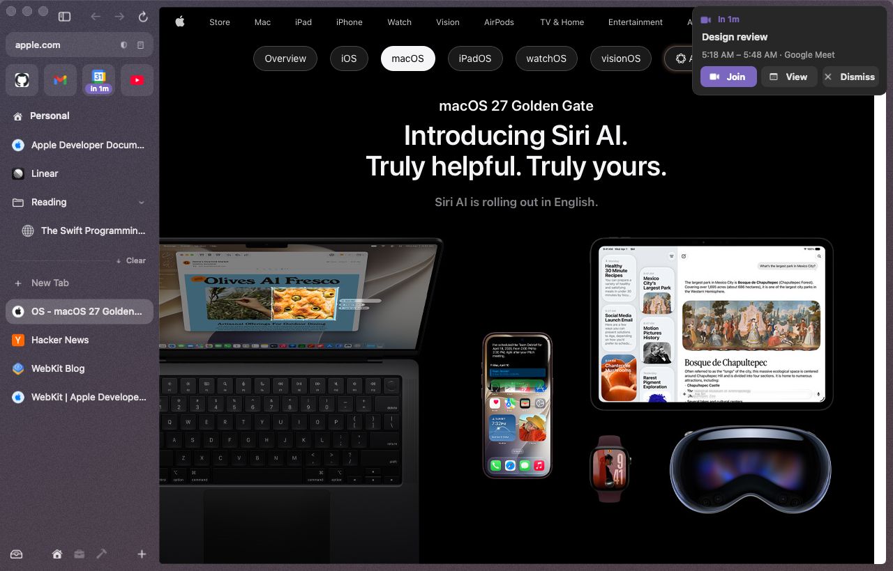
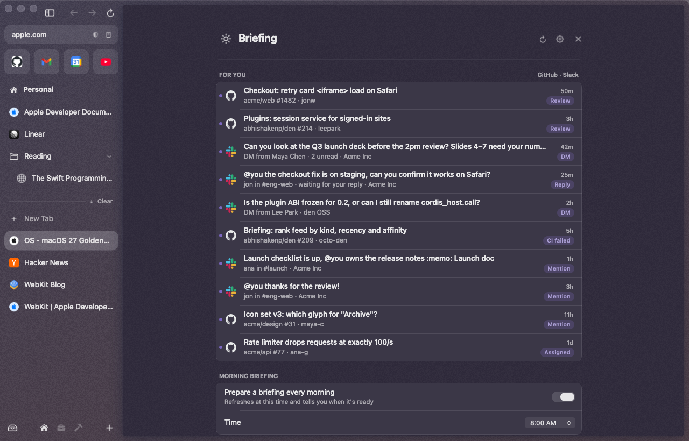
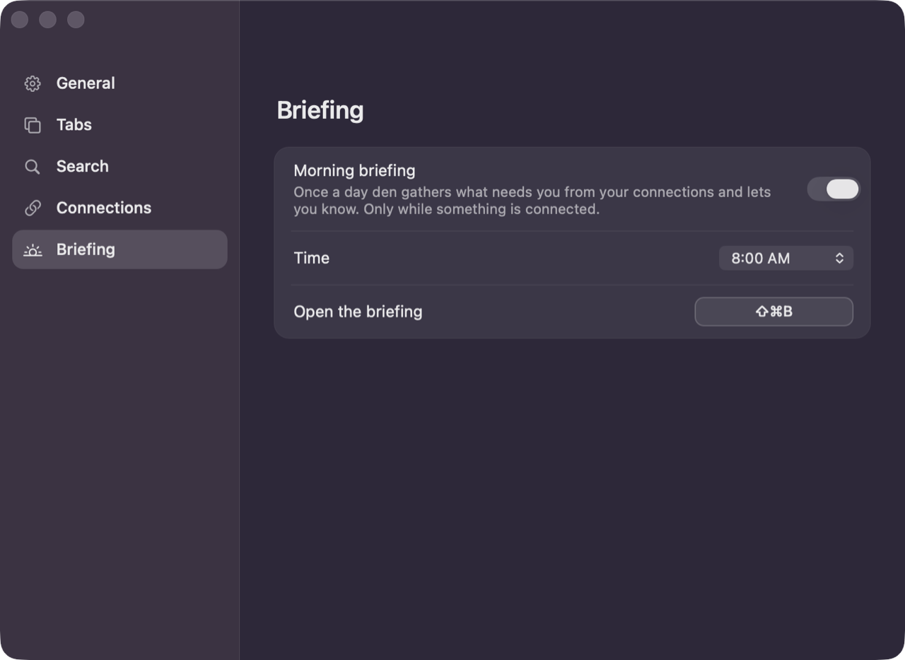
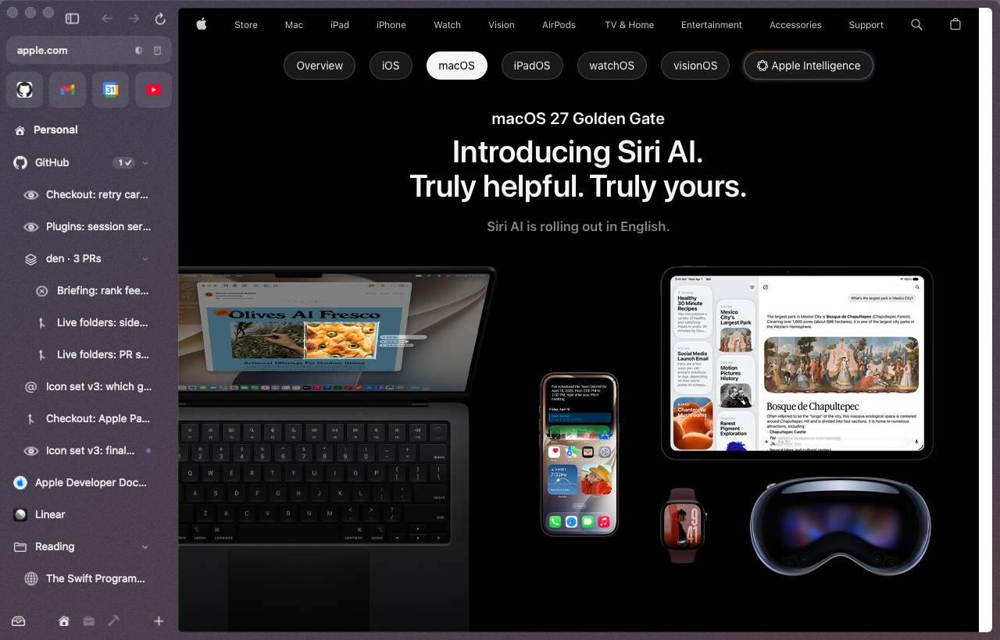

# Connections & daily briefing

Connect Slack, GitHub, Gmail, Google Calendar and Notion, and den turns what's waiting for you into a short morning briefing with a todo list, reminds you before meetings, and keeps a live folder of your pull requests. There are no den accounts, no OAuth apps and no den servers: den reads each service through the session you signed in to **inside den**, from your Mac. Each connection is its own plugin and costs nothing until it's connected.

> [!NOTE]
> Connections are tested end to end against local fake Slack, GitHub, Gmail, Google Calendar and Notion servers. A first sign-in against the real services hasn't been verified yet. If something's off, please [open an issue](https://github.com/abhishakenp/den/issues).

## Connecting

From any of:

- **Settings ▸ Connections**: **Connect** next to any of them.
- The command bar: **Connect Slack**, **Connect Gmail**, … or **Connections…**.
- The briefing page, while nothing's connected.

What happens:

1. If you're already signed in to that site in den, it connects straight away.
2. If not, den opens the sign-in page in a tab. Sign in as usual.
3. den notices the session and shows **"Slack connected"** (or Gmail, …). It gives up if you close the tab or after 15 minutes.

Connect uses the current space's [profile](spaces-and-themes.md#profiles-separate-logins-per-space), so a Work space can connect your work accounts.

### Or just sign in

You don't have to press Connect. **Sign in to github.com, Slack, Google or Notion in den, now or any time later, and the connection turns itself on**, with a toast: **"GitHub connected · Undo"**. One Google sign-in connects Gmail and Google Calendar together (**"Gmail and Google Calendar connected · Undo"**; Undo undoes both). If you'd rather not, press **Undo**: den disconnects and stops doing it for that service until you press Connect yourself.

  

A pull request card for a private repository has a **Connect GitHub** button of its own, and fills in as soon as you're signed in ([Hover previews](hover-previews.md#the-github-pr-peek)).

This costs nothing while you browse: den doesn't check on a timer. It notices because signing in changes that site's cookies in den (a cookie-store observer, plus the page load that ends every sign-in), and only then looks at whether you're signed in. It works in your default profile; for another space's profile, use Connect.

If you sign out of the site later, den notices, removes the connection and tells you: "Signed out of GitHub. Connect again to keep it in your briefing". Disconnect any time from Settings or the command bar (**Disconnect Slack**); den then leaves it off, even while you stay signed in, until you press Connect.

### Several workspaces or accounts

Every Slack and Notion workspace and every Google account you're signed in to is read. When there's more than one, a sheet lets you choose which show up in your briefing ("Shown in your briefing"). Change it later with **Workspaces…** or **Accounts…** in Settings ▸ Connections, which also has **Important…** (the channels, repos, people and pages that come first) and **Disconnect**.

## What den reads

| | Reads |
|---|---|
| **Slack** | unread DMs, @mentions from the last two days, and threads where you might owe a reply. About 20 requests per workspace per refresh |
| **GitHub** | review requests, failing CI on your PRs, issues assigned to you, mentions, and your open PRs (for the [live folder](#live-folders)): 5 searches on github.com |
| **Gmail** | unread mail in your inbox, from Gmail's own feed: one request per account per refresh. Mail from a person shows as **waiting for your reply** (den can't see replies, so it's a good guess, not a fact); Google Docs comments, mentions and shares show as Docs; receipts, newsletters and other automated mail are listed but never become todos |
| **Google Calendar** | today's events, read from the Calendar page you have open in den: no requests at all. Or, if you'd rather not keep Calendar open, from its secret address (below) |
| **Notion** | unread mentions, comments and pages shared with you: one request per workspace per refresh, through the same internal API Notion's app uses |

Each connection plugin can only reach its own site (`slack.com`, `github.com`, `google.com`, `notion.so`); den blocks anything it didn't declare.

Gmail's feed is documented by Google for Google Workspace accounts; whether a personal @gmail.com account gets it hasn't been checked. Notion's terms forbid automated access to its service, which is what this connection does: [the research](../research/integrations-auth.md#11-session-reuse-for-gmail-google-calendar-and-notion-2026-09-28) spells out the risks.

### Google Calendar

Keep Google Calendar as a favorite or pinned tab and den reads today's events whenever that page loads. They stay for the rest of the day even if the tab unloads. Without a Calendar tab, the briefing says so ("open Google Calendar in a tab once today to include your events").

If you'd rather not keep Calendar open: in Google Calendar, **Settings ▸ your calendar ▸ Integrate calendar ▸ Secret address in iCal format**, copy it, and paste it in **Settings ▸ Connections ▸ Google Calendar ▸ Calendar address**. den fetches it once per refresh. Treat it like a password: anyone with it can see your calendar, and Google's **Reset** makes a new one. Some work accounts hide it.

**Meeting reminders.** Two minutes before a meeting a card appears in the window's top-right corner with its time and a **Join** button (Google Meet, Zoom or Teams links), **View** and **Dismiss**. Change the lead time or turn it off in Settings ▸ Connections ▸ Google Calendar.

**Countdown.** In the hour before a meeting, the Calendar favorite shows **in 8m**, then **now** while it runs.

## The briefing

Open it with **⇧⌘B** or **Daily Briefing** in the command bar.

- **Summary**: a short paragraph, written by Apple's on-device model.
- **Today**: the rest of today's calendar, all-day events first.
- **Todos**: one per thing that needs you. Click one to jump to the exact message, PR or thread. Check it off; checked todos disappear after a day. They're kept across launches.
- **For you**: a feed of up to 25 items across connections, ranked by kind, then how recent it is, then how often you open things from that person or place.

### When it runs

- Every morning at **8:00**, with a toast: "Your morning briefing is ready ⇧⌘B". If your Mac was asleep or den wasn't running, it catches up at wake or launch.
- While something's connected, it refreshes every 15 minutes and when your Mac wakes. Opening the briefing refreshes it if it's more than 5 minutes old.
- **Nothing is scheduled at all until you connect something.** No timers, no toast, no requests.

Settings ▸ Briefing turns the morning briefing off, sets its time (5:00 AM to 12:00 PM), and changes the shortcut.

### Important channels, repos and people

Mark the Slack channels, GitHub repos, Gmail senders and Notion pages that matter most, and they come first:

- Their items rank **above everything else** in **For you**, whatever their kind or age.
- They're **never left out**: not cut from the 25-item feed, always in the summary's input and in the todo list's candidates.

Where to set them:

- **Settings ▸ Briefing ▸ Important channels, repos and people**: the ones you marked (**Remove**), then channels, repos, senders and pages from your current feed (**Mark Important**). **Important…** next to a connection in Settings ▸ Connections opens it.
- The command bar: **Mark #design as Important**, **Unmark denhq/den as Important**, for channels and repos in your feed (the 30 most recent), and **Important Channels and Repos…**, which opens that Settings section.

With several Slack workspaces, channels carry the workspace name ("#general · Acme"), and a channel is marked in its own workspace only. DMs aren't channels; they already rank near the top.

## Live folders

A live folder is a pinned folder that fills itself: **New GitHub Live Folder** in the command bar (while GitHub is connected) puts one at the top of your pinned tabs, with your review requests, your open pull requests, failing CI, assigned issues and mentions. Click a row to open it (or go to the tab that already has it); hover it for the pull request peek.

- **New things get a dot.** A collapsed folder shows a dot on its icon while anything inside is new.
- **Done things clear themselves.** When a review is given, a PR merges or an issue closes, its row leaves the folder and counts into the **N ✓** chip on the folder's header. Click the chip for **Recently Closed**, where you can reopen any of them (kept for a week). The × on a row marks it done by hand.
- **Stacked pull requests** (a PR whose base branch is another open PR's branch) are grouped under one row, "den · 3 PRs", bottom PR first. Collapse it and it stays collapsed.
- **Signed out of GitHub**, the folder says so with a row that signs you back in.
- It refreshes with the briefing, every 15 minutes while GitHub is connected; **Refresh** in the folder's menu asks now. Delete it like any folder.

## Privacy

- **Nothing leaves your Mac except requests to the service itself.** den fetches your data the same way the site does in a tab, with your cookies. Google Calendar isn't even fetched: den reads the page you have open.
- Session tokens are read when needed and kept in memory only. den never writes cookies back, and caches nothing to disk. The one thing it stores is what you give it: a calendar address, if you paste one, stays in den's settings on this Mac.
- **Summaries run on your Mac**, with Apple's Foundation Models. There's no chat, no cloud model, and the model can't click, send or open anything: it only writes text and todos.
- **Without Apple Intelligence** (older Mac, or turned off), you get a plain summary like "2 review requests and 3 unread DMs.", every actionable item becomes a todo, and the page tells you why there's no written summary.
