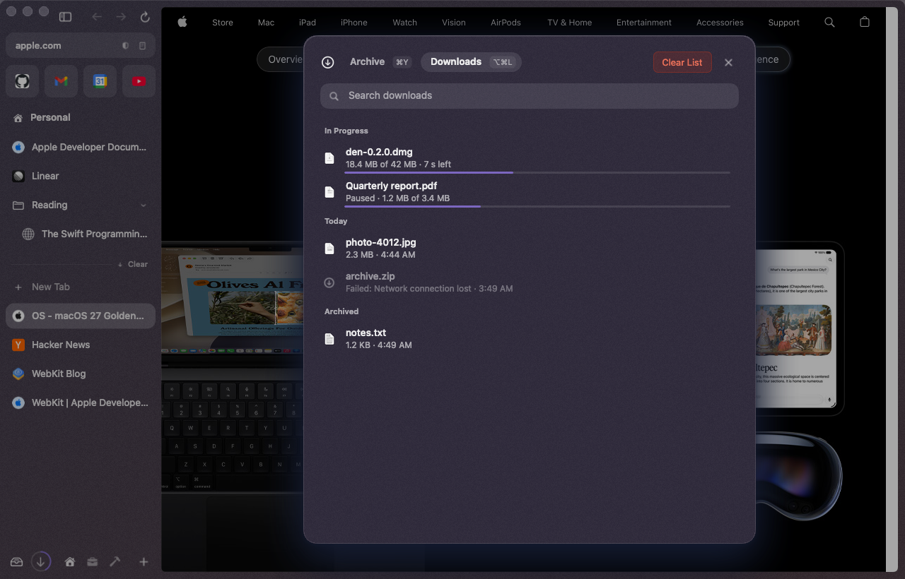
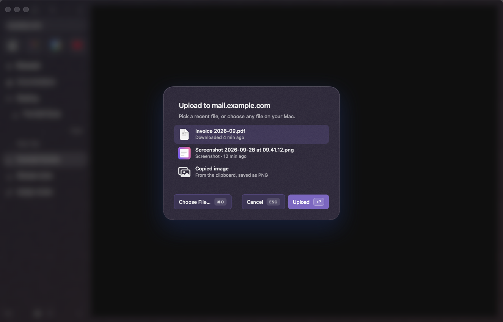

# Downloads & uploads

## Downloads

When a link leads to a file den can't show (a zip, a disk image, an installer), or the site says it's a download, den saves it in your **Downloads** folder and the page stays where it was. If a file with that name is already there, the new one is called "name 2", like Finder does. "Save Link As…" and "Save Image As…" in a page's right-click menu ask where to save first, and show up in the same list.

- **While it downloads**, a download arrow with a progress ring appears next to the Library button at the bottom left of the sidebar. A toast says "Downloading “file”"; its **Show** button opens the list.
- **When it's done**, the toast says "Downloaded “file”" with **Show in Finder**, and the arrow gets a dot until you look at your downloads. With nothing running and nothing new, the arrow isn't there.
- **Library ▸ Downloads** (⌥⌘L, the arrow, or "Downloads" in the command bar) lists everything, newest first:
  - **In Progress**: size so far, the total and the time left, with **Pause** and **Cancel** when you point at the row. A paused download keeps what already arrived and carries on with **Resume**, even after you quit den (if the site allows it).
  - Finished files: click to open one; point at it for **Show in Finder** and **Remove from List**. Drag a row out to use the file anywhere: Finder, Mail, a page's upload field.
  - A download that failed or was cancelled has **Try Again**; a file you moved or deleted has **Download Again**.
  - **Archived**: finished downloads older than a day. Change that, or turn it off, in Settings ▸ Tabs ▸ Downloads ▸ "Archive finished downloads".
- **Clear List** removes everything that isn't downloading. The files stay in their folder.
- Press ⌘Y to switch to the Archive of closed tabs, ⌥⌘L again to close.

Downloaded files are marked as coming from the internet, like Safari's, so macOS checks an app the first time you open it.

## Uploads

When a page asks for a file (an "Upload" or "Attach" button), den first shows the files you most likely want:

- your last few **downloads** (from the past week),
- your newest **screenshots** (from where macOS saves them),
- what's on the **clipboard**: a copied file, or a copied image, uploaded as a PNG.

Click one to upload it. If the page takes several files, click each one you want, then **Upload**. **Choose File…** (⌘O) opens the usual file panel, and Esc cancels. Only files the page accepts are offered (just images for a photo upload, for example). If there's nothing to offer, or the page wants a folder, the usual panel opens straight away.

den looks at your downloads, screenshots and clipboard only at that moment, and reads the clipboard only if you pick it.
