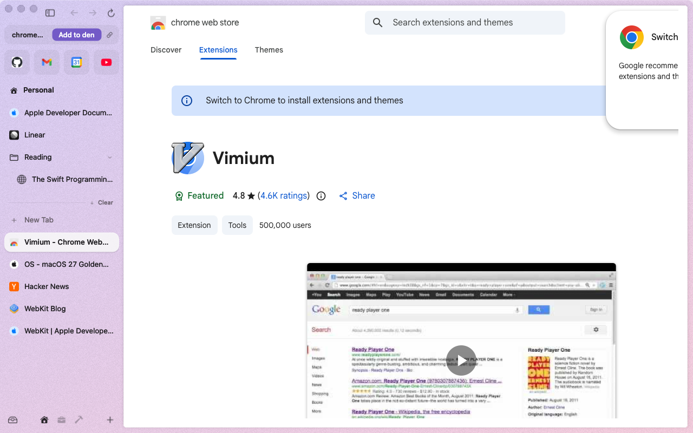
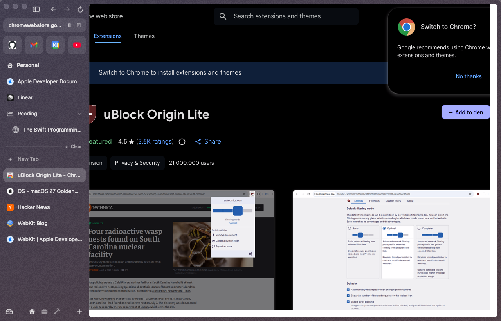
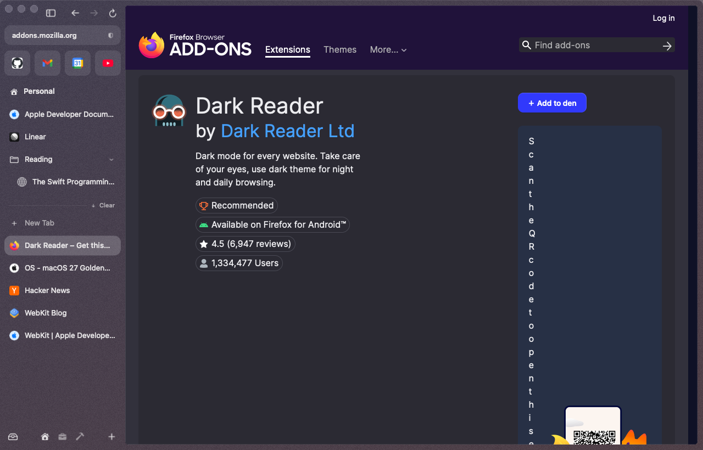
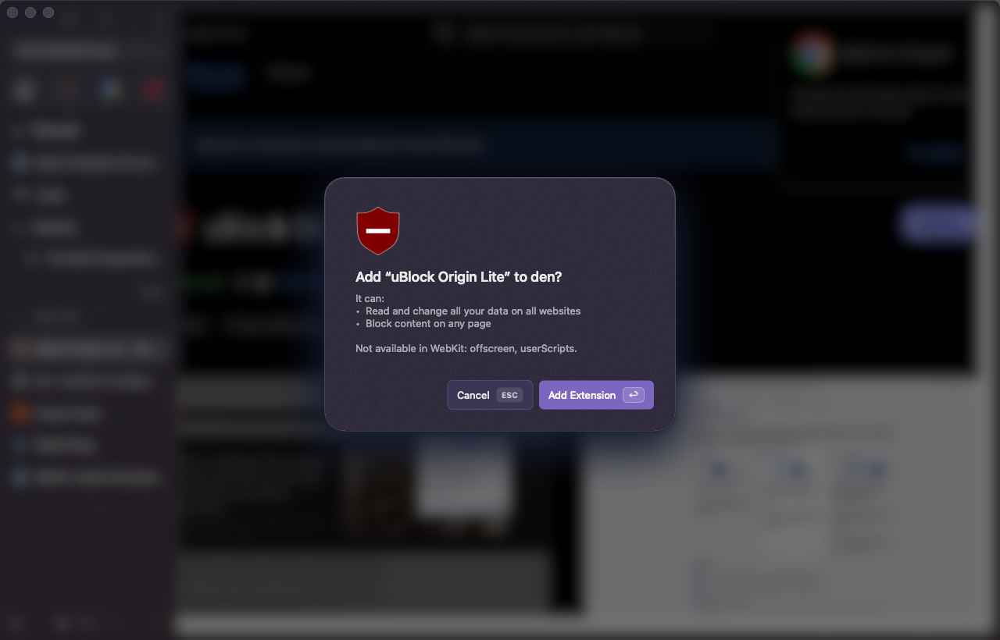
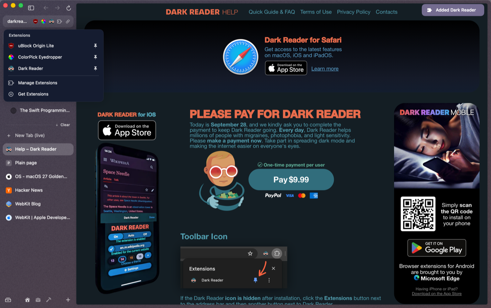
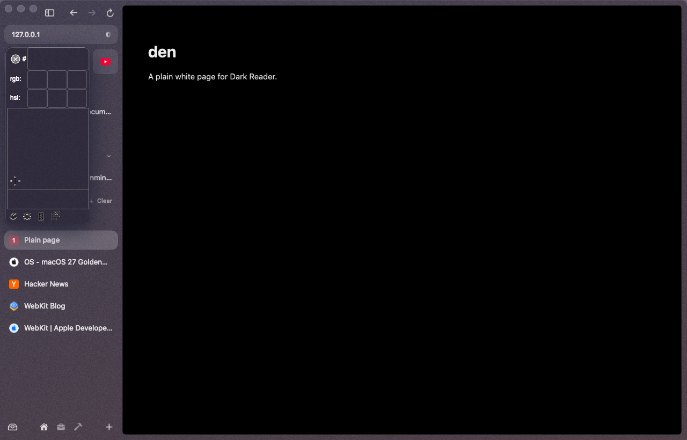
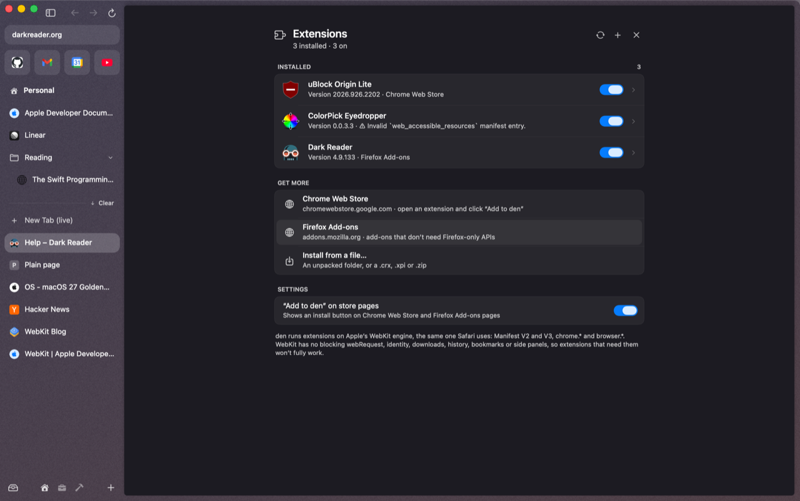

# Extensions

den runs Chrome and Firefox extensions on WebKit, through Apple's `WKWebExtension`. Manifest v2 and v3, `chrome.*` and `browser.*`. We've verified uBlock Origin Lite (it blocks ads), ColorPick Eyedropper and Dark Reader.

## Installing

**From the store.** Open an extension's page on the [Chrome Web Store](https://chromewebstore.google.com) or [Firefox Add-ons](https://addons.mozilla.org). The URL pill at the top of the sidebar shows **Add to den**. Click it. It works whatever the store's page says: the Chrome Web Store tells Safari-engine browsers to "Switch to Chrome" and greys out its own button, but den reads the extension from the page address and never needs the store's button.

den also swaps the store's own install button for **＋ Add to den** on the page itself, when the page shows one.

  
  

den shows what the extension can do, and what WebKit can't give it, before you confirm with **Add Extension**:

If an installed extension later asks for more access, den asks again ("wants more access" ▸ **Allow**).

**When something goes wrong.** den never fails quietly. If an install can't finish, or an extension installs but part of it won't start, a notice says so in plain words ("Vimium couldn't be installed: …"). **Details** shows the technical reason. den also writes it to `~/.den/logs/extensions.log`. An extension's page in **Extensions** lists its errors, and notes any features den can't give it ("Some features unavailable in den: bookmarks, history").

**From a file.** **Install Extension from File…** in the command bar takes an unpacked folder, or a `.crx`, `.xpi` or `.zip`.

**For development.** Put an unpacked extension folder (with its `manifest.json`) in `~/.den/extensions`. It loads with the permissions it asks for, no prompt. den reads that folder at launch. To reload after editing, turn the extension off and on.

## Using them

Hover the URL pill at the top of the sidebar: pinned extensions show there, with their badges, next to a puzzle-piece button for the rest. Click an icon for its popup; click outside or press Esc to close it.

  
  

## The Extensions page

Type **Extensions** in the command bar, or choose **Manage Extensions** from the puzzle menu.

For each extension:

- **Site access**: On all sites, When you click it, or On specific sites
- its permissions
- **Pin to the URL bar**
- on/off, **Options**, **View in Store**, **Remove**

Remove never deletes a folder of yours in `~/.den/extensions`; delete the folder to uninstall it.

The page links to both stores, and its Settings section can turn off the **Add to den** button on store pages. **Get Extensions** in the command bar opens the Chrome Web Store.

## Updates

den checks store-installed extensions once a day (only if you have some). An update that asks for no new permissions installs quietly; one that wants more waits on its details page as **Update to \<version\>**. The update button at the top of the page checks now.

## What works on WebKit, and what doesn't

WebKit's extension support is good but not Chrome's. These don't exist on WebKit:

- **blocking `webRequest`**: so full **uBlock Origin can't work**. Use **uBlock Origin Lite**, which does.
- `identity`, `downloads`, `history`, `bookmarks`, side panels.

And these aren't wired into den yet:

- an extension's own keyboard shortcuts (`commands`)
- an extension's items in right-click menus

Extensions that talk to a desktop app through native messaging (for example a password manager's desktop integration) need a bridge den doesn't have yet. See [Coming soon](coming-soon.md).
