# Hover previews

**Rest the pointer on a tab in the sidebar** and a small card opens beside it: the page's title and site, a compact snapshot, and buttons for what you'd otherwise right-click for. A pull request tab shows its checks, diff size and conflicts. **Hold ⇧ over any link on a web page** and you get a card for where it goes.

<p align="center">
  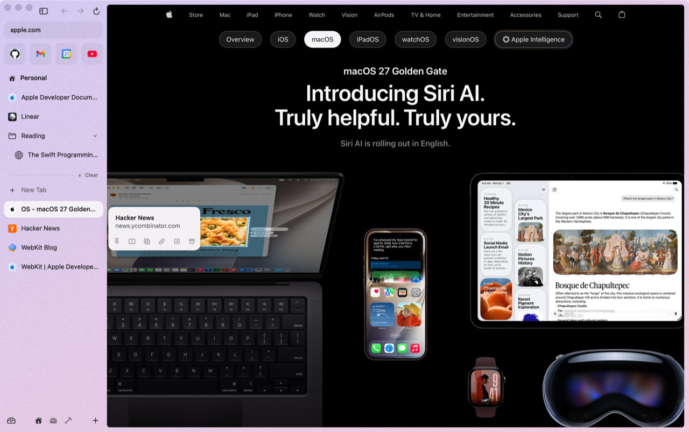
  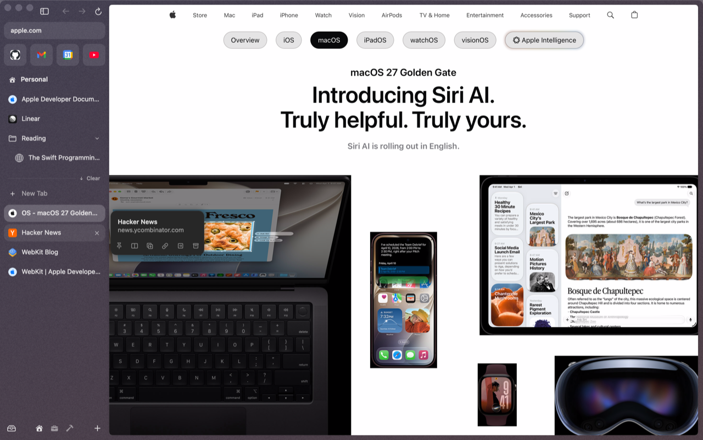
</p>

## How it behaves

- A card opens after **0.7 s** on a tab row and **0.3 s** on a favorite tile, so sweeping across the sidebar shows nothing. These are Dia's timings, measured.
- Once a card is up, moving to another tab swaps it **at once**, in a single frame. To make it wait again for each tab, like Dia, turn on **Settings ▸ Previews ▸ Wait before switching tab cards**.
- The card fades and grows in from its top-left corner, and it waits **0.2 s** before closing, so you can move the pointer onto it and use its buttons.
- Clicking a tab hides its card until you move off it.
- It works on tab rows, favorites, folders and splits. A split's card lists both of its tabs.
- It follows the space's theme, light or dark, and Reduce Motion.

Nothing is fetched, timed or captured until you actually hover.

## Buttons on the card

The card's buttons do what the right-click menu does, on the tab you're pointing at. Rest on a button and its tooltip names it along with its shortcut. **While a card is open, those shortcuts act on that card's tab**, not the selected one: point at a tab and press ⌘D to pin it, or ⇧⌘C to copy its link.

| Button | Shortcut | Shown |
|---|---|---|
| Pin / Unpin | ⌘D | Today tabs / pinned tabs |
| Back to Pinned URL | – | pinned tabs and favorites (dimmed while they're still at their pinned page) |
| Open as Split | ⌃⇧= | splits this tab with the one you're on; on the tab you're on it adds a split |
| Duplicate | – | always |
| Copy Link | ⇧⌘C | always |
| Mute / Unmute | – | when the tab is playing sound, or is muted |
| Move to Space ▸ | – | when you have another space |
| Archive / Close | ⌘W | Today tabs archive; pinned tabs and favorites close (they stay in the sidebar) |

The card is 170 to 200 pt wide like Dia's, and a little wider when it has more than five buttons.

<p align="center">
  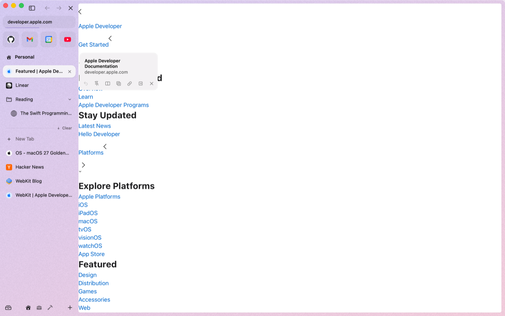
  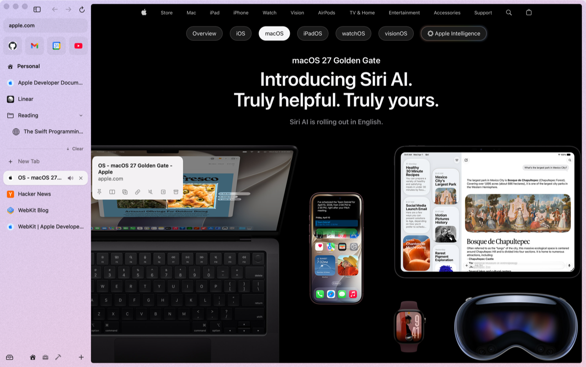
  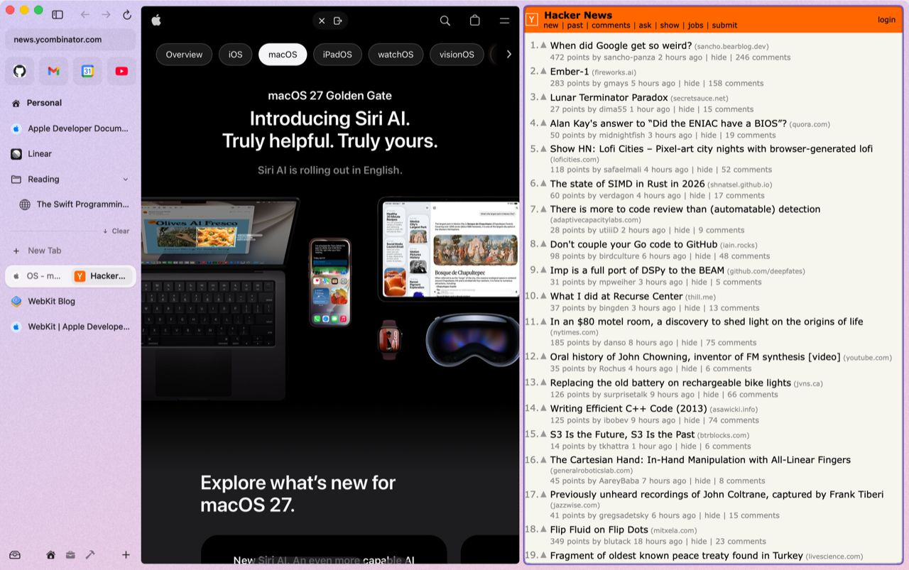
</p>

## The GitHub PR peek

Hover a pull request tab to see it without opening it:

- the title, the author's picture and name, and the PR number
- **+additions −deletions · files changed**
- a bar of its checks: green passed, yellow running, red failed, grey not started
- one line of status (all checks passed, still running, queued), or **up to three failing checks** you can click to open
- **Show N failures** and **Show comments**, or **Resolve conflicts** when the branch conflicts with its base

<p align="center">
  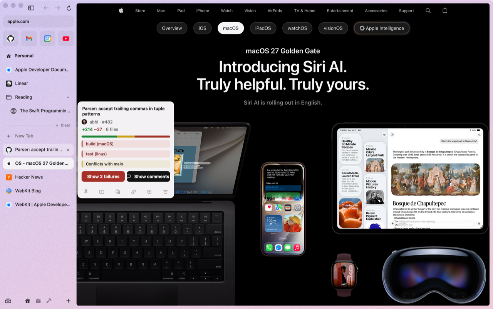
  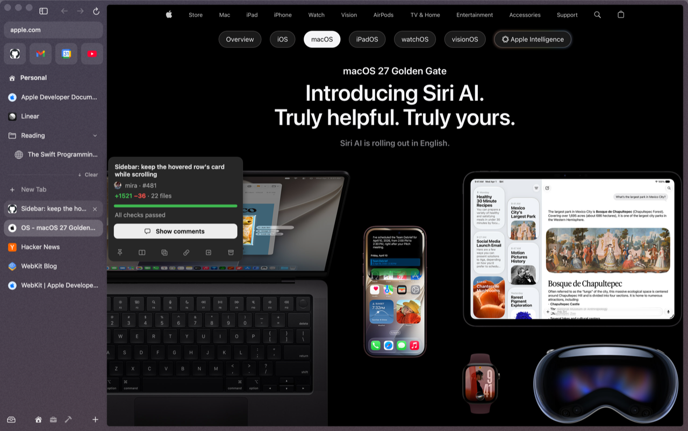
</p>

**Public repositories need nothing:** den reads GitHub's public API, with no sign-in and no connection. den has no account of its own and no servers.

For a **private repository**, the card says what's missing and has a **Connect GitHub** button. It opens github.com's sign-in in a tab; once you're signed in there, the card fills in by itself, even while it's open. GitHub doesn't share a private PR's checks or diff outside its page, so those stay on the PR itself.

<p align="center">
  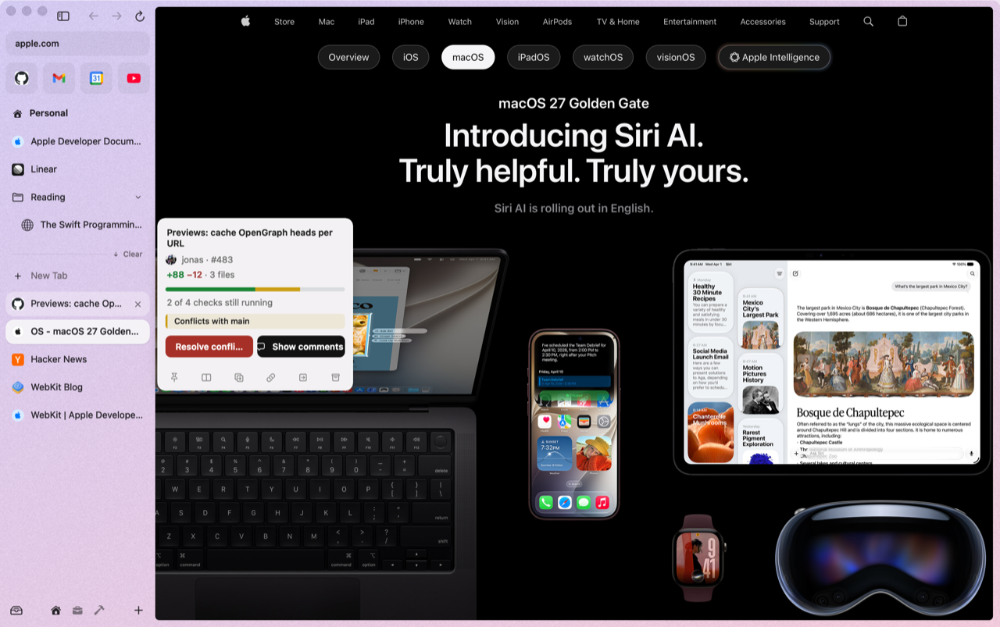
  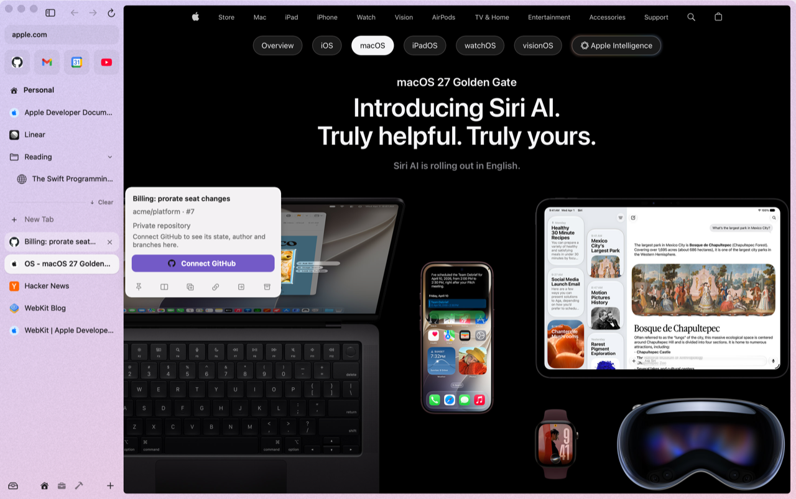
</p>

## Link previews: hold ⇧ over a link

On any web page, **hold ⇧ and rest on a link** for a card with the target page's picture, title, summary and site. Its buttons are **Open in Peek** (same as ⇧-clicking the link), **Open as Split** (⌃⇧=) and **Copy Link** (⇧⌘C).

<p align="center">
  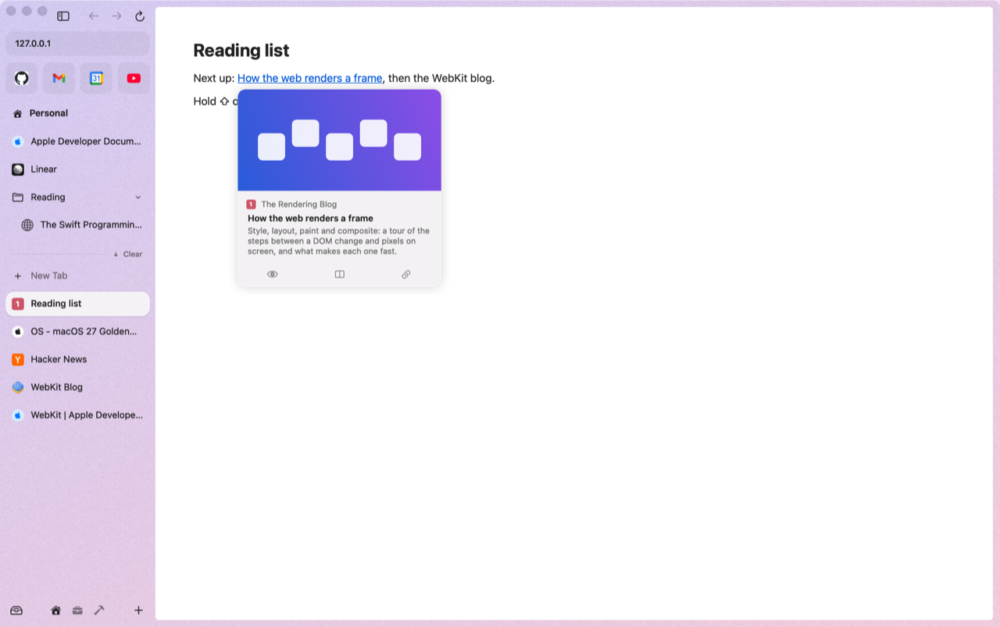
  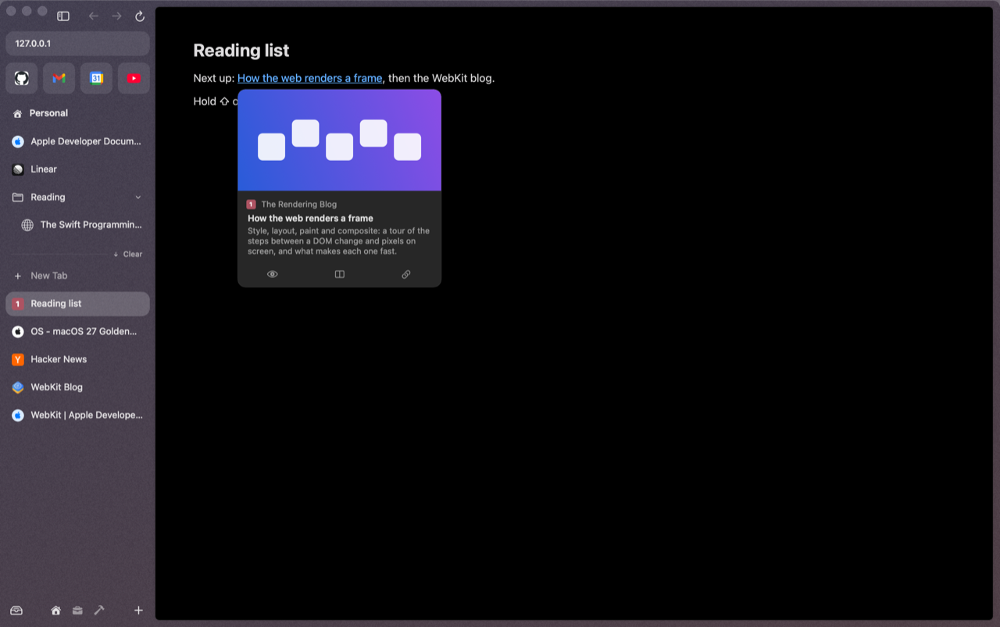
</p>

- den reads only the linked page's `<head>`: it asks for the first 256 KB and stops at `</head>`. Your cookies aren't sent. Each link is fetched once and kept for 10 minutes.
- A link to a pull request gets the PR peek instead.
- On sites that have their own link previews, such as Wikipedia, den's card stays out of the way.
- Nothing runs until you hold ⇧ over a link.
- **Settings ▸ Previews ▸ Link previews** lets you choose **Hold ⇧ and hover** (the default), **Hover** (no ⇧; the card waits 0.7 s, like a tab) or **Off**.

## Link addresses at the bottom of the page

**Point at any link** and its address shows in a small pill at the bottom-left of the page: the site in bold, then the path. Stay on the link for a moment (1.5 s) and the pill shows the whole address, query and all. If the pointer heads toward the pill, it slides to the bottom-right corner, out of your way. Tabbing to a link with the keyboard shows its address too.

<p align="center">
  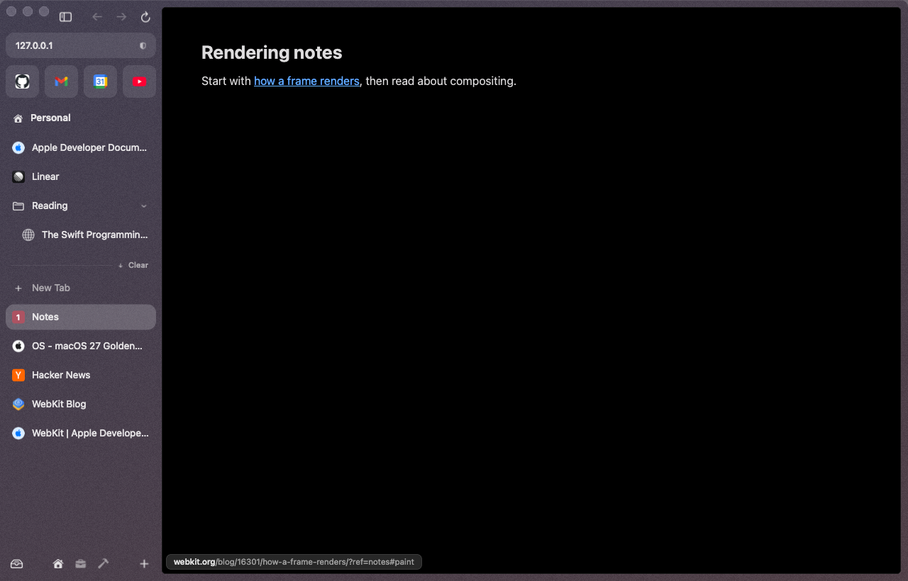
</p>

Turn it off in **Settings ▸ Previews ▸ Show link addresses**.

## What the cards show

| Tab | Card |
|---|---|
| **GitHub pull request** | the PR peek above |
| **GitHub issue** | state, labels, assignees, comment count, who opened it and when |
| **Google Calendar** | the rest of today, a **Now** / **Next** badge, up to 5 events, and a **Join** button for Meet, Zoom or Teams links |
| **Gmail** | unread count, up to 4 senders and subjects, and **Compose** |
| **Slack** | mentions, DMs, channels and threads with activity |
| **Folder** | the tabs inside (up to 6) with a one-line status each, like "CI failing" or an unread count |
| **Any other page** | its title and site, a compact snapshot of the page (not for the tab you're already on), and the buttons |

<p align="center">
  
  
</p>

The Gmail, Calendar and Slack cards read from your own signed-in session in den. The Calendar card reads the Calendar tab itself, so open it once first. Nothing goes to a den server; there isn't one.

## Settings

**Settings ▸ Previews**:

| | Default |
|---|---|
| Link previews | Hold ⇧ and hover (or Hover, or Off) |
| Show link addresses | on: the pill at the bottom of the page |
| Wait before switching tab cards | off: the card switches at once |

Page snapshots are taken only when you hover, and kept for 30 s. To turn hover cards off entirely, disable the plugin in `~/.den/config.toml`:

```toml
[plugins]
disabled = ["previews"]
```
