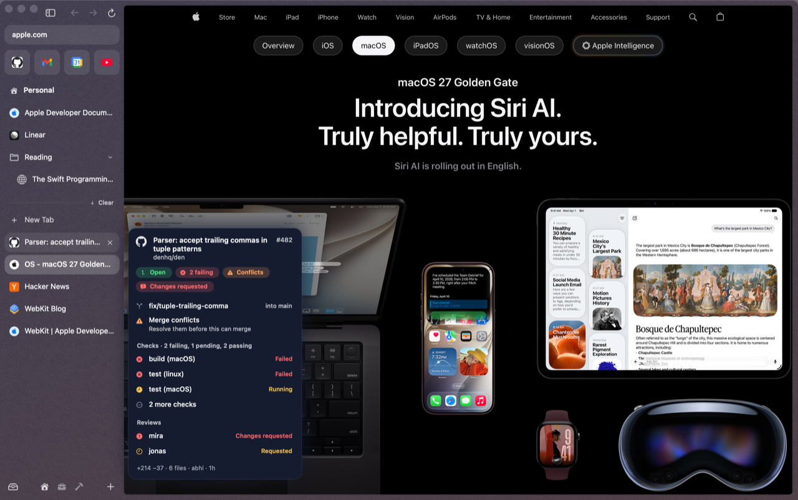
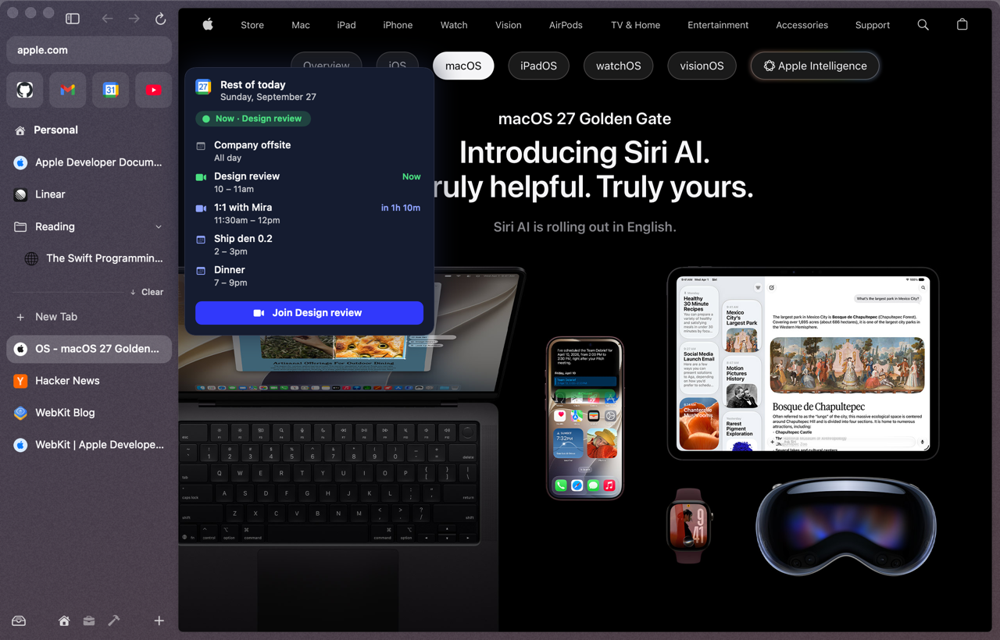
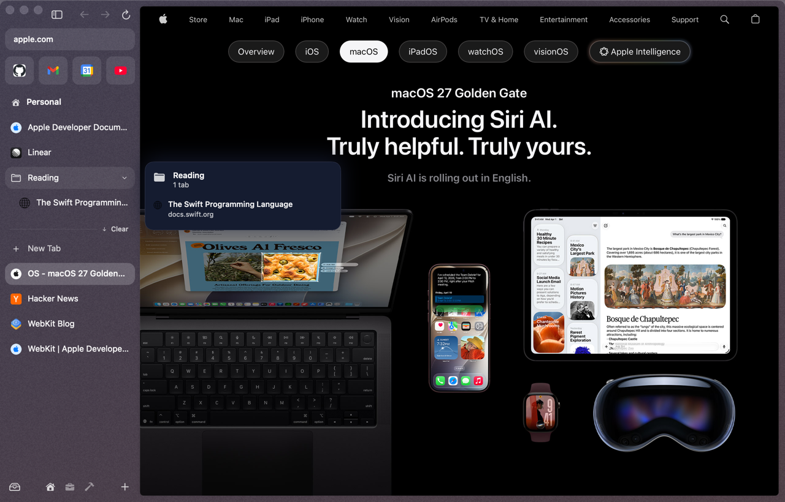

# Hover previews

**Rest the pointer on a tab in the sidebar** and a card slides out with what's in it: a pull request's checks, your next meeting, unread mail, or a snapshot of the page. You don't have to switch tabs to check on one.

<p align="center"></p>

## How it behaves

- The first card appears after **450 ms**, so sweeping across the sidebar shows nothing.
- Once a card is up, moving to the next row swaps it **instantly**, with no second wait.
- You can move the pointer onto the card. Clicking one of its rows or buttons opens that thing and closes the card.
- Clicking a tab hides its card until you move off it.
- It works on tab rows, favorites, folders and split rows (a split previews its focused pane).
- It follows Reduce Motion.

Nothing is fetched, timed or captured until you actually hover.

## What the cards show

| Tab | Card |
|---|---|
| **GitHub pull request** | Open / Draft / Merged / Closed; failing, pending or passing checks; conflicts; review state. The branch ("into main"), up to four checks with failures first, up to three reviewers, and a footer with +/− lines, files changed, author and last update |
| **GitHub issue** | state, labels, assignees, comment count, who opened it and when |
| **Google Calendar** | the rest of today, a **Now** / **Next** badge, up to 5 events, and a **Join** button for Meet, Zoom or Teams links |
| **Gmail** | unread count, up to 4 senders and subjects, and **Compose** |
| **Slack** | mentions, DMs, channels and threads with activity |
| **Folder** | the tabs inside (up to 6) with a one-line status each, like "CI failing" or an unread count |
| **Any other page** | a snapshot of the page (not for the tab you're already on) |

<p align="center">
  
  
</p>

## The GitHub PR peek

Public pull requests and issues come from GitHub's public API, with **no sign-in and no connection needed**.

For a **private repository**, den uses the github.com session you signed in to inside den, and shows the PR's state and branches with "Private repository · open it for checks and reviews". If you're not signed in to GitHub in den, the card says so.

The Gmail, Calendar and Slack cards read from your own signed-in session in den too. The Calendar card reads the Calendar tab itself, so open it once first. Nothing goes to a den server; there isn't one.

## Settings

| | Default |
|---|---|
| Delay before the first card | 450 ms (not configurable yet) |
| Page snapshots | taken only on hover, kept 30 s |

To turn hover cards off entirely, disable the plugin in `~/.den/config.toml`:

```toml
[plugins]
disabled = ["previews"]
```

## Coming later

Hold **⇧ while hovering a link on any web page** to preview it without clicking: that's being built, and isn't in den yet. See [Coming soon](coming-soon.md#link-previews).
