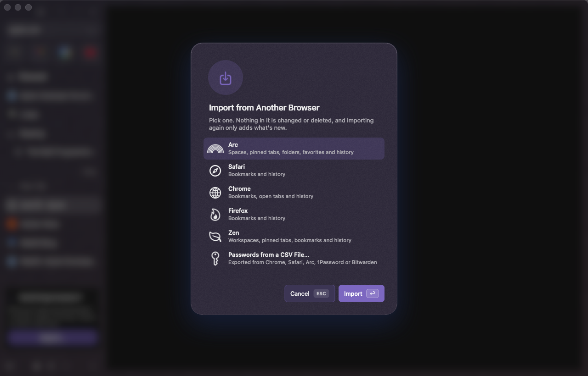
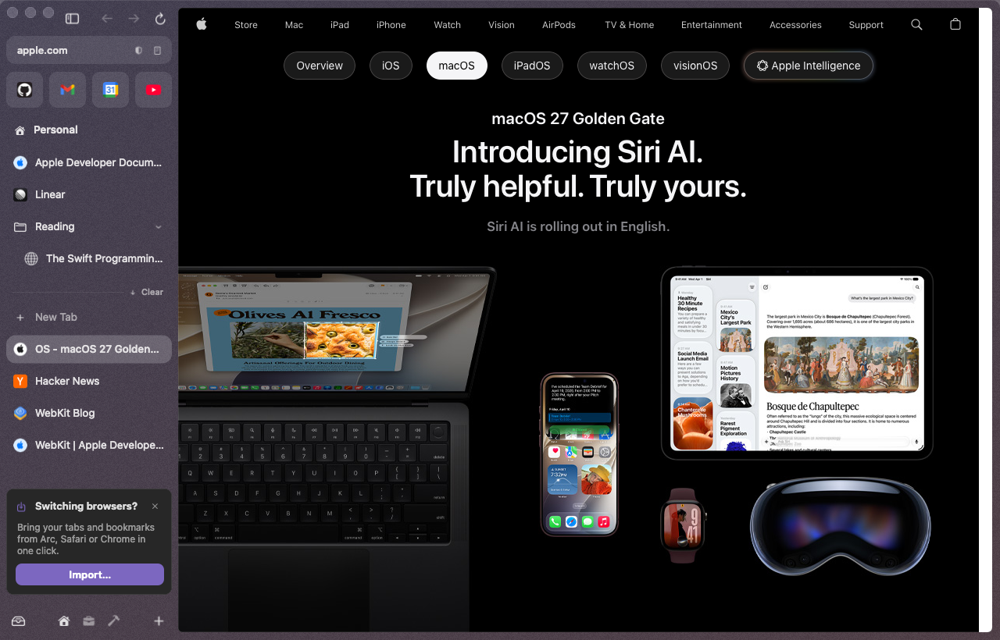
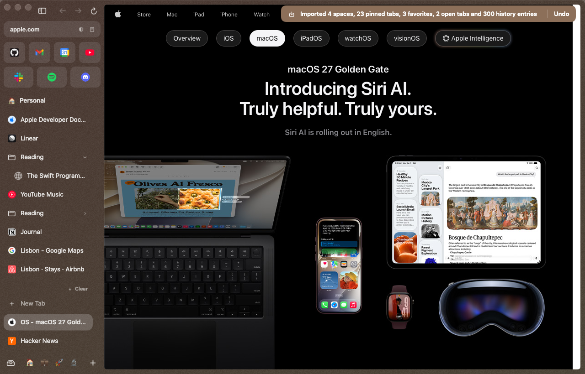

# Importing from another browser

den brings over your spaces, pinned tabs, favorites, bookmarks, open tabs and history from Arc, Safari, Chrome, Dia, Brave, Edge, Firefox and Zen, and passwords from a CSV export. Nothing in the other browser is changed or deleted, nothing leaves your Mac, and importing is never a step you have to get through.

## Three ways in

- **The card.** When den finds another browser's data, a small **Switching browsers?** card sits at the bottom of the sidebar with one button: **Import from Arc** (or **Import…** with a menu when it found several). One click and it runs in the background. × hides the card for good. It doesn't come back after one import either, and **Settings ▸ General ▸ Show tips** off hides it with the tips.
- **The command bar.** ⌘T, type "import", pick **Import from…**.
- **Settings ▸ General ▸ Import ▸ Import…**

**Import from…** and Settings open the same small dialog: one row per browser found, with what it will bring, plus **Passwords from a CSV File…**. Click a row (or pick it and press Return) to start.

While it runs, a toast says "Importing from Arc…". When it's done the toast says what came over, with **Undo**:

> Imported 4 spaces, 23 pinned tabs, 3 favorites, 2 open tabs and 300 history entries · **Undo**

Big histories are read off the main thread, so den keeps responding while they come in.

## What comes over

| From | Spaces | Pinned tabs and folders | Favorites | Bookmarks | Open tabs | History |
|---|---|---|---|---|---|---|
| Arc | ✅ names, emoji, colors, grain, profile | ✅ nested folders, renamed tabs, split views' tabs | ✅ (every profile's) | — (Arc has none) | ✅ each space's Today tabs | ✅ every profile |
| Zen | ✅ workspaces: names, emoji, colors | ✅ pinned tabs and their folders | ✅ Essentials | ✅ | ❌ | ✅ |
| Chrome, Brave, Edge, Dia | — | — | — | ✅ bar, Other, Mobile | ✅ the last session's windows | ✅ every profile (up to 4) |
| Safari | — | — | — | ✅ Favorites bar, Bookmarks menu, Reading List | ❌ | ✅ |
| Firefox | — | — | — | ✅ toolbar, menu, Other, Mobile | ❌ | ✅ |

Where it goes, and why:

- **Spaces** (Arc, Zen) become den spaces. A space with the same name as one of yours ("Work") is filled in rather than duplicated, and takes on the imported icon and colors; Undo puts your look back. Arc's colors map onto den's theme (up to three colors, its grain); Arc's other theme settings have no den equivalent.
- **Profiles.** An Arc space on a second Arc profile gets its own den profile, named after the first space that uses it, so its cookies and site data stay apart like they did in Arc. You sign in again inside den: cookies are never copied.
- **Bookmarks** go into one collapsed pinned folder in the space you're in, "Chrome Bookmarks", "Safari Bookmarks" and so on, with their folders inside. den has no separate bookmarks: like Arc, a pinned tab *is* a bookmark (it keeps its URL, and the favicon takes you back to it). One folder keeps the sidebar tidy, and you can drag what you use out of it. Nothing loads until you open it.
- **Open tabs** from a Chromium browser's last session become a **From Chrome** group in Today. Like any Today tab they archive themselves after a day.
- **History** goes to the command bar. Type part of a page's title or address and it shows under **History**, ranked by how often and how recently you visited it (den keeps the 20,000 most relevant pages).
- **Favorites** join den's favorites (12 at most); a site you already have there isn't added twice.

Things den skips on purpose: browser-internal pages (`arc://`, `chrome://`, `about:`), bookmarklets (`javascript:`), Firefox's smart bookmarks (`place:`), and anything without a web address.

## Importing again, and Undo

Import as often as you like: each import adds only what's new. Tabs, folders and spaces are matched by the other browser's own ids, history by address. If nothing changed, the toast says so.

**Undo** in the summary toast takes that import back out: its tabs and folders, the spaces it created, the history only it brought, and your spaces' old look. Tabs you added yourself stay. The toast's button undoes the most recent import.

## Safari: Full Disk Access

macOS keeps Safari's files behind **Full Disk Access**. Without it, Safari's row says "Needs Full Disk Access", and choosing it opens **System Settings ▸ Privacy & Security ▸ Full Disk Access** with one line saying what to do. Turn den on there, then import again. den asks only when you choose Safari, never on its own.

## Passwords

den never reads another browser's encrypted password store. Export your passwords to a CSV file from the other browser, then **Import from… ▸ Passwords from a CSV File…** and pick the file. Touch ID confirms, and each login goes into den's Keychain vault ([Passwords](privacy-and-passwords.md#passwords-the-touch-id-vault)).

- **Chrome, Arc, Brave, Edge, Dia:** Settings ▸ Passwords (or chrome://password-manager/settings) ▸ Export passwords.
- **Safari / the Passwords app:** File ▸ Export All Passwords to File….
- **1Password:** File ▸ Export ▸ choose CSV. **Bitwarden:** Tools ▸ Export vault ▸ .csv.
- **Firefox:** about:logins ▸ ··· ▸ Export Logins….

den reads the file and nothing else: it doesn't change or delete it. Delete it yourself afterwards, since it holds your passwords in plain text. Logins den already has (same site and username) are left as they are, and rows without a web address (app logins) are skipped. The toast says how many came over. Password imports have no Undo; remove a login from **Passwords…**.

## Not yet

- Zen 1.12 and later keep workspaces in a compressed session file den doesn't read yet: their bookmarks and history still come over, their workspaces don't.
- Open tabs from Safari, Firefox and Zen.
- Search engines and site keywords.
- Arc's Little Arc settings, Boosts and Easels.
