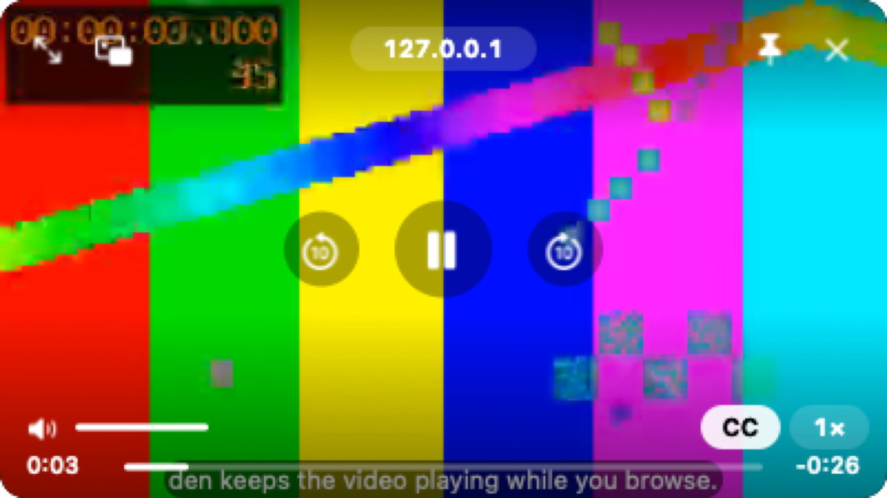

# Media

den tells you which tab is making noise, lets you mute or pause it from the sidebar, keeps a video you're watching on screen when you leave its tab, and can dock a chat or AI site beside every tab.

## Now playing, at the bottom of the sidebar

When a tab you've left is playing music or a video with sound, a small player sits at the bottom of the sidebar, above the space icons.

- It shows the track's **artwork, title and artist** when the site provides them (most music and video sites do), or the page's title and site icon.
- Buttons: **previous**, **play/pause**, **next**, **mute** and **stop** (×: pauses it and takes it off the list).
- **Click the artwork or the title** to go to the tab.
- Several tabs at once: the one that started playing most recently is on top. "2 more playing" opens the whole list; "Show less" folds it again.
- The tab you're looking at isn't listed (its controls are on the page), and neither is the video in the mini player.
- A paused tab stays listed until you stop it, close it, or den unloads it.
- Next is dimmed when the site has no next track. Previous goes back a track, or to the start when there's no previous one.

**Keys, media keys and Control Center.** The newest playing tab is den's "now playing": the play/pause, next and previous keys on your keyboard, AirPods, and Control Center's Now Playing all control it. In den, **⌃⌘P** plays or pauses it, **⌃⌘→** skips ahead, **⌃⌘←** goes back.

## Hover controls on a tab

Point at a tab that's playing (or paused) something and its row shows **play/pause** and, when the site has them, **previous** and **next** buttons, next to the speaker.

## Tab audio and mute

- A **speaker icon** appears on any tab row or favorite tile that's playing audio. It shows for audible `<video>` and `<audio>` only, not muted or zero-volume ones.
- **Click the speaker** to mute the tab; click it again to unmute. A muted tab keeps a crossed-out speaker. Right-click ▸ **Mute Tab** / **Unmute Tab** does the same.
- A tab stays muted while it's open; mute isn't remembered after the tab is closed or den relaunches.
- Tabs playing audio are never archived and never unloaded, so music keeps going in the background.
- den won't restart for an [update](updates.md) while media is playing.

## The mini player

When a video is playing and you switch to another tab, switch apps, or den's window is covered, minimized or hidden, the video moves into a small floating player. Come back to the tab (or to den) and it goes back into the page, still playing. The page is never reloaded.

- It only follows a video worth following: playing, audible (not muted), at least 5 seconds long (or live), and at least 200 × 100 pt on the page. One mini player at a time.

- Hover it for den's controls: play/pause, back and forward 10 s, the seek bar, mute and volume, playback speed, picture in picture, back to the tab, and close.
- **The site's name** sits at the top ("youtube.com"). Click it to go back to the tab.
- **Keep on top** (the pin, or **T**): on by default, the player floats over other apps' windows. Turn it off and other windows can cover it.
- **CC** (or **C**) turns subtitles on and off, when the video comes with its own subtitle tracks. Sites that draw their own captions (YouTube) keep their own button.
- **Tuck it away:** drag the player more than halfway past the left or right edge of the screen and let go. It hides there with a strip showing, and the sound keeps playing. Click the strip to bring it back.
- Drag it anywhere; drag a corner to resize it. It snaps to the nearest screen corner and remembers where you put it.
- **Double-click** it to go back to the tab. **×** closes it and pauses the video; that video won't open the player again this session.
- It floats over every Space and over full-screen apps, and clicking it never brings den to the front.
- Turn it off by typing "mini player" in the [command bar](command-bar.md#settings-from-the-bar): **Mini player when you leave a playing video** (on by default).

**Keys** (with the player clicked). Firefox's picture-in-picture keys work too:

| Key | Does |
|---|---|
| Space | Play / pause |
| ← / → | Back / forward 5 s |
| ⌘← / ⌘→ | Back / forward a tenth of the video |
| Home / End | Start / end of the video |
| ↑ / ↓ | Volume up / down |
| M, or ⌘↓ / ⌘↑ | Mute / unmute |
| C | Subtitles on or off |
| T | Keep on top on or off |
| Esc | Back to the tab |
| ⌘W | Close the player |

For the system's picture in picture instead, use the player's picture-in-picture button, or the site's own PiP button, as you would in Safari.

## Web panels

A web panel keeps a site you use all day, like Slack, WhatsApp, Discord, Claude or Gemini, open beside every tab, in every space. It slides out from the sidebar's edge and the page makes room.

- **⌃⌘S** shows or hides the panel (View ▸ Toggle Web Panel, or "web panel" in the command bar).
- **Add one:** in the panel's header, **+** ▸ **Add This Tab**, or pick Claude, Gemini, ChatGPT, WhatsApp, Slack or Discord. From anywhere: the command bar's **Add This Tab as a Web Panel**, or **Settings ▸ Web Panels**, where you type an address such as `claude.ai`.
- **Switch** with the site icons in the header. The **…** menu opens the panel's page as a tab, reloads it, turns on **Phone Layout** (the site gets an iPhone's browser name, for sites that only go narrow on a phone), or removes the panel.
- Panels are narrow, so most sites show their phone-sized layout anyway. Some sites (WhatsApp, Slack) ask you to install their app when they think you're on a phone, so Phone Layout is off unless you turn it on.
- **Hidden panels sleep.** Half a minute after a panel leaves the screen, den unloads it like an unused tab, so it costs nothing until you show it again. One that's playing sound keeps playing.
- You stay signed in: a panel shares cookies with your tabs.
- The panel you had open comes back when den restarts.
- Don't want panels at all? Add `panels` to `[plugins] disabled` in [config.toml](../den-home.md).
