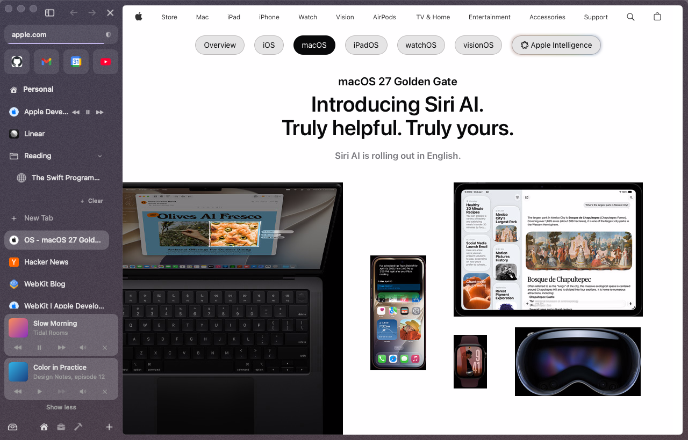
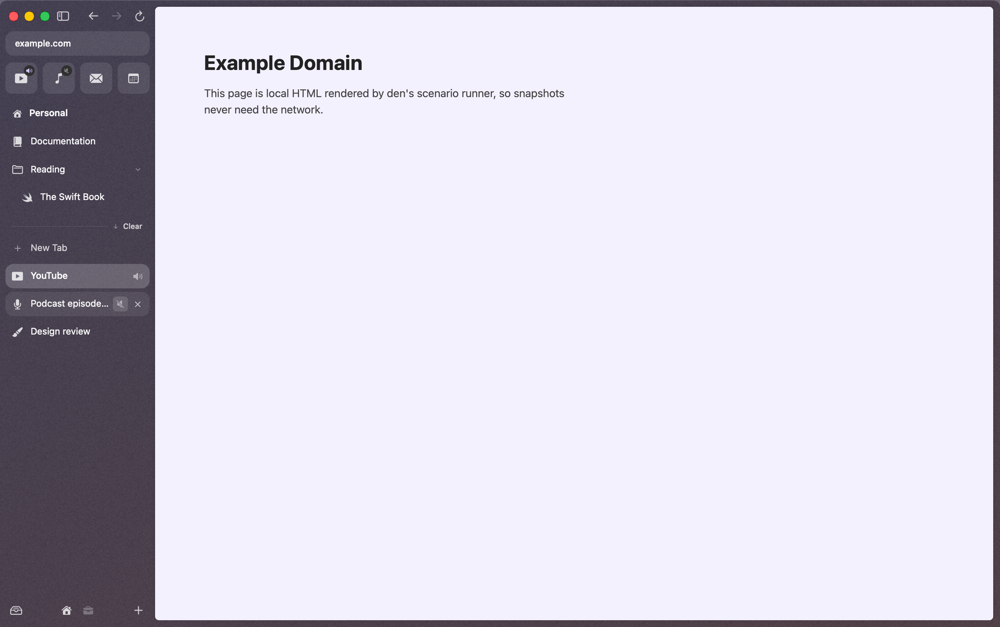
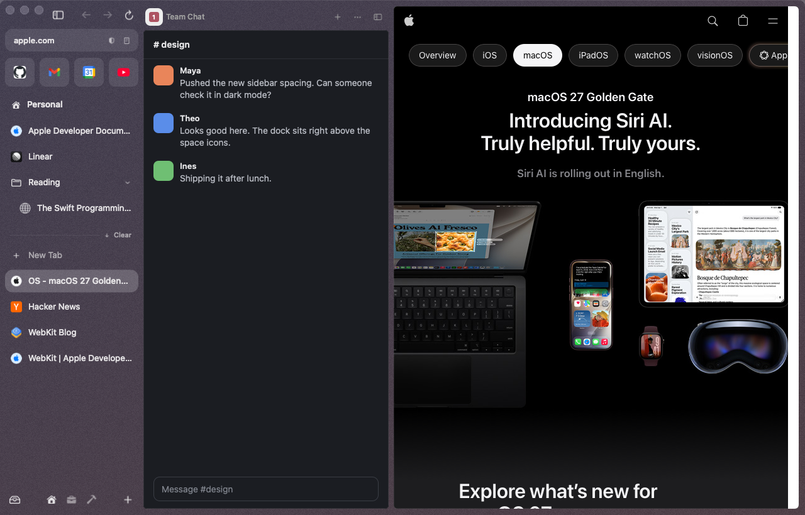

# Media

den tells you which tab is making noise, lets you mute or pause it from the sidebar, keeps a video you're watching on screen in the Mac's picture in picture when you leave its tab, and can dock a chat or AI site beside every tab.

## Now playing, at the bottom of the sidebar

When a tab you've left is playing music or a video with sound, a small player sits at the bottom of the sidebar, above the space icons.

- It shows the track's **artwork, title and artist** when the site provides them (most music and video sites do), or the page's title and site icon.
- Buttons: **previous**, **play/pause**, **next**, **mute**, **picture in picture** (videos only) and **stop** (×: pauses it and takes it off the list).
- **Click the artwork or the title** to go to the tab.
- Several tabs at once: the one that started playing most recently is on top. "2 more playing" opens the whole list; "Show less" folds it again.
- The tab you're looking at isn't listed (its controls are on the page). A video in picture in picture is, with a button to bring it back.
- A paused tab stays listed until you stop it, close it, or den unloads it.
- Next is dimmed when the site has no next track. Previous goes back a track, or to the start when there's no previous one.

**Keys, media keys and Control Center.** The newest playing tab is den's "now playing": the play/pause, next and previous keys on your keyboard, AirPods, and Control Center's Now Playing all control it. In den, **⌃⌘P** plays or pauses it, **⌃⌘→** skips ahead, **⌃⌘←** goes back.

## Hover controls on a tab

Point at a tab that's playing (or paused) something and its row shows **play/pause** and, when the site has them, **previous** and **next** buttons, next to the speaker. A favorite does the same: pointing at its tile swaps the icon for **play/pause**, with **previous** and **next** too when the tile is wide enough (fewer favorites in its row, or a wider sidebar).

## Tab audio and mute

- A **speaker icon** appears on any tab row or favorite tile that's playing audio. It shows for audible `<video>` and `<audio>` only, not muted or zero-volume ones.
- **Click the speaker** to mute the tab; click it again to unmute. A muted tab keeps a crossed-out speaker. Right-click ▸ **Mute Tab** / **Unmute Tab** does the same.
- A tab stays muted while it's open; mute isn't remembered after the tab is closed or den relaunches.
- Tabs playing audio are never archived and never unloaded, so music keeps going in the background.
- den won't restart for an [update](updates.md) while media is playing.

## Picture in picture

den uses the Mac's own picture in picture, the same floating video window Safari uses. It stays on top of every app, follows you to every Space and over full-screen apps, and has the system's controls: play/pause, skip back and forward (on videos you can seek), close, and the return button that brings you back to the tab. Drag it anywhere, resize it from a corner, or drag it past the screen's edge to tuck it away while the sound plays.

**It starts on its own**, like Safari's video viewer: when a video is playing with sound and you switch to another tab or space, minimize den, hide it, or cover its window with another app's, the video moves into picture in picture. Come back and it slides back into the page, still playing. A full-screen video does the same when you switch to another Space.

- Only a video worth following: playing, audible (not muted), at least 5 seconds long (or live), and at least 200 × 100 pt on the page. Scrolled out of view is fine: the floating window always shows the whole video.
- **The return button** (in the floating window) takes you to the tab, in its space and window, and brings den to the front. **×** closes it and pauses the video.
- **By hand:** **⌥⌘P** (View ▸ Picture in Picture, or "Picture in Picture" in the [command bar](command-bar.md)) puts the video you're looking at, or else the one playing most recently, in picture in picture, and takes it out again. A video you put there yourself stays when you come back to its tab, as in Safari. The video's own picture-in-picture button and its right-click menu (**Enter Picture in Picture**) work too.
- **While it floats,** den's own controls still reach it: its row in the [now-playing dock](#now-playing-at-the-bottom-of-the-sidebar) (play/pause, mute, stop, and a picture-in-picture button), the tab's speaker to mute it, **⌃⌘P** to play or pause, and your keyboard's media keys and Control Center.
- Turn the automatic part off by typing "picture in picture" in the [command bar](command-bar.md#settings-from-the-bar): **Picture in Picture when you leave a playing video** (on by default).

## Camera and microphone

A tab that's using your camera or microphone shows a red camera or mic icon on its row (on a favorite, in the tile's corner), slashed while the site has paused it. Click it to turn the camera and microphone off for that page.

## Web panels

A web panel keeps a site you use all day, like Slack, WhatsApp, Discord, Claude or Gemini, open beside every tab, in every space. It slides out from the sidebar's edge and the page makes room.

- **⌃⌘S** shows or hides the panel (View ▸ Toggle Web Panel, or "web panel" in the command bar).
- **Add one:** in the panel's header, **+** ▸ **Add This Tab**, or pick Claude, Gemini, ChatGPT, WhatsApp, Slack or Discord. From anywhere: the command bar's **Add This Tab as a Web Panel**, or **Settings ▸ Web Panels**, where you type an address such as `claude.ai`.
- **Switch** with the site icons in the header. The **…** menu opens the panel's page as a tab, reloads it, turns on **Phone Layout** (the site gets an iPhone's browser name, for sites that only go narrow on a phone), or removes the panel.
- **Resize** by dragging the gap between the panel and the page; den keeps the width. Double-click the gap for the default width again.
- Panels are narrow, so most sites show their phone-sized layout anyway. Some sites (WhatsApp, Slack) ask you to install their app when they think you're on a phone, so Phone Layout is off unless you turn it on.
- **Hidden panels sleep.** Half a minute after a panel leaves the screen, den unloads it like an unused tab, so it costs nothing until you show it again. One that's playing sound keeps playing.
- You stay signed in: a panel shares cookies with your tabs.
- The panel you had open comes back when den restarts.
- Don't want panels at all? Add `panels` to `[plugins] disabled` in [config.toml](../den-home.md).
