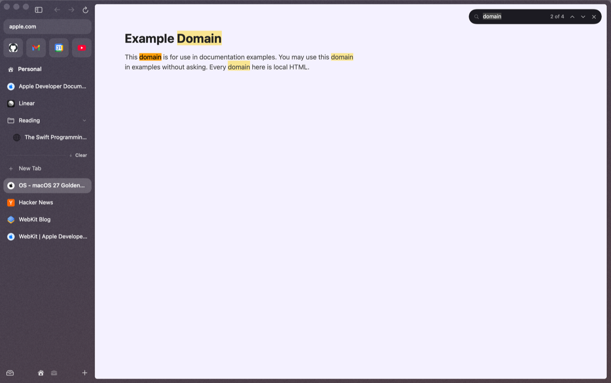
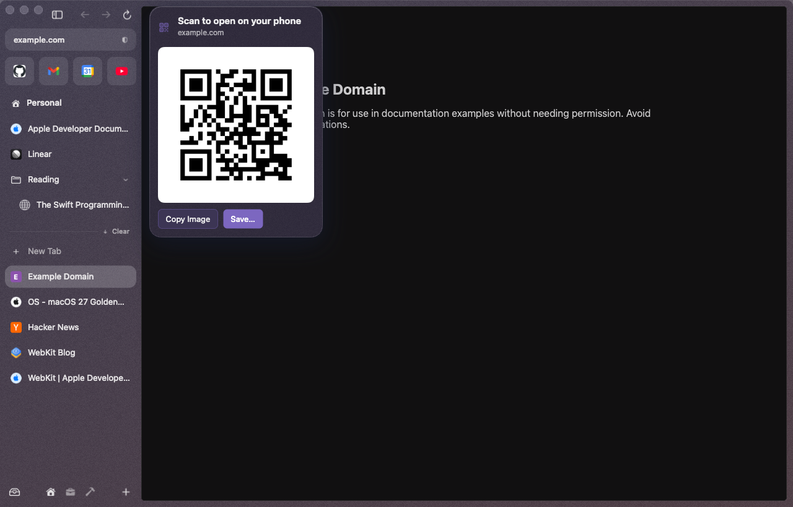
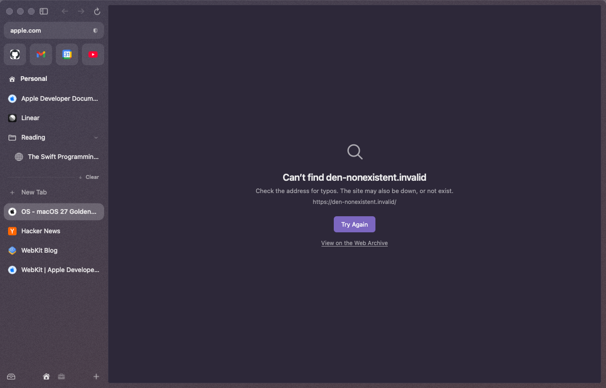
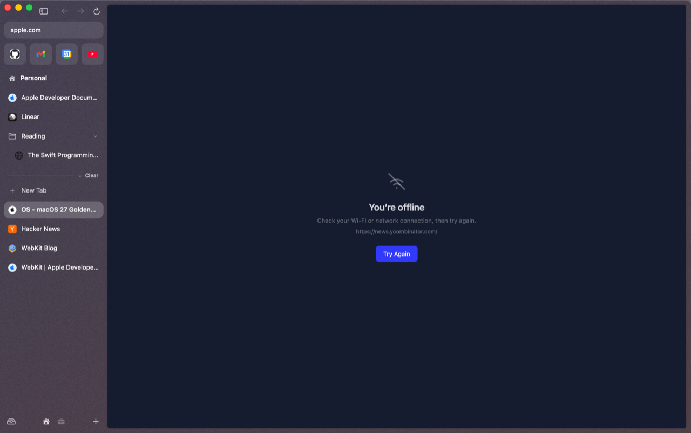
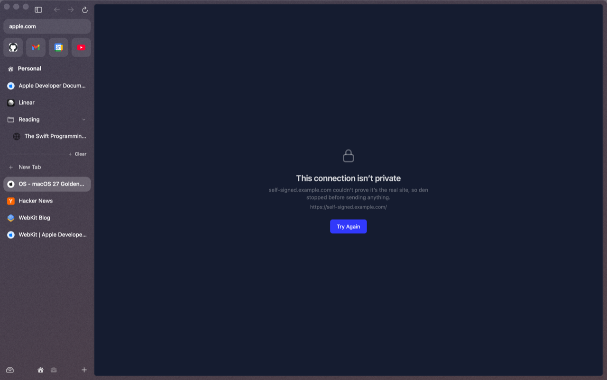
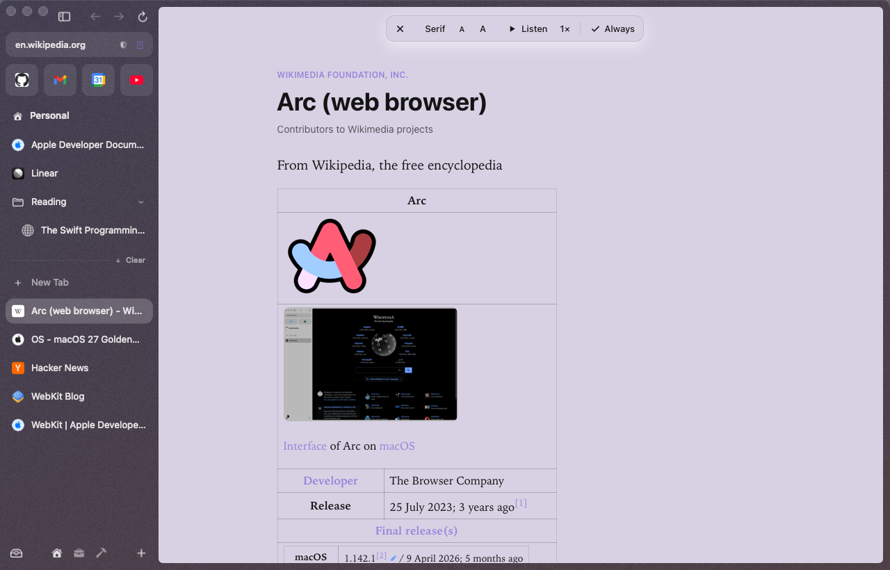
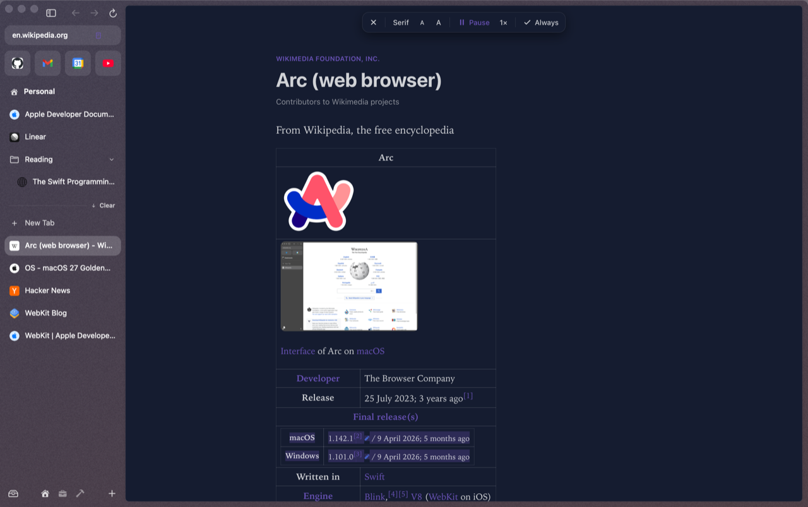
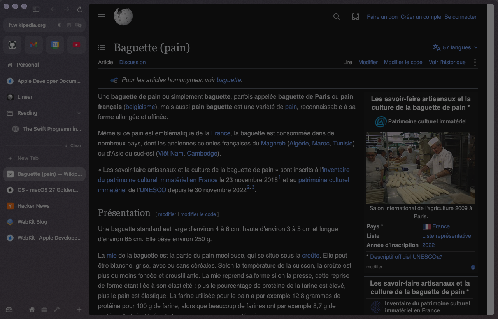
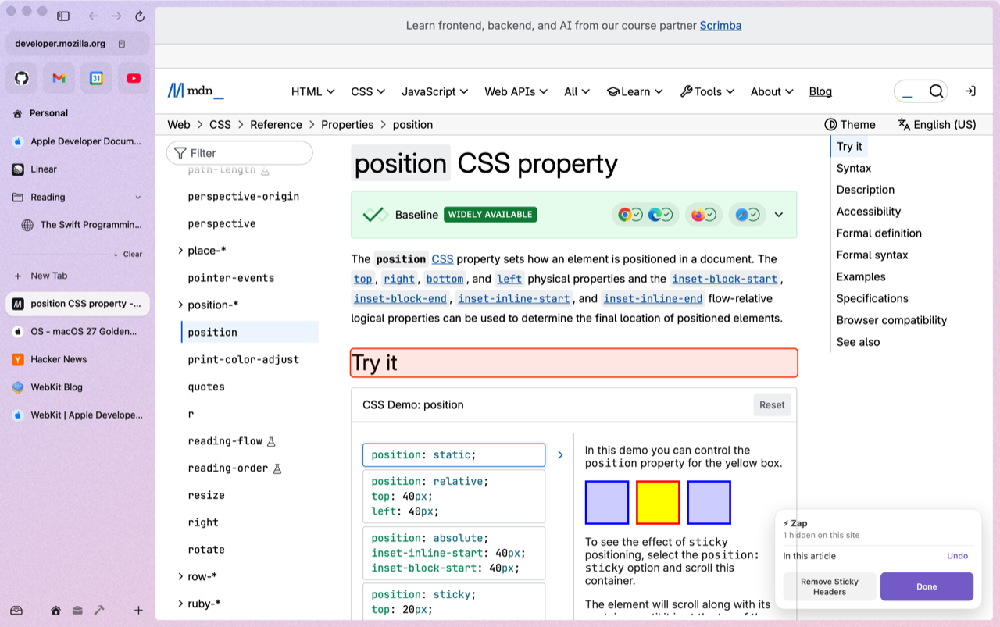
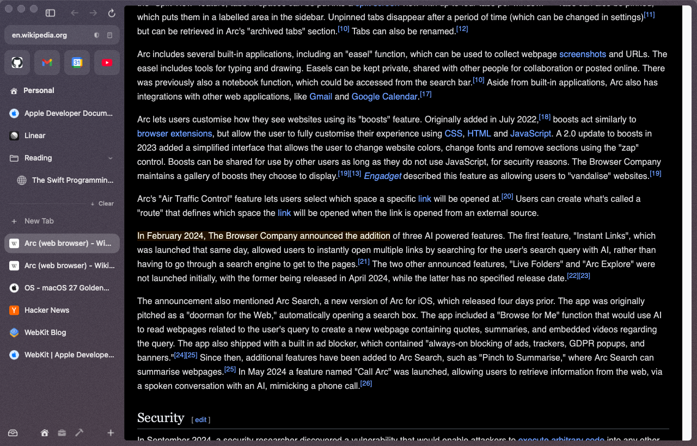

# Page tools

The everyday things you do to a page.

## Find

⌘F opens a small find bar at the top right of the page.

| Keys | |
|---|---|
| Return or ⌘G | next match |
| ⇧Return or ⇧⌘G | previous match |
| ⌘E | find the selected text |
| Esc | close |

## Zoom, remembered per site

⌘+ (or ⌘=), ⌘- and ⌘0. Pinch and smart zoom work too. The zoom level is remembered for the site (`www.` or not), so GitHub stays at 110 % in every tab. ⌘0 forgets it.

## Copy the link

| Keys | Copies |
|---|---|
| ⇧⌘C | the page's URL |
| ⌥⇧⌘C | the page as a Markdown link, `[title](url)` |

The link button in the URL pill copies the URL too, and so does **Copy Link** in a tab's right-click menu.

A short message at the top right says exactly what went on the clipboard: "Copied link · example.com/path…", "Copied Markdown link · …", "Copied image · 1280 × 800 px" for a capture, "Copied link to highlight · “the words…”", and "Copied password for ada on example.com · clears in 60 s".

## Paste and Go

Right-click the URL pill, or the command bar's text field, for **Paste and Go** when the clipboard holds a web address, or **Paste and Search** when it holds other text. The pill's version opens it in the current tab; the command bar's does what pressing Return would. The item only appears when there's one line of text to paste.

## Share and QR code

**Share…** opens macOS's share sheet for the page: AirDrop, Messages, Mail, Notes, Reminders and the rest. It's in the File menu, the command bar, the URL pill's right-click menu and a tab's right-click menu.

**QR Code for This Page** (File menu or command bar) shows a QR code next to the URL pill: point your phone's camera at it to open the page there. **Copy Image** copies it, **Save…** saves it as a PNG. Esc or a click elsewhere closes it.

  

## Save, print, inspect

| Keys | |
|---|---|
| ⇧⌘S | save the page as a Web Archive |
| ⌘P | print (or save as PDF from the print dialog) |
| ⌥⌘U | view source |
| ⌥⌘I | Web Inspector |
| ⌥⌘C | inspect element |
| ⌥⌘J | JavaScript console |

## When a page can't load

den shows a plain page saying why, with **Try Again**, and the tab keeps the address so nothing's lost: you're offline, the host can't be found, it's taking too long, the connection failed, or the connection isn't private.

When the site itself is the problem (it can't be found, refuses the connection or doesn't answer), the page also has **View on the Web Archive**: the Internet Archive's most recent copy of that address. It isn't offered when you're offline (the archive is out of reach too) or when a connection isn't private (that can mean someone on your network is interfering, and den doesn't route around it).

  
  
  

## Reader

When a page is an article, a Reader button appears in the URL pill. Click it (or press ⌃⌘R) and the article opens over the page in den's colors, without the clutter. The toolbar at the top switches Serif and Sans, makes the text smaller or larger, and has **Always**: that site then opens in Reader every time. Esc or ⌃⌘R goes back to the page.

  
  

**Listen** reads the article aloud with your Mac's voice for its language, and highlights the sentence being read. Click again to pause; the speed button goes from 0.8× to 2×.

The button next to it shows the voice and lets you pick another (press V in the reader, or "Choose Read-Aloud Voice…" in the command bar). It lists every voice installed on your Mac, with the page's language first and each voice marked Default, Enhanced or Premium. Type to search by name, language or region; ↑↓ move, Return chooses, ⌥Return or ▶ plays a short sample, Esc closes.

den remembers the voice you pick for its language: pick a French voice once and French pages use it. A voice from another language is used for that page only, unless you tick **Use for all French pages**. **System Voice** goes back to your Mac's voice for that language. **Get more voices…** opens System Settings > Accessibility > Read & Speak, where you can download Enhanced and Premium voices. Siri's voices aren't available to other apps, so they aren't in the list. Settings > Reading lists the voices you've kept per language.

## Translate

When a page is in another language, a Translate button appears in the URL pill. Click it and the page is translated on your Mac, with Apple's translation models: nothing is sent anywhere. The text you're looking at changes first, then the rest of the page. Click the button again for the original. If a language isn't downloaded yet, macOS asks first.

## Capture

⇧⌘2 (Arc's) dims the page: drag over a region, or pick **Element** and click one, or take the **Visible Area** or the **Full Page** from the bar at the top. Esc cancels. The picture is copied to the clipboard; "Save Captures to Folder…" in the command bar (or Settings > Reading) saves them as PNG files instead, in Downloads or a folder you choose.

## Zap

"Zap Elements" in the command bar: hover shows what you'd hide, a click hides it. The panel lists what's hidden on the site, each with **Undo**, and has **Remove Sticky Headers**, which hides every header, banner and bar that follows you as you scroll (also a command on its own). den remembers them per site and hides them before the page appears the next time. "Show Zapped Elements on This Site" brings them back.

## Copy a link to a highlight

Select some text, right-click, **Copy Link to Highlight**. Anyone who opens the link lands on that text, highlighted (den, Safari and Chrome all open these).

Settings > Reading keeps the reader's font, size and speed, the sites that always open in Reader, where captures go, and the zapped sites.
