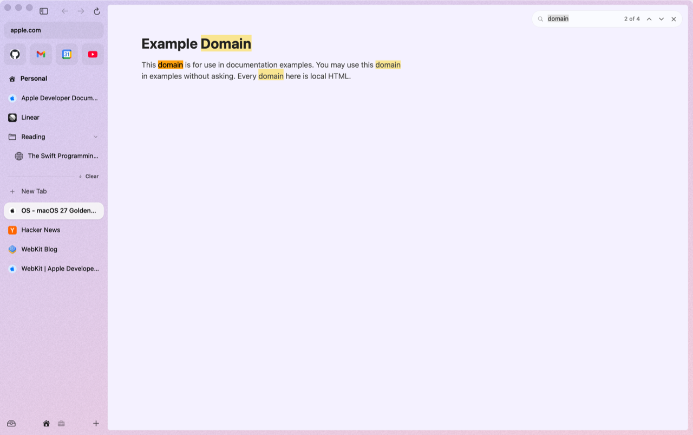
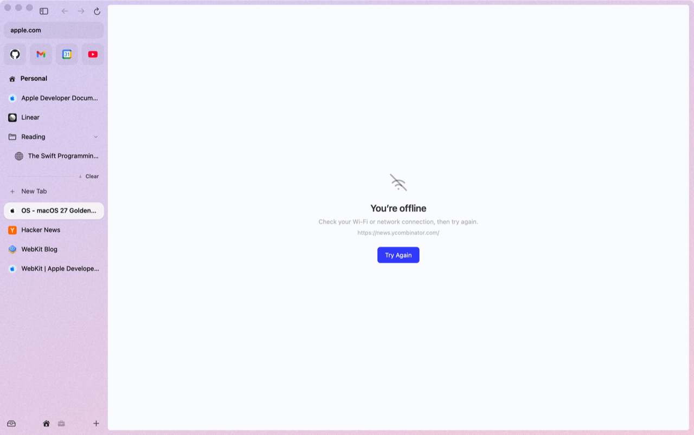
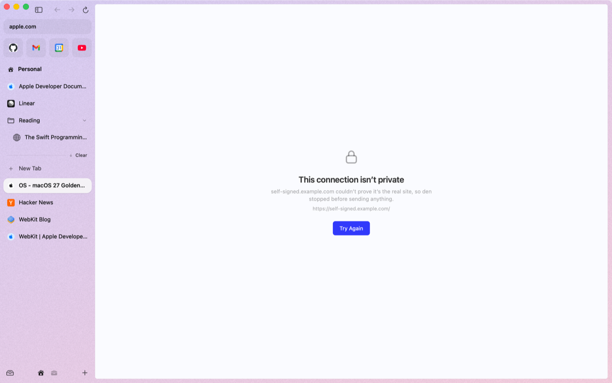
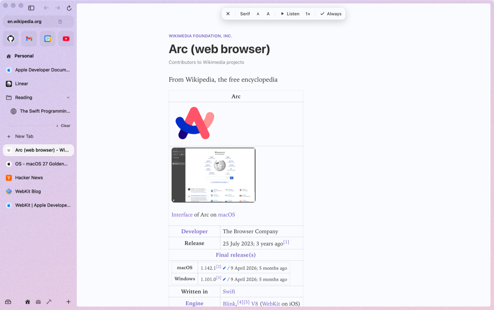
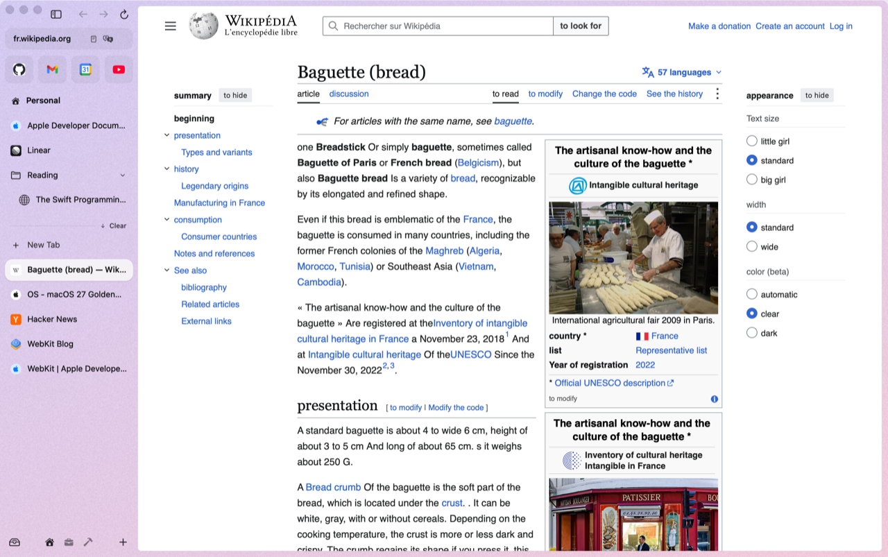
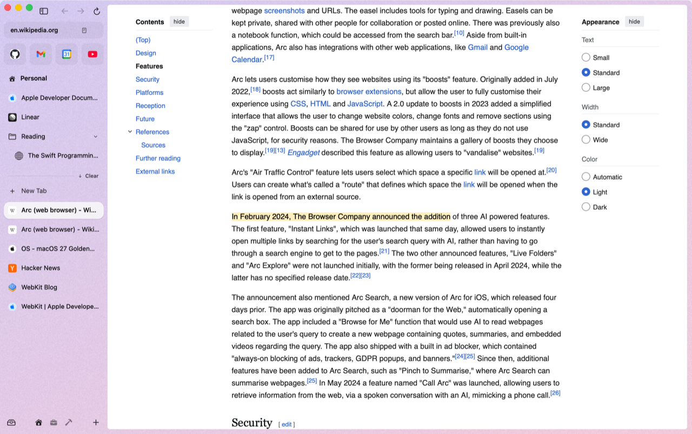

# Page tools

The everyday things you do to a page.

## Find

⌘F opens a small find bar at the top right of the page.

| Keys | |
|---|---|
| Return or ⌘G | next match |
| ⇧Return or ⇧⌘G | previous match |
| ⌘E | find the selected text |
| Esc | close |

## Zoom, remembered per site

⌘+ (or ⌘=), ⌘- and ⌘0. Pinch and smart zoom work too. The zoom level is remembered for the site (`www.` or not), so GitHub stays at 110 % in every tab. ⌘0 forgets it.

## Copy the link

| Keys | Copies |
|---|---|
| ⇧⌘C | the page's URL |
| ⌥⇧⌘C | the page as a Markdown link, `[title](url)` |

The link button in the URL pill copies the URL too, and so does **Copy Link** in a tab's right-click menu.

## Save, print, inspect

| Keys | |
|---|---|
| ⇧⌘S | save the page as a Web Archive |
| ⌘P | print (or save as PDF from the print dialog) |
| ⌥⌘U | view source |
| ⌥⌘I | Web Inspector |
| ⌥⌘C | inspect element |
| ⌥⌘J | JavaScript console |

## When a page can't load

den shows a plain page saying why, with **Try Again**, and the tab keeps the address so nothing's lost: you're offline, the host can't be found, it's taking too long, the connection failed, or the connection isn't private.

  
  

## Reader

When a page is an article, a Reader button appears in the URL pill. Click it (or press ⌃⌘R) and the article opens over the page in den's colors, without the clutter. The toolbar at the top switches Serif and Sans, makes the text smaller or larger, and has **Always**: that site then opens in Reader every time. Esc or ⌃⌘R goes back to the page.

  
  

**Listen** reads the article aloud with your Mac's voice for its language, and highlights the sentence being read. Click again to pause; the speed button goes from 0.8× to 2×.

## Translate

When a page is in another language, a Translate button appears in the URL pill. Click it and the page is translated on your Mac, with Apple's translation models: nothing is sent anywhere. The text you're looking at changes first, then the rest of the page. Click the button again for the original. If a language isn't downloaded yet, macOS asks first.

## Capture

⇧⌘2 (Arc's) dims the page: drag over a region, or pick **Element** and click one, or take the **Visible Area** or the **Full Page** from the bar at the top. Esc cancels. The picture is copied to the clipboard; "Save Captures to Folder…" in the command bar (or Settings > Reading) saves them as PNG files instead, in Downloads or a folder you choose.

## Zap

"Zap Elements" in the command bar: hover shows what you'd hide, a click hides it. The panel lists what's hidden on the site, each with **Undo**, and has **Remove Sticky Headers**, which hides every header, banner and bar that follows you as you scroll (also a command on its own). den remembers them per site and hides them before the page appears the next time. "Show Zapped Elements on This Site" brings them back.

## Copy a link to a highlight

Select some text, right-click, **Copy Link to Highlight**. Anyone who opens the link lands on that text, highlighted (den, Safari and Chrome all open these).

Settings > Reading keeps the reader's font, size and speed, the sites that always open in Reader, where captures go, and the zapped sites.
