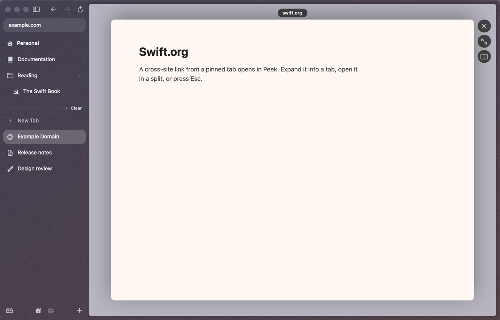
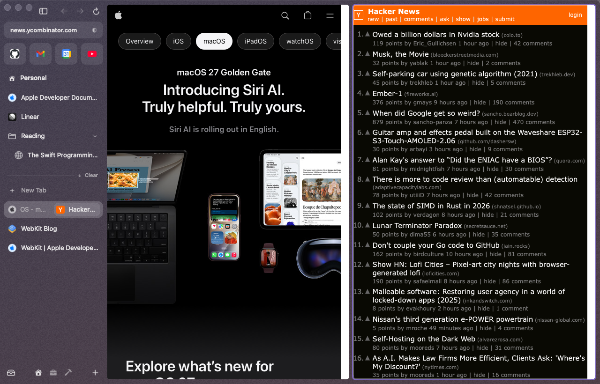
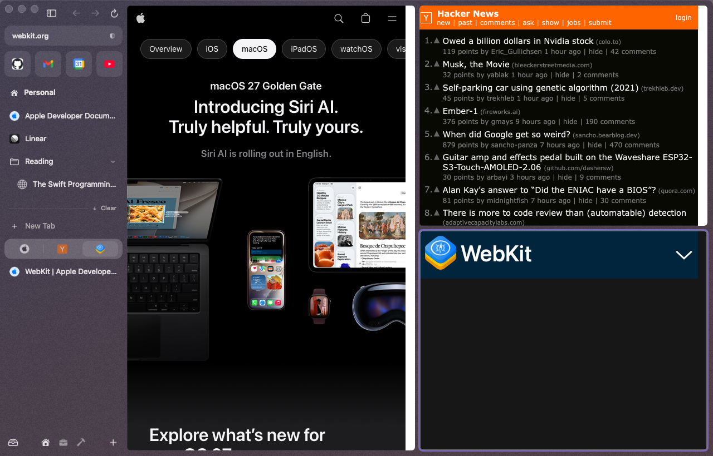
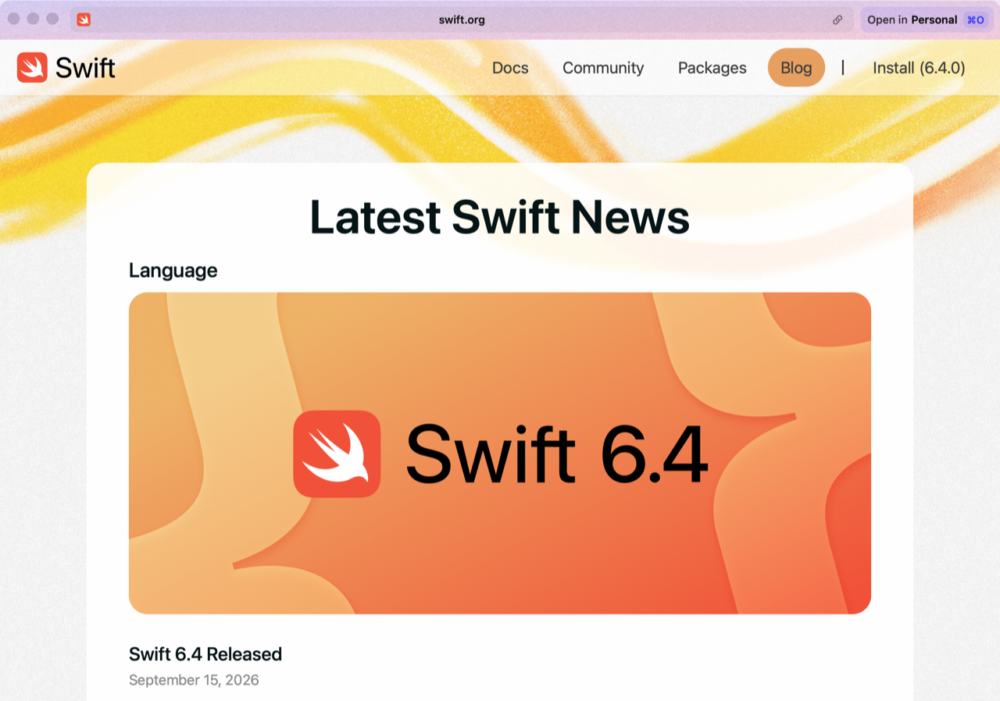

# Peek, split view & Little Arc

Three ways to look at a second page without losing the first.

## Peek

A Peek opens a link in a card floating over the current page. Close it and you're exactly where you were.

**It opens when you:**

- **⇧-click or ⌥-click any link**, in any tab. (Only ⇧ alone or ⌥ alone; ⌘-click still makes a background tab.)
- Click a link **to another site** from a **pinned tab or favorite**. Your Gmail or Linear tab stays on Gmail or Linear. Links within the same site navigate normally.
- Press **⇧Return** on a URL, search or archived tab in the [command bar](command-bar.md).

**Then:**

| | |
|---|---|
| Esc, or click outside the card | close it |
| **⌘Z** within 15 s | bring back the Peek you just closed |
| **Open as Tab** button, or ⌘O | turn it into a real tab, keeping its history, scroll position and anything you typed |
| **Open in Split View** button | put it next to the current tab |

A Peek uses the same profile (logins) as the tab it came from.

Don't want pinned tabs to Peek? Turn off Settings ▸ Tabs ▸ **Peek at links from pinned tabs and favorites**. ⇧-click and ⌥-click keep working.

## Split view

Up to four pages side by side, saved as one row in the sidebar.

**Make a split:**

- **Drag a tab from the sidebar onto the page.** A tinted zone shows where it'll go: the **left third** puts it on the left, anywhere else on the right.
- **⌃⇧=** adds an empty pane and opens the command bar to fill it.
- **Split Right** in the Tabs menu or the command bar.
- **Open in Split View** on a Peek.
- **Drag a tab onto another tab's row** in the sidebar (its middle): the two become a split, the dragged tab on the right.
- **Drag a tab onto a split's row** in the sidebar (its middle) to add it as another pane.

**Use it:**

| | |
|---|---|
| Click a pane, or ⌃⇧1…⌃⇧4 | focus it (it gets an accent ring) |
| Hover a pane | shows **×** (close the pane) and **Separate Page from Split View** |
| ⌃⇧- | close the focused pane. A Today tab is archived; a pinned tab just leaves the split |
| Click a segment of the split's sidebar row | focus that pane |
| Right-click the split's row | **Side by Side**, **Top and Bottom**, **Grid** (3+ panes), **Separate All Tabs** |

Grid with three panes is one tall pane on the left and two stacked on the right; with four it's 2 × 2. A split that's down to one tab turns back into a plain tab.

Panes can't be resized by dragging yet.

## Little Arc: a mini window for links from other apps

When den is your default browser, a link you click in Mail, Slack or Messages opens as a normal tab in your current space. If you'd rather have Arc's quick floating window, turn on Settings ▸ Tabs ▸ **Open links from other apps in a mini window**.

- The mini window floats at the top right, with the site in its title bar and a copy-link button.
- **Open in \<Space\>** (or ⌘O) moves the page into a Today tab, with its state.
- Clicking the same link again brings back its window instead of opening another.
- Close the window and the page closes.
- A mini window you haven't touched for 6 hours goes to the Library (⇧⌘T brings it back). Change it with Settings ▸ Tabs ▸ **Archive unused mini windows** (Never, 1 h, 6 h, 24 h).
- Open mini windows show up in the command bar under **Windows**.
