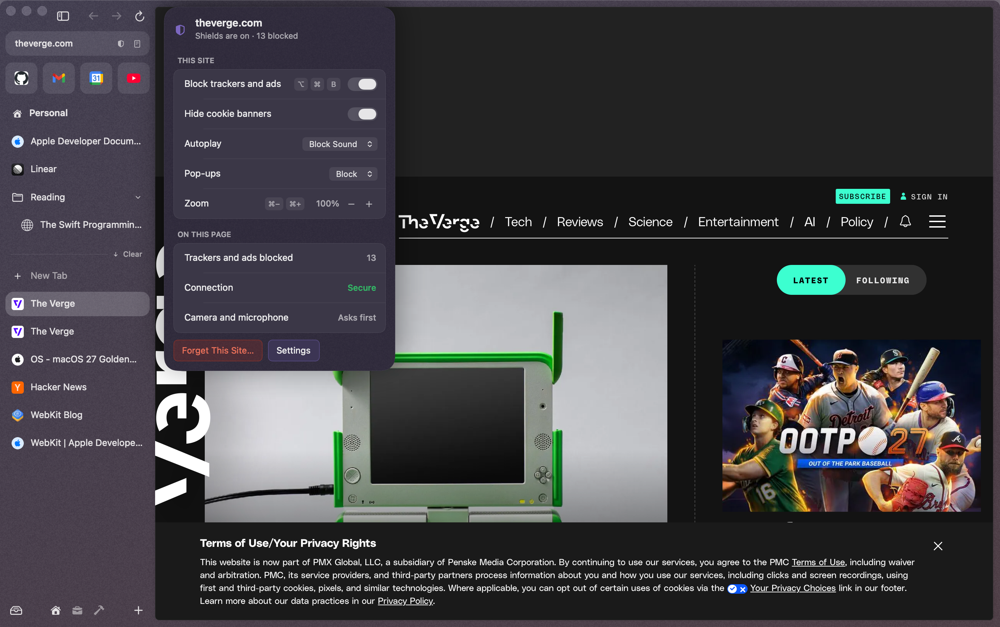
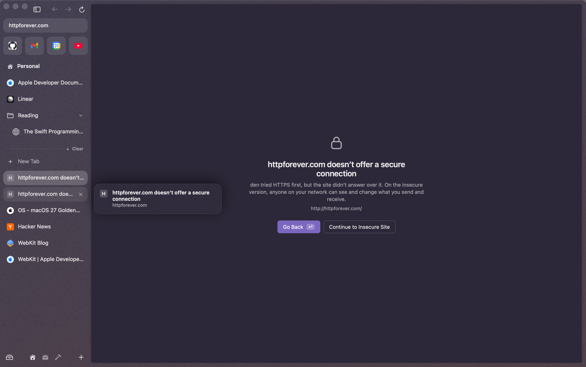
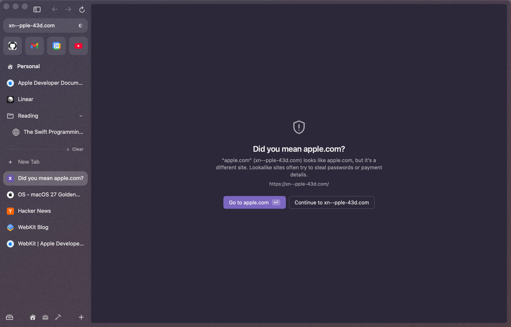
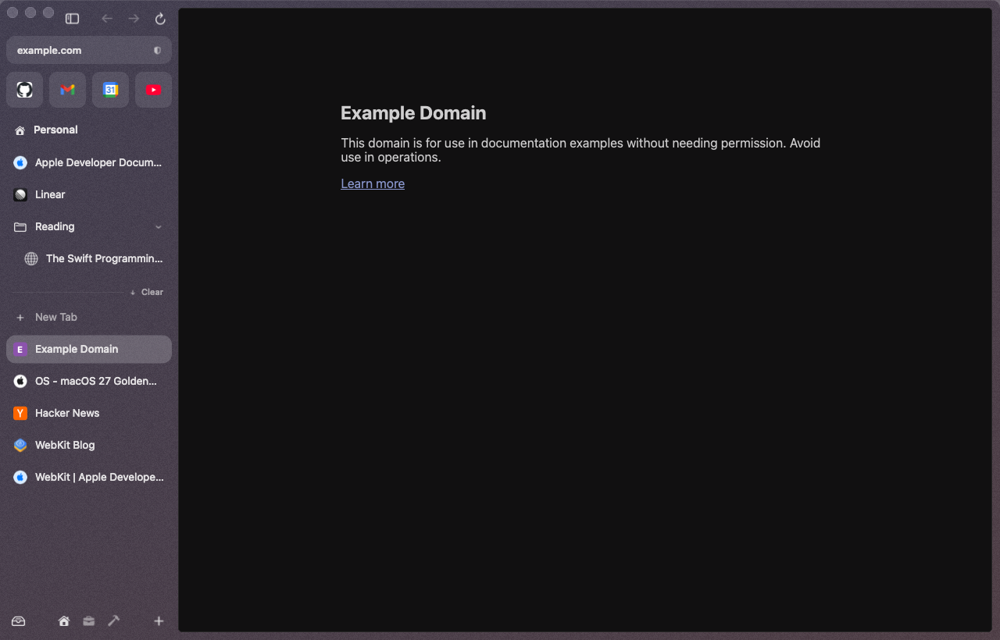
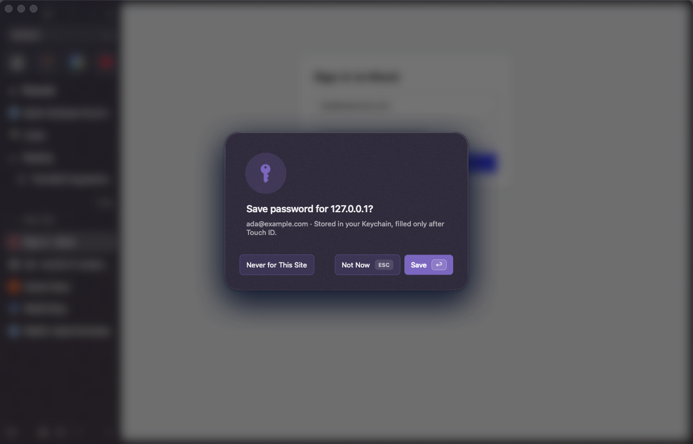
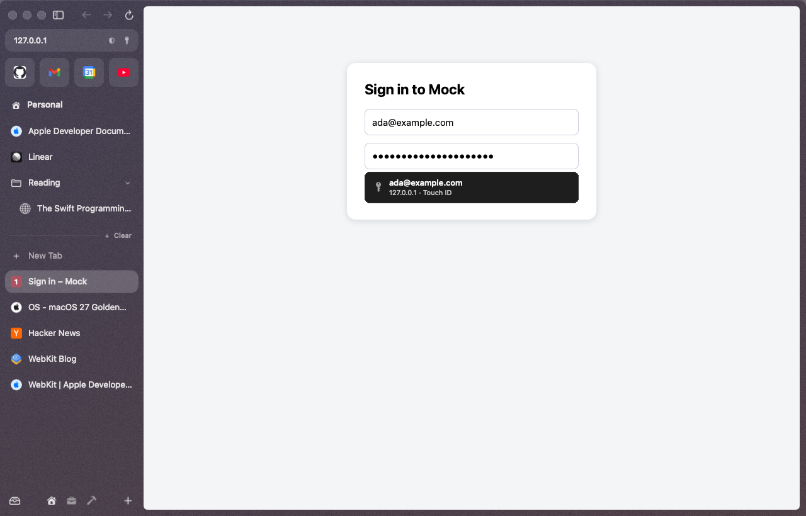
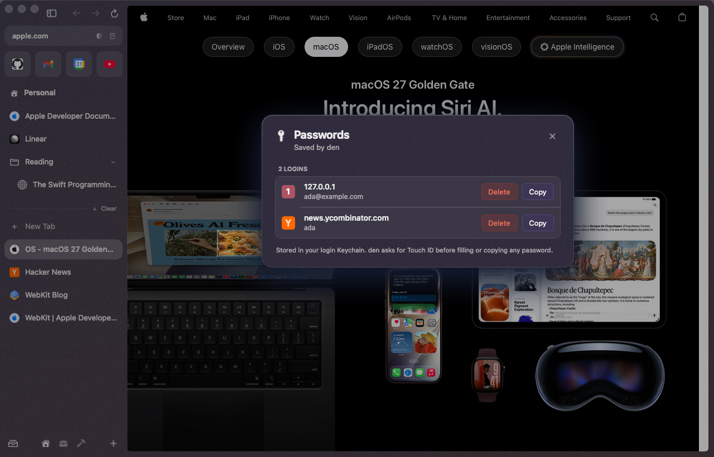
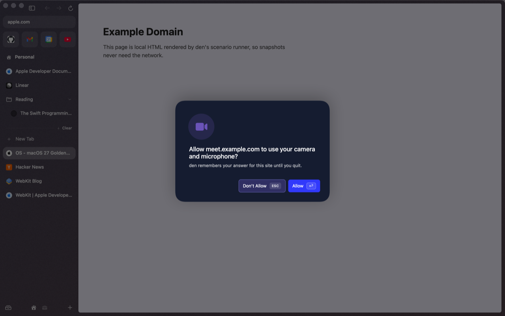
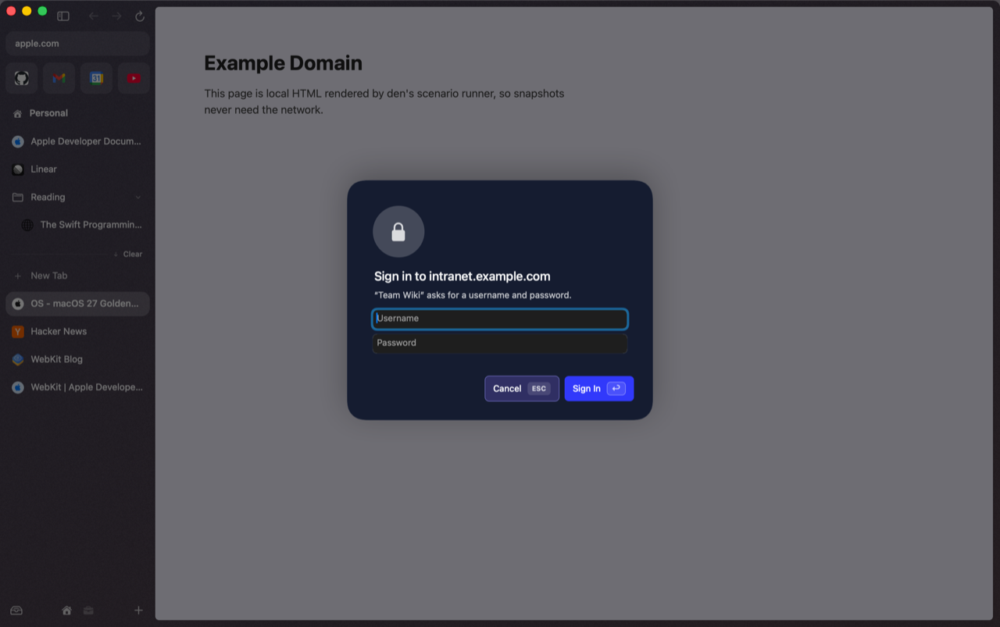

# Privacy & passwords

## Shields

Shields are on for every site from the first launch; there's nothing to set up.

  

| What | What it does |
|---|---|
| **Trackers and ads** | Blocked before they load, by WebKit itself (EasyList and EasyPrivacy, built into den). No script runs in your pages for it |
| **Cookie banners** | Hidden, and their scripts blocked (EasyList Cookie List). Sites get no answer, so nothing is accepted for you |
| **Tracking parameters** | `utm_…`, `fbclid`, `gclid` and about 30 more click IDs come off every page you open, so the address you copy or bookmark is clean too |
| **Bounce trackers** | A link through an ad or affiliate click tracker (Rakuten, Awin, Skimlinks, CJ, impact.com, Reddit's and Slack's outbound links) goes straight to where it points. Google's and Facebook's link checkers are left alone: they warn about dangerous links |
| **HTTPS-first** | `http://` addresses are tried over HTTPS first. If a site has no HTTPS, den asks before opening the insecure page |
| **Lookalike sites** | A name made to look like a well-known site ("аpple.com" with a Cyrillic "а", "g00gle.com") stops at a warning: **Go to apple.com** (↩) or **Continue**. International names show in their own script ("bücher.de"); ones that could fake another name stay in their raw `xn--` form |
| **Autoplay** | Videos may start by themselves only when muted |

  
  

### The Shields panel

Click the shield in the address pill, or press **⌥⌘S**. For the site you're on:

- **Block trackers and ads** (⌥⌘B without opening the panel). Turn it off when a site breaks; its links then keep their parameters too. The shield in the pill stays crossed out as a reminder.
- **Hide cookie banners**, **Autoplay** (Block Sound, Allow, Block All), **Pop-ups** (Block, Allow), **Zoom** (⌘− ⌘+ ⌘0).
- **On this page:** how many trackers and ads WebKit blocked (a real count), a skipped bounce redirect, tracking parameters removed, whether the connection is secure, and your camera and microphone answers (with a reset).
- **Forget This Site…** removes its cookies, site data and cache, and your Shields, zoom and permission choices for it. You'll be signed out.

A change applies from the next load, so the panel offers **Reload** (⌘R). If you've typed something you haven't sent yet, it says so first and the button becomes **Reload Anyway**.

Everything also lives in the command bar (type "shields") and in **Settings ▸ Shields**, which lists the sites with their own settings and the sites you allowed without HTTPS.

**uBlock Origin Lite.** If you install it, den offers once to turn its own blocker off, so pages aren't filtered twice. Cookie banners, clean links and the rest stay on.

### Cookie banners

den hides banners and blocks their scripts; it doesn't click "Reject" for you. DuckDuckGo's autoconsent library does click, but it's JavaScript that would run on every page and in every frame; its measured cost is below, and den doesn't ship it.

"Accept or subscribe" consent walls that lock the page (Sourcepoint's on spiegel.de, zeit.de, theguardian.com) are left alone on purpose by the list: hiding one would leave a page you can't scroll. Answer those yourself; den remembers nothing about them.

### What it costs

Measured on an Apple M3, macOS 26.5, on 2026-09-28 with a busy machine (1-minute load 23–42), so treat small differences as noise. `build/den.app` with and without `shields.dylib`, invisible windows (`--background`), [perfprobe](../../scripts/perf/perfprobe.swift):

| | Shields | No Shields |
|---|---|---|
| Launch to first window, median of 8 (two rounds) | 533 / 504 ms | 535 / 514 ms |
| den's own memory | 28–30 MB | 28–32 MB |
| Total with example.com open (den + WebKit processes) | 144.2 MB | 144.3 MB |
| Total with theverge.com open, 25 s after launch | 460.5 MB | 683.0 MB |

- **Nothing runs until used.** The panel, lists and settings cost nothing at launch: the lists are looked up in WebKit's store (the compile happens once; 3.9–7.6 s per list on this machine the first time), and WebKit keeps them memory-mapped.
- **Disk:** the lists add 1.7 MB to den.app (LZFSE); WebKit's compiled copies take 53 MB in `~/Library/Application Support/den/ContentRules`.
- **Per navigation:** one call from WebKit's policy check into the plugin to clean the URL, a few string comparisons.

Page loads, same page alternately without and with Shields, 3 loads each, medians ([ShieldsLiveTests](../../Tests/PluginTests/ShieldsLiveTests.swift), `DEN_LIVE=1`). Load times swing with the network; the requests and bytes are the steadier numbers:

| Page | Requests | Transferred | Load time |
|---|---|---|---|
| bbc.com | 117 → 85 | 91 → 91 KB | 1.1 → 2.4 s |
| stackoverflow.com/questions | 137 → 57 | 61 → 62 KB | 1.9 → 1.6 s |
| theverge.com | 304 → 164 | 2,808 → 1,734 KB | 45 → 3.9 s (without Shields, trackers kept the page loading) |

Cookie banners, with cookie-banner hiding off and on (same run): hidden on stackoverflow.com, gov.uk, dell.com and hp.com; the Sourcepoint consent wall on spiegel.de stays, as described above. DuckDuckGo's autoconsent (v16.42.0, MPL-2.0) is 441 KB of script with its rules; just evaluating it took 16–78 ms per page load (example.com, spiegel.de, lemonde.fr), before it does any work, in every page.

The same test checks, on the real web: `https://example.com/?utm_source=den&fbclid=abc123&id=1` opens as `https://example.com/?id=1`; a Rakuten deep link (`click.linksynergy.com/deeplink?…&murl=https%3A%2F%2Fexample.org%2F%3Futm_medium%3Daffiliate`) opens `https://example.org/` without contacting Rakuten; a server redirect that adds `utm_campaign` is cleaned too; `http://example.com/` opens over HTTPS; `http://httpforever.com/` shows den's page; `xn--pple-43d.com` shows the lookalike warning; autoplay with sound is refused (`NotAllowedError`) until you allow it for the site; a pop-up without a click is blocked until you allow it.

## Dark mode for every website

When den is dark, websites are too. Pages see den's appearance, so sites with their own dark theme use it. The rest are darkened by a WebKit user stylesheet (images and video are left alone), so there's no script and no white flash. Pages that are already dark are never touched, and den remembers them so the next visit costs nothing. **Always Light** even lightens pages that are dark by design.

It's on by default, and follows den's appearance (Automatic, Light or Dark, set in the [theme picker](spaces-and-themes.md#themes)). Choose per site from the command bar (⌘T, type "dark"):

| Command | On the current site |
|---|---|
| **Dark Mode: Follow den on This Site** | the default |
| **Dark Mode: Always Dark on This Site** | dark even when den is light |
| **Dark Mode: Always Light on This Site** | never darkened |
| **Dark Mode: Off for This Site** | den never touches it |
| **Dark Mode for Websites: On/Off** | turns the whole feature off or on |

## Google sign-in

Google refuses to sign you in from many embedded web views. den identifies itself with Safari's user agent (read from the Safari on your Mac), so Google sign-in works.

## Passwords: the Touch ID vault

den saves logins to your Mac's Keychain and fills them after Touch ID.

  
  

  
  

- **Saving.** After you sign in, den asks **"Save password for \<site\>?"** (or **Update password…**) with **Save**, **Not Now** and **Never for This Site**.
- **Filling.** Click into a login field and your saved logins for that site appear below it. Pick one, touch the sensor ("den is trying to fill your password for \<site\>"), and it's filled. Username-first sign-ins (Google, Microsoft) get the list on the email step too.
- **The key in the URL bar.** On a site with saved logins, a key sits in the URL pill. Click it to jump to the login field, with your logins listed under it.
- **Strong passwords.** On sign-up forms, **Use Strong Password** fills a password of three dash-separated groups of six characters (`xxxxxx-xxxxxx-xxxxxx`), with an uppercase letter and a digit.
- **Your list.** **Passwords…** in the command bar asks for Touch ID, then lists everything with **Copy** and **Delete**. Copying asks for Touch ID again; the message says whose password it is ("Copied password for ada on example.com · clears in 60 s"), and after 60 s the clipboard is cleared, unless you've copied something else since. The list stays unlocked for 5 minutes.

The rules den follows:

- HTTPS only. Nothing is saved or filled on plain HTTP.
- Login fields inside frames from another site are ignored.
- The site's origin comes from WebKit, never from the page itself.
- Every fill, copy and reveal asks for Touch ID (or your Mac password) right then; an earlier Touch ID is never reused.

> [!NOTE]
> den can't read iCloud Keychain or the Passwords app; macOS has no API for it. Logins you save in den stay in den's Keychain items.

## Passkeys

**Not yet.** WebKit handles passkeys by itself, but only for a browser that Apple has granted its browser-passkey entitlement, which needs a paid developer account and Apple's approval. Until then den tells sites it has no passkey support on this Mac, so they ask for your password instead of starting a passkey sign-in that ends in "Something went wrong — Make sure Bluetooth is on". Settings ▸ General ▸ **Skip passkey sign-in, use the password** (on by default) controls this; it applies to tabs opened afterwards, and it stops doing anything once den has the entitlement. The full investigation is in [docs/research/passkeys.md](../research/passkeys.md).

## Camera, microphone and sign-in prompts

  
  

- **Camera and microphone:** "Allow \<site\> to use your camera?" with **Don't Allow** / **Allow**. den remembers your answer for that site until you quit.
- **HTTP sign-in** (the old browser-dialog kind): the username and password go straight to WebKit for the session. den doesn't store them.
- **Page alerts, confirms and prompts** appear as den dialogs, one at a time, themed to your space.
- **Every den dialog answers the keyboard**, even when the page behind it grabbed focus: **Esc** is the cancel button (or the only button), **Return** the default one. Focus goes back to where you were typing.

## What den sends, and to whom

- **Search suggestions** go to Google as you type (Settings ▸ Search ▸ **Search suggestions** turns them off; then nothing leaves den until you press Return).
- **Connections** talk only to the service itself, with your own session. See [Connections](connections-and-briefing.md#privacy).
- **Hover cards** fetch only when you hover one: public GitHub pull requests and issues from GitHub's public API, and private repos, Gmail, Calendar and Slack through your own session in den. See [Hover previews](hover-previews.md).
- **Updates** check GitHub on the schedule in [Updates](updates.md), and store-installed extensions check their store once a day.
- den has no servers, no accounts and no analytics.
