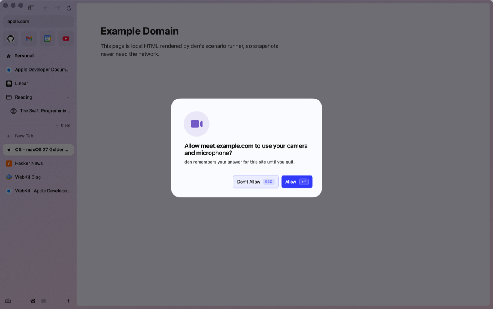
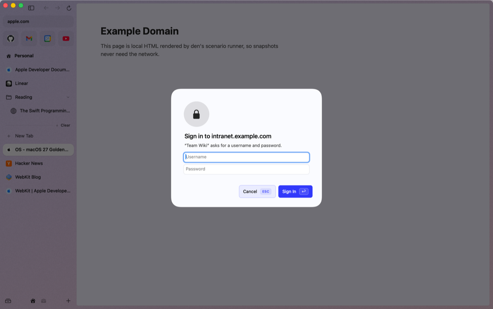

# Privacy & passwords

## Dark mode for every website

When den is dark, websites are too. Pages see den's appearance, so sites with their own dark theme use it. The rest are darkened by a WebKit user stylesheet (images and video are left alone), so there's no script and no white flash. Pages that are already dark are never touched, and den remembers them so the next visit costs nothing. **Always Light** even lightens pages that are dark by design.

It's on by default, and follows den's appearance (Automatic, Light or Dark, set in the [theme picker](spaces-and-themes.md#themes)). Choose per site from the command bar (⌘T, type "dark"):

| Command | On the current site |
|---|---|
| **Dark Mode: Follow den on This Site** | the default |
| **Dark Mode: Always Dark on This Site** | dark even when den is light |
| **Dark Mode: Always Light on This Site** | never darkened |
| **Dark Mode: Off for This Site** | den never touches it |
| **Dark Mode for Websites: On/Off** | turns the whole feature off or on |

## Google sign-in

Google refuses to sign you in from many embedded web views. den identifies itself with Safari's user agent (read from the Safari on your Mac), so Google sign-in works.

## Passwords: the Touch ID vault

den saves logins to your Mac's Keychain and fills them after Touch ID.

- **Saving.** After you sign in, den asks **"Save password for \<site\>?"** (or **Update password…**) with **Save**, **Not Now** and **Never for This Site**.
- **Filling.** Click into a login field and your saved logins for that site appear below it. Pick one, touch the sensor, and it's filled.
- **Strong passwords.** On sign-up forms, **Use Strong Password** fills a password of three dash-separated groups of six characters (`xxxxxx-xxxxxx-xxxxxx`), with an uppercase letter and a digit.
- **Your list.** **Passwords…** in the command bar asks for Touch ID, then lists everything with **Copy** and **Delete**. Copying asks for Touch ID again, and the clipboard is cleared after 60 s. The list stays unlocked for 5 minutes.

The rules den follows:

- HTTPS only. Nothing is saved or filled on plain HTTP.
- Login fields inside frames from another site are ignored.
- The site's origin comes from WebKit, never from the page itself.
- Every read of a saved password needs Touch ID (or your Mac password).

> [!NOTE]
> den can't read iCloud Keychain or the Passwords app; macOS has no API for it. Logins you save in den stay in den's Keychain items.

## Passkeys

**Not yet.** WebKit handles passkeys by itself, but only for a browser that Apple has granted its browser-passkey entitlement, which needs a paid developer account and Apple's approval. den is signed ad hoc for now, so passkey sign-ins fail and sites fall back to a password or a code. The full investigation is in [docs/research/passkeys.md](../research/passkeys.md).

## Camera, microphone and sign-in prompts

  
  

- **Camera and microphone:** "Allow \<site\> to use your camera?" with **Don't Allow** / **Allow**. den remembers your answer for that site until you quit.
- **HTTP sign-in** (the old browser-dialog kind): the username and password go straight to WebKit for the session. den doesn't store them.
- **Page alerts, confirms and prompts** appear as den dialogs, one at a time, themed to your space.

## What den sends, and to whom

- **Search suggestions** go to Google as you type (Settings ▸ Search ▸ **Search suggestions** turns them off; then nothing leaves den until you press Return).
- **Connections** talk only to the service itself, with your own session. See [Connections](connections-and-briefing.md#privacy).
- **Hover cards** for public GitHub pull requests call GitHub's public API when you hover one.
- **Updates** check GitHub on the schedule in [Updates](updates.md), and store-installed extensions check their store once a day.
- den has no servers, no accounts and no analytics.
