# Sidebar & tabs

The sidebar is den's tab strip, turned on its side. From top to bottom: the URL pill, your **favorites**, the space's **pinned tabs** and folders, a divider with **Clear**, and **Today**'s tabs. The footer holds the Library button, your spaces and **+**.

## The three kinds of tabs

| | Where | Lives in | ⌘W does |
|---|---|---|---|
| **Favorites** | icon grid at the top | every space | unloads it, keeps it |
| **Pinned** | above the divider | one space | unloads it, keeps it |
| **Today** | below the divider | one space | archives it to the Library |

New tabs open at the top of Today. Anything you want to keep, pin (⌘D). Today is the pile that clears itself.

### Favorites

- Drag any tab onto the grid, or right-click ▸ **Add to Favorites**. Up to 12.
- Favorites are shared by every space. First run gives you GitHub, Gmail, Calendar and YouTube.
- Drag tiles sideways to reorder them.

### Pinned tabs

- ⌘D pins or unpins the current tab (or right-click ▸ **Pin Tab**).
- A pinned tab remembers where it started. Once you browse away, a **/** appears before its title. **Click the favicon** to go straight back. Right-click also offers **Go Back to Pinned URL** and **Replace Pinned URL with Current**.
- Links from a pinned tab or favorite to another site open in a [Peek](peek-split-little-arc.md) instead of navigating your "app" away.

### Today

- Today tabs archive themselves after **24 hours** without use. The selected tab and tabs playing audio are never archived. Change it in Settings ▸ Tabs ▸ **Archive Today tabs** (Never, 1 h, 6 h, 12 h, 24 h, 7 days, 30 days).
- **Clear** (on the divider) or ⇧⌘K archives every Today tab except the one you're on. den shows "Cleared Tabs! Use ⌃Z to undo."
- **Tidy** (on the divider while you hover it, once turned on) or ⌃⇧T sorts Today's loose tabs into named groups. See [Tidy Tabs](#tidy-tabs).

## The Library

Every tab you close or that archives itself goes to the Library.

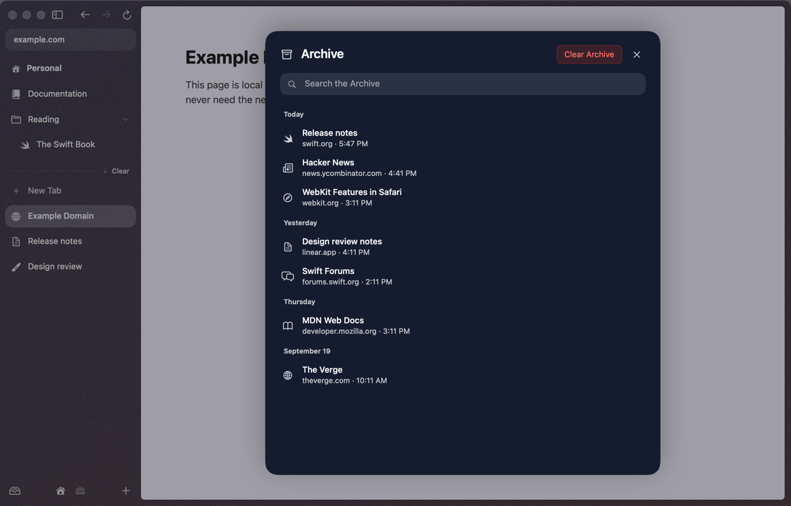

- Open it with ⌘Y, ⇧⌘L, or the Library button at the bottom left of the sidebar.
- Type to search titles and URLs. Tabs are grouped by the day they closed.
- Click a row (or its **Restore** button) to bring it back to Today in its own space. Return restores the first match; Esc closes the sheet.
- ⇧⌘T reopens the last closed tab without opening the Library.
- History ▸ **Search Archive…** searches it from the command bar instead.
- **Clear Archive** empties it, after asking. That one can't be undone.

The Library keeps your last 500 tabs.

## Undo

⌃Z undoes the last sidebar action: closing, clearing, moving, deleting a folder, and so on, up to 30 steps. It's Tabs ▸ **Undo Sidebar Action**. (⌘Z stays the normal Undo for text.)

## Groups

⌘-click (or middle-click) a link in a Today tab and den keeps the two together: the link opens **in the background**, and your tab and the new one become a **group** where your tab was. The group sits on a lighter rounded panel, its tabs indented under a bold name.

  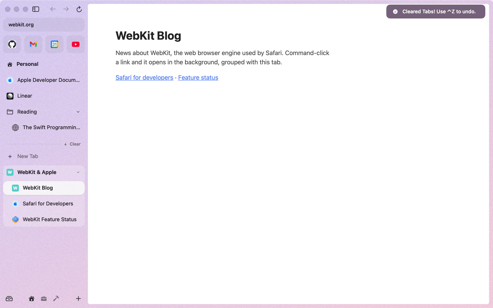
  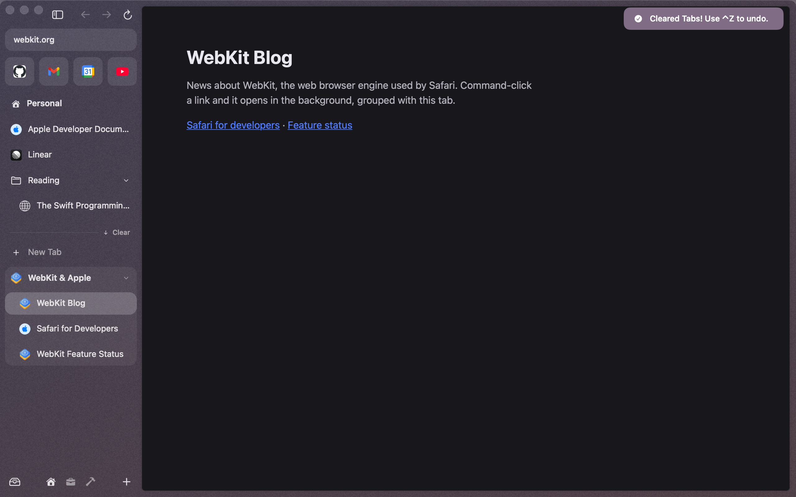

- More ⌘-clicks from the same tab join the group, after the links it already opened. A ⌘-click from a tab inside the group lands right after that tab.
- The group is named after the sites ("WebKit & Apple"). When Apple Intelligence is on, the on-device model suggests a better name a moment later: the name shimmers while it thinks, then the new one sweeps in. Nothing waits for it, and it never renames a group you named yourself.
- A group made this way **dissolves** when it's down to one tab. Rename it, or make it yourself (below), and it stays.
- **⌥⌘T** opens a new tab at the end of the current tab's group.
- **⌃Z** right after a ⌘-click takes the group away and leaves both tabs.
- Don't want groups? Settings ▸ Tabs ▸ **Group ⌘-clicked links** off gives you a plain background tab at the top of Today.

### Tidy Tabs

Today piled up? **Tidy** sorts its loose tabs (the ones not already in a group) into named groups, like "Trip to Lisbon" or "Pull Requests", using Apple's on-device model. Your tabs never leave your Mac.

- It's **off** until you turn on Settings ▸ Tabs ▸ **Tidy tabs with Apple Intelligence**. It needs a Mac with Apple Intelligence turned on; if yours can't run it, that setting says why.
- Then hover the divider above Today and click **Tidy** (next to **Clear**), press **⌃⇧T**, pick **Tidy Tabs** in the command bar or the Tabs menu, or right-click the divider.
- The new groups start collapsed; the tab you're on stays visible under its group's name. Tabs that fit no group stay where they were.
- **⌃Z**, or **Undo** on the "Tidied 6 tabs into 2 groups" toast, puts every tab back in one step.
- It never runs on its own unless you also turn on **Tidy automatically**: then, when Today has 8 or more loose tabs, den tidies them for you (at most every 30 minutes).

## Folders

Folders live with your pinned tabs, and in Today as groups.

- **⌃⌘N** makes a folder of the current tab, plus any tabs you **⌘-click** (or **⇧-click** for a range) in the sidebar first. Its name is ready to type over; Return keeps it. Right-click a tab ▸ **New Folder with Tab** (**New Group with Tab** in Today) does the same.
- In the pinned section, right-click a folder ▸ **New Folder Inside**. Folders nest.
- Click a folder to open or close it. **A closed folder still shows the tab you're on** under its name, so you never lose your place.
- Drop a tab onto the **middle** of a folder's row to put it inside. Near its top or bottom edge, the tab goes before or after the folder instead.
- Right-click ▸ **Rename Folder…** (or **Rename Group…**) to rename it in place.
- Right-click ▸ **Delete Folder…** (a group: **Close Group…**) archives the tabs inside, and **Ungroup Tabs** puts a group's tabs back in Today. ⌃Z undoes either.
- A Today folder goes away when its last tab does; a pinned folder stays, even empty.
- Hover a folder to see its tabs: click one to switch to it, or **New Tab** to add one (see [Hover previews](hover-previews.md)).

  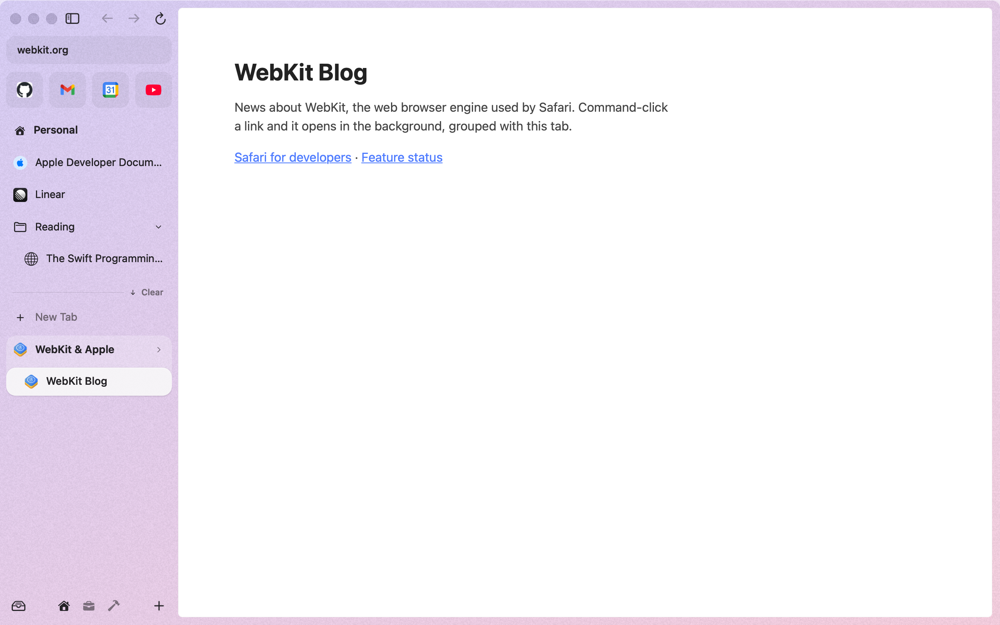
  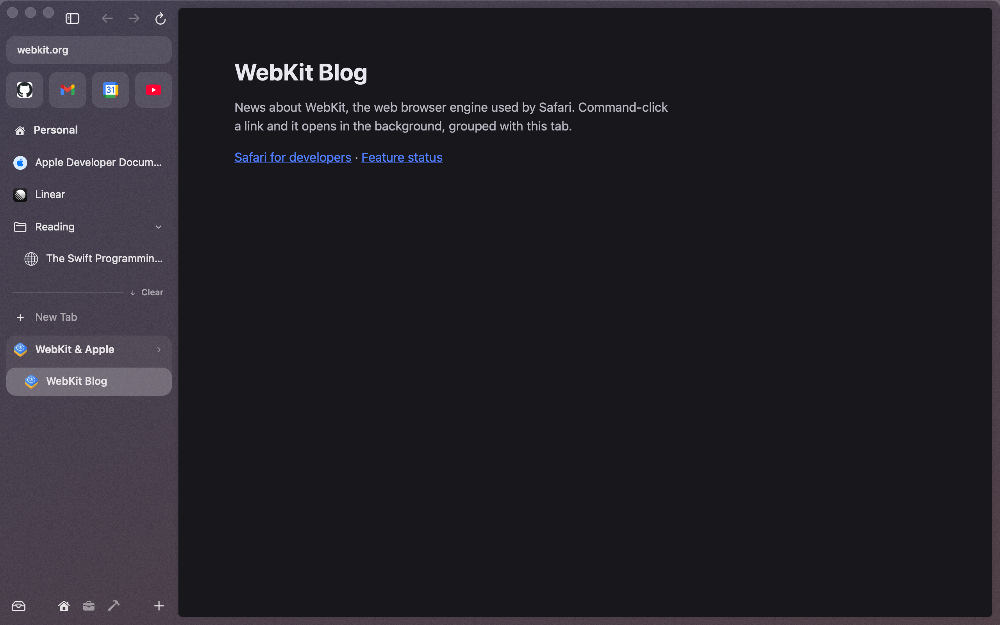

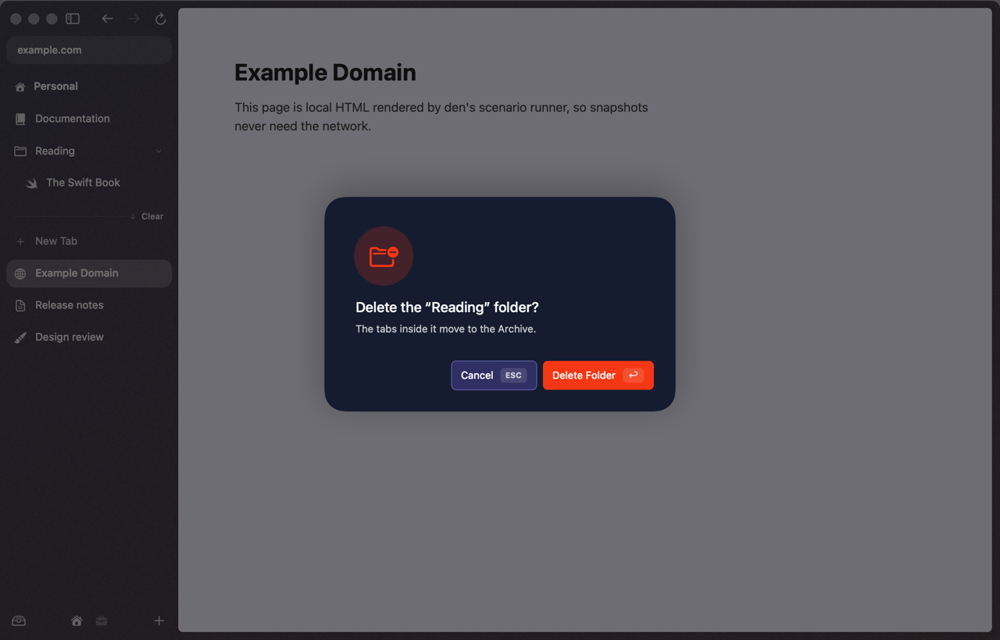

## Renaming

- **Double-click a tab** to rename it in place. Return saves, Esc cancels.
- Or right-click ▸ **Rename…**, Tabs ▸ **Rename Tab**, or "Rename Tab" in the command bar.
- Clear the name and press Return to go back to the page's own title.
- Favorites keep their page titles.

## Drag and drop

Drag any row more than a few points and it lifts off. A thin line shows where it'll land, and your trackpad ticks as the target changes.

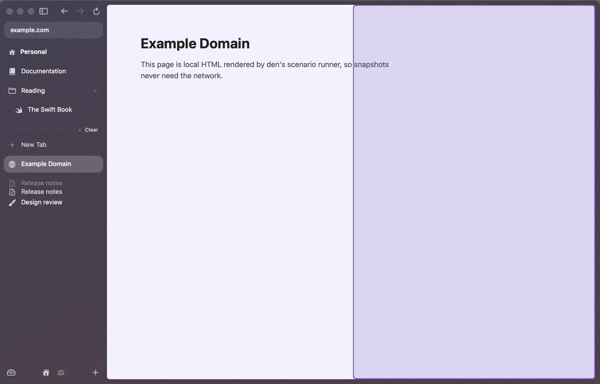

| Drop a tab… | What happens |
|---|---|
| between rows | moves it there |
| on the favorites grid | makes it a favorite |
| on the middle of a folder | puts it inside |
| on the middle of another tab's row | makes a split of the two, the dragged tab on the right |
| on a split view's row | adds it to the split (up to 4 panes) |
| on a **space icon** in the footer | moves it to that space, in the same section. A favorite lands in that space's Today |
| on the **page** | opens it in split view next to the current tab |

When you drag a tab over the page, a tinted zone shows where it'll go: the **left third** of the page puts it on the left, the rest puts it on the right.

Drag links, URLs or files from other apps onto the sidebar and they open as Today tabs.

## Right-click a tab

**Copy Link**, **Duplicate**, **Rename…**, **Mute Tab** / **Unmute Tab** (while it plays audio), **Pin Tab** / **Unpin Tab** / **Remove from Favorites**, **Add to Favorites**, **New Folder with Tab** (or **Remove from Folder**), **Move to \<space\>** for each other space, and **Archive Tab** (Today) or **Close Tab**, then **Close Tabs Below** for Today tabs.

Every item with a shortcut shows it on the right. **Hold ⌥** while the menu is open for the alternates: **Copy Link as Markdown** (⌥⇧⌘C), **Close Other Tabs** (⌥⌘W) and **Close Tabs Above**. Closing several tabs at once is one ⌃Z.

  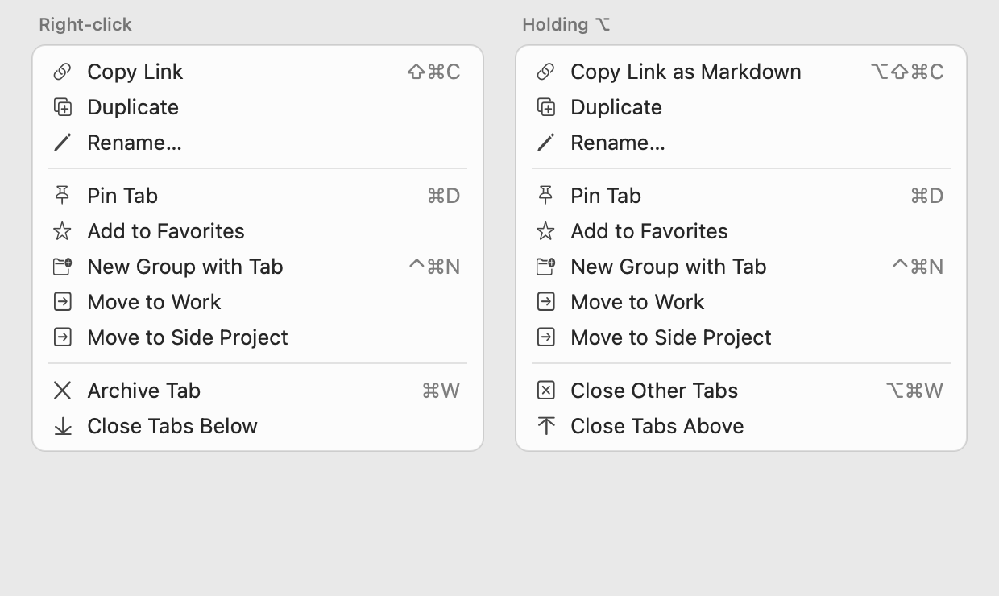

(A native menu is a window of its own, so this picture is drawn from the menu's own items rather than captured from the screen.)

## Switching tabs

| Keys | Goes to |
|---|---|
| ⌃Tab | the tab you used last, even in another space |
| ⌃⇧Tab | the one you used least recently |
| ⌥⌘↓ / ⌥⌘↑, or ⇧⌘] / ⇧⌘[ | next / previous tab in the sidebar |
| ⌘1 … ⌘8 | the Nth tab, counting favorites, then pinned, then Today |
| ⌘9 | the last tab |

## Opening links

| Click | Opens |
|---|---|
| click | here |
| ⌘-click or middle-click | a background tab, grouped with this one (from a Today tab; see [Groups](#groups)) |
| ⌘⇧-click | a new tab, in front (grouped the same way) |
| ⇧-click or ⌥-click | a [Peek](peek-split-little-arc.md) |
| ⇧⌥-click | a split view: the link opens to the right of this tab |

⌥-click **New Tab** in the sidebar to open the new tab as a split with the current one.

**Middle-click a tab in the sidebar** to close it.

## Hiding the sidebar

- ⌘S, or the sidebar button at the top, hides it. The page takes the whole window.
- With the sidebar hidden, **move the pointer to the left edge of the window** and it slides back over the page. Move away and it hides again.
- Full screen hides it too, and brings it back when you leave.

  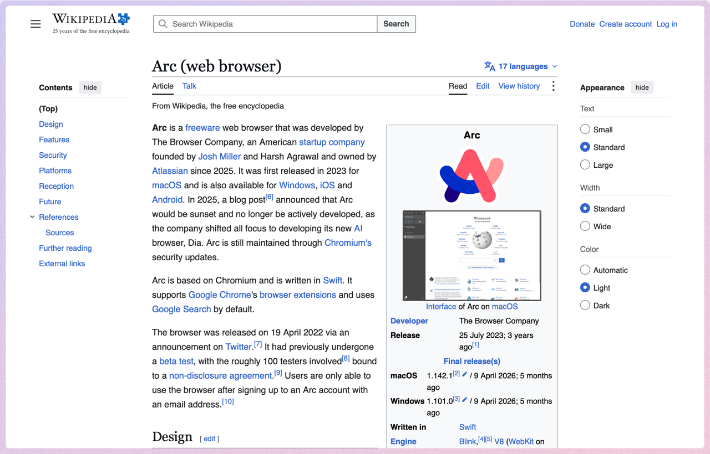
  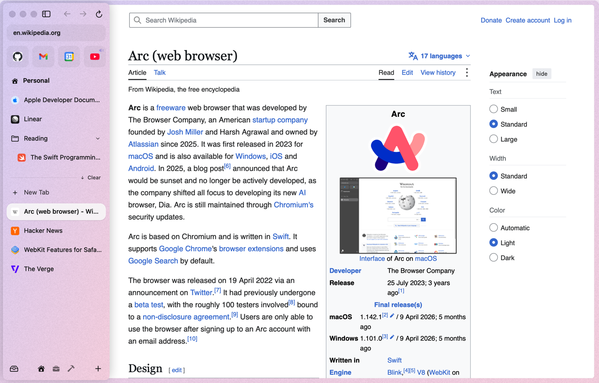

**Resize** it by dragging its edge (180–420 pt). **Double-click the edge** to reset it to 228 pt. Drag it narrow enough and it hides.

## Memory

Background tabs you haven't used for 5 minutes **of time in den** are unloaded: they keep their history, scroll position and a snapshot, and reload when you click them. Time you spend in other apps doesn't count, so the tabs you left before lunch are still there when you come back. Your **5 most recently used tabs** are never unloaded, and neither are tabs on screen, tabs playing media or in picture in picture, tabs using the camera or microphone, or pages with unsaved form input. Settings ▸ Tabs ▸ **Unload idle tabs** changes the time (0 turns it off). See [Performance](performance.md).

## When a page misbehaves

- **No white flash.** Switching to a tab that hasn't drawn yet keeps the previous page on screen until the new one paints (at most a second), and the card behind it takes the page's own colour, so dark sites never flash white.
- **A crashed page** shows "This page crashed" with a **Reload** button instead of a blank card. den never reloads it by itself, so a page that keeps crashing can't loop.
- **A page that keeps showing alerts**: from the fourth dialog, it offers **Stop this page from showing dialogs**. Tick it and the page gets no more until you reload or leave it.

  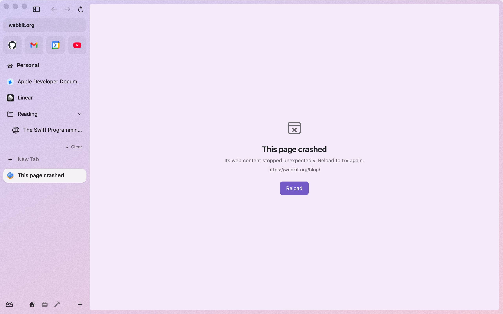
  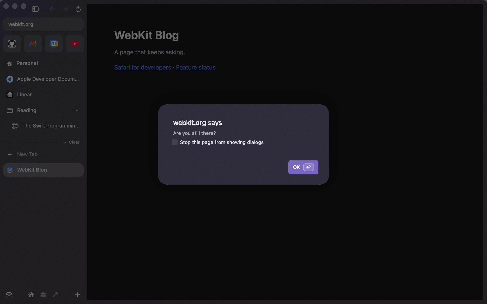

## Settings ▸ Tabs

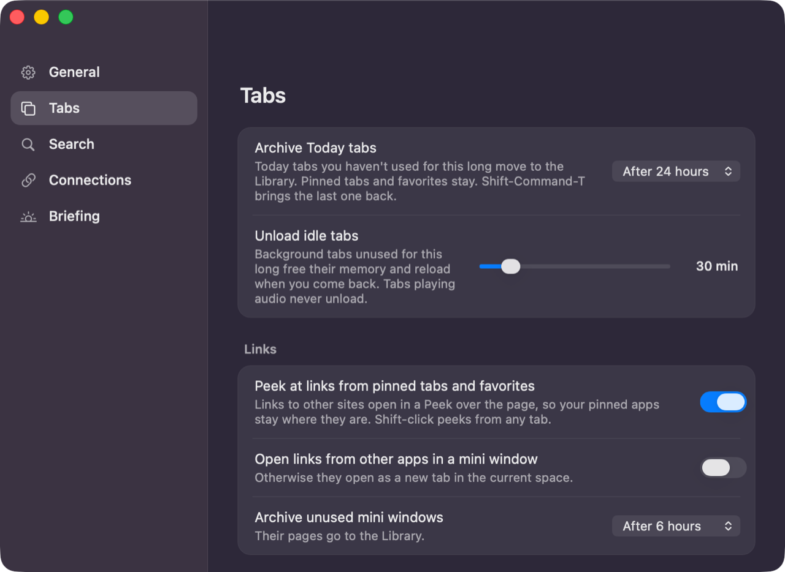

