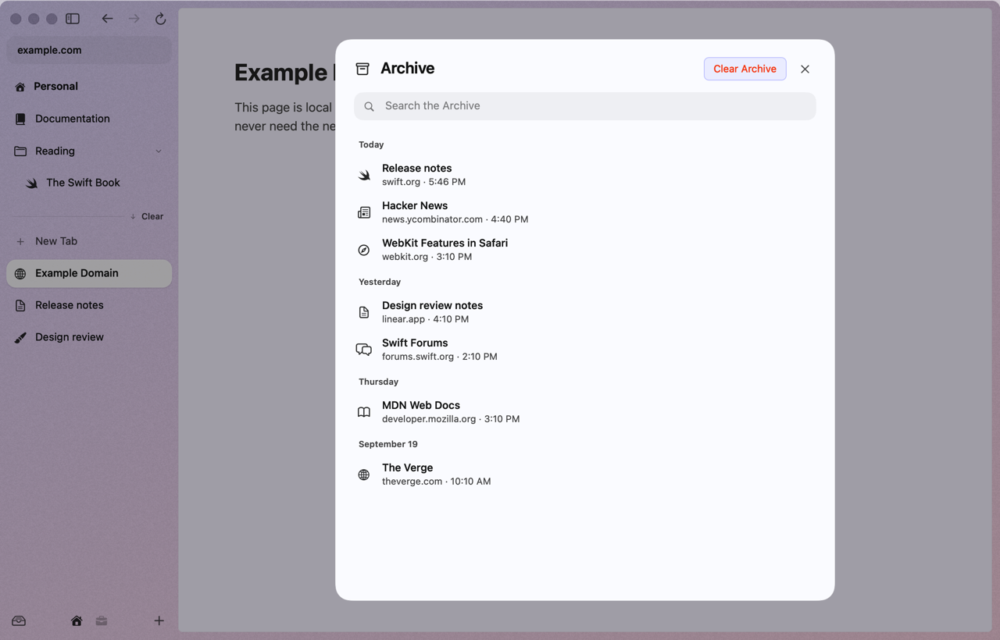
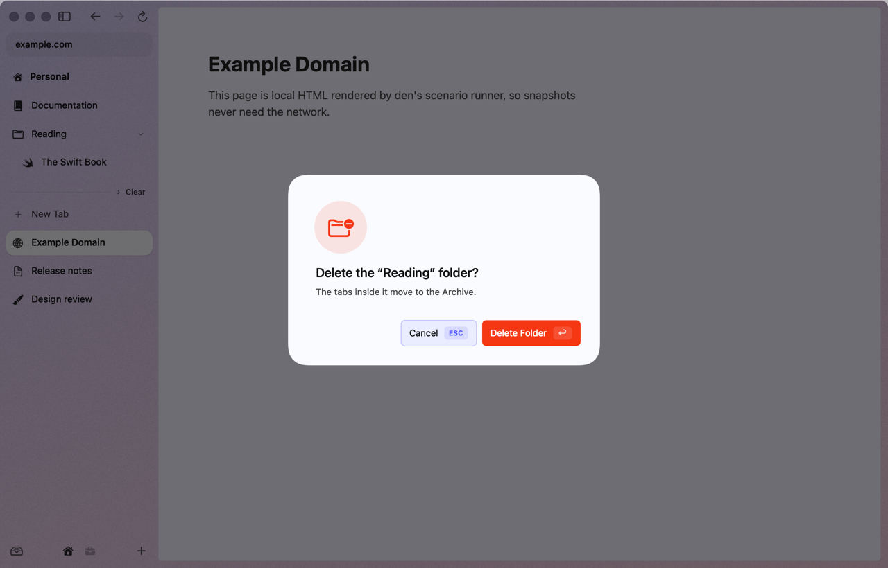
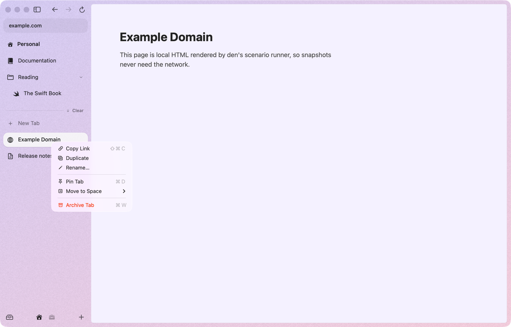
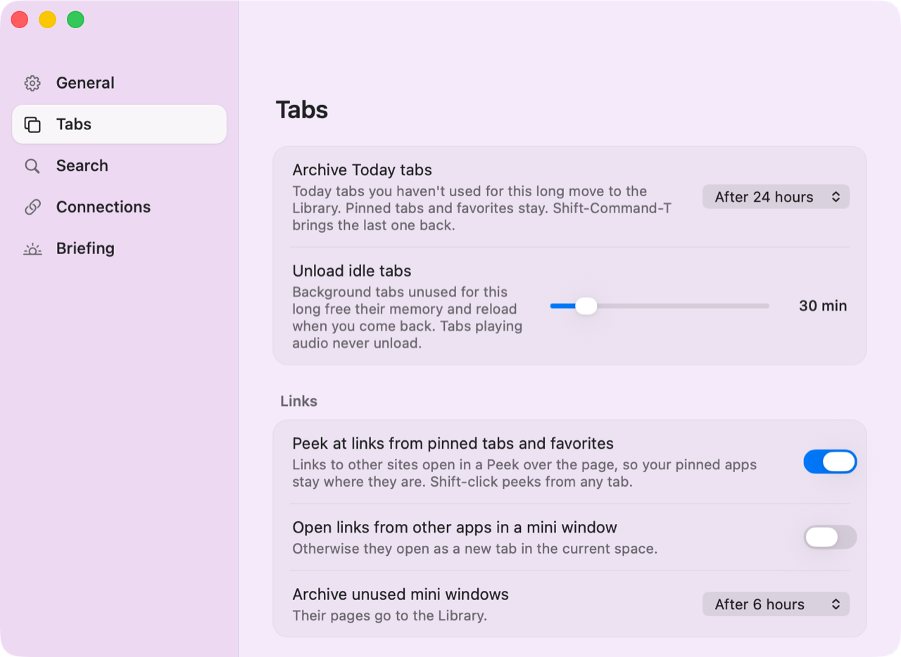

# Sidebar & tabs

The sidebar is den's tab strip, turned on its side. From top to bottom: the URL pill, your **favorites**, the space's **pinned tabs** and folders, a divider with **Clear**, and **Today**'s tabs. The footer holds the Library button, your spaces and **+**.

## The three kinds of tabs

| | Where | Lives in | ⌘W does |
|---|---|---|---|
| **Favorites** | icon grid at the top | every space | unloads it, keeps it |
| **Pinned** | above the divider | one space | unloads it, keeps it |
| **Today** | below the divider | one space | archives it to the Library |

New tabs open at the top of Today. Anything you want to keep, pin (⌘D). Today is the pile that clears itself.

### Favorites

- Drag any tab onto the grid, or right-click ▸ **Add to Favorites**. Up to 12.
- Favorites are shared by every space. First run gives you GitHub, Gmail, Calendar and YouTube.
- Drag tiles sideways to reorder them.

### Pinned tabs

- ⌘D pins or unpins the current tab (or right-click ▸ **Pin Tab**).
- A pinned tab remembers where it started. Once you browse away, a **/** appears before its title. **Click the favicon** to go straight back. Right-click also offers **Go Back to Pinned URL** and **Replace Pinned URL with Current**.
- Links from a pinned tab or favorite to another site open in a [Peek](peek-split-little-arc.md) instead of navigating your "app" away.

### Today

- Today tabs archive themselves after **24 hours** without use. The selected tab and tabs playing audio are never archived. Change it in Settings ▸ Tabs ▸ **Archive Today tabs** (Never, 1 h, 6 h, 12 h, 24 h, 7 days, 30 days).
- **Clear** (on the divider) or ⇧⌘K archives every Today tab except the one you're on. den shows "Cleared Tabs! Use ⌃Z to undo."

## The Library

Every tab you close or that archives itself goes to the Library.

- Open it with ⌘Y, ⇧⌘L, or the Library button at the bottom left of the sidebar.
- Type to search titles and URLs. Tabs are grouped by the day they closed.
- Click a row (or its **Restore** button) to bring it back to Today in its own space. Return restores the first match; Esc closes the sheet.
- ⇧⌘T reopens the last closed tab without opening the Library.
- History ▸ **Search Archive…** searches it from the command bar instead.
- **Clear Archive** empties it, after asking. That one can't be undone.

The Library keeps your last 500 tabs.

## Undo

⌃Z undoes the last sidebar action: closing, clearing, moving, deleting a folder, and so on, up to 30 steps. It's Tabs ▸ **Undo Sidebar Action**. (⌘Z stays the normal Undo for text.)

## Folders

Folders live with your pinned tabs.

- Right-click a tab ▸ **New Folder with Tab**, or right-click a folder ▸ **New Folder Inside**. Folders nest.
- Click a folder to open or close it.
- Drop a tab onto the **middle** of a folder's row to put it inside. Near its top or bottom edge, the tab goes before or after the folder instead.
- Right-click ▸ **Rename Folder…** to rename it in place.
- Right-click ▸ **Delete Folder…** archives the tabs inside (⌃Z brings them back).
- Hover a folder to see what's in it (see [Hover previews](hover-previews.md)).

## Renaming

- **Double-click a tab** to rename it in place. Return saves, Esc cancels.
- Or right-click ▸ **Rename…**, Tabs ▸ **Rename Tab**, or "Rename Tab" in the command bar.
- Clear the name and press Return to go back to the page's own title.
- Favorites keep their page titles.

## Drag and drop

Drag any row more than a few points and it lifts off. A thin line shows where it'll land, and your trackpad ticks as the target changes.

| Drop a tab… | What happens |
|---|---|
| between rows | moves it there |
| on the favorites grid | makes it a favorite |
| on the middle of a folder | puts it inside |
| on a split view's row | adds it to the split (up to 4 panes) |
| on a **space icon** in the footer | moves it to that space, in the same section. A favorite lands in that space's Today |
| on the **page** | opens it in split view next to the current tab |

When you drag a tab over the page, a tinted zone shows where it'll go: the **left third** of the page puts it on the left, the rest puts it on the right.

Drag links, URLs or files from other apps onto the sidebar and they open as Today tabs.

## Right-click a tab

**Copy Link**, **Duplicate**, **Rename…**, **Pin Tab** / **Unpin Tab** / **Remove from Favorites**, **Add to Favorites**, **New Folder with Tab**, **Move to \<space\>** for each other space, and **Archive Tab** (Today) or **Close Tab**.

## Switching tabs

| Keys | Goes to |
|---|---|
| ⌃Tab | the tab you used last, even in another space |
| ⌃⇧Tab | the one you used least recently |
| ⌥⌘↓ / ⌥⌘↑, or ⇧⌘] / ⇧⌘[ | next / previous tab in the sidebar |
| ⌘1 … ⌘8 | the Nth tab, counting favorites, then pinned, then Today |
| ⌘9 | the last tab |

## Opening links

| Click | Opens |
|---|---|
| click | here |
| ⌘-click or middle-click | a background tab at the top of Today |
| ⌘⇧-click | a new tab, in front |
| ⇧-click or ⌥-click | a [Peek](peek-split-little-arc.md) |

**Middle-click a tab in the sidebar** to close it.

## Hiding the sidebar

- ⌘S, or the sidebar button at the top, hides it. The page takes the whole window.
- With the sidebar hidden, **move the pointer to the left edge of the window** and it slides back over the page. Move away and it hides again.
- Full screen hides it too, and brings it back when you leave.

  
  

**Resize** it by dragging its edge (180–420 pt). **Double-click the edge** to reset it to 228 pt. Drag it narrow enough and it hides.

## Memory

Background tabs you haven't used for 30 minutes are unloaded: they keep their history, scroll position and a snapshot, and reload when you click them. Tabs on screen and tabs playing audio are never unloaded. Settings ▸ Tabs ▸ **Unload idle tabs** changes it (0 turns it off). See [Performance](performance.md).

## Settings ▸ Tabs

