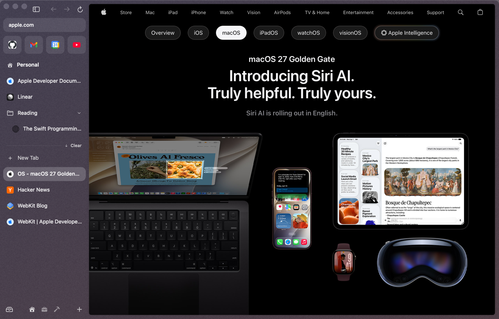
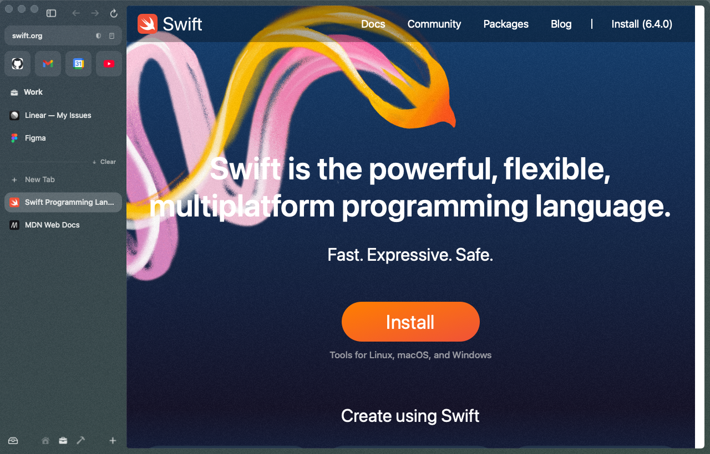
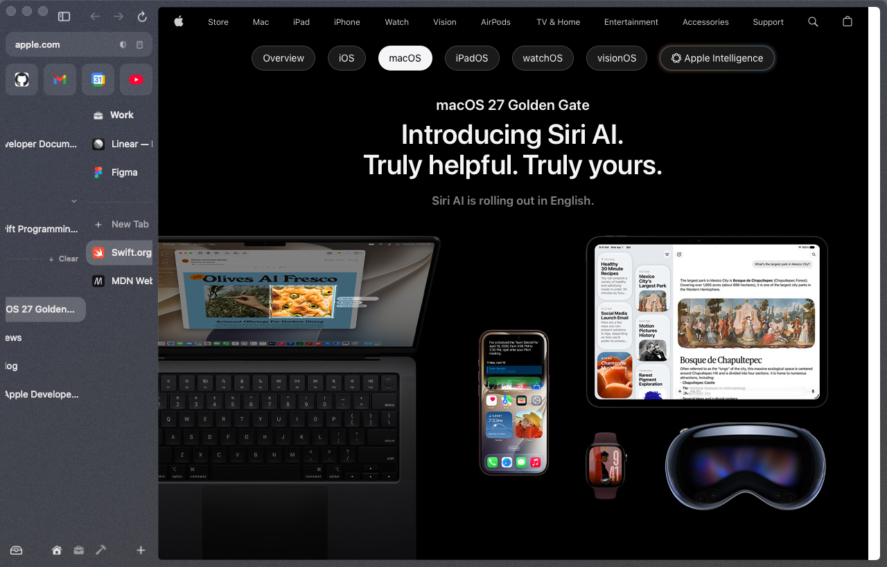
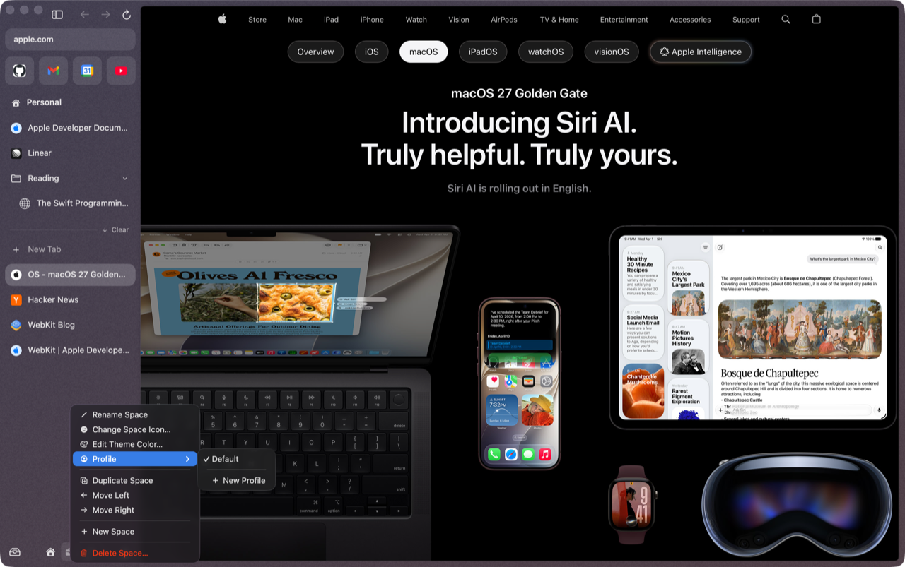
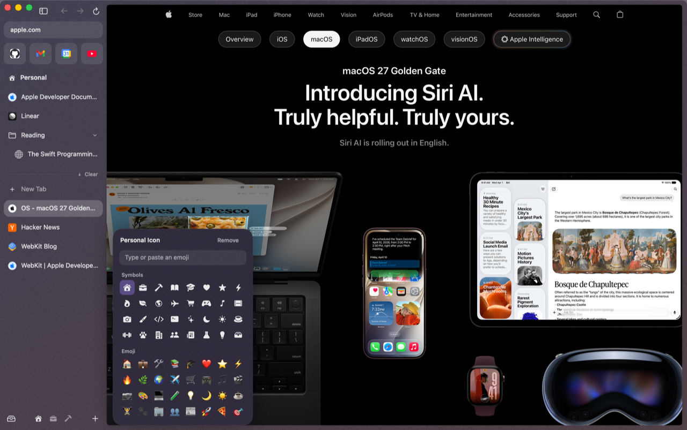
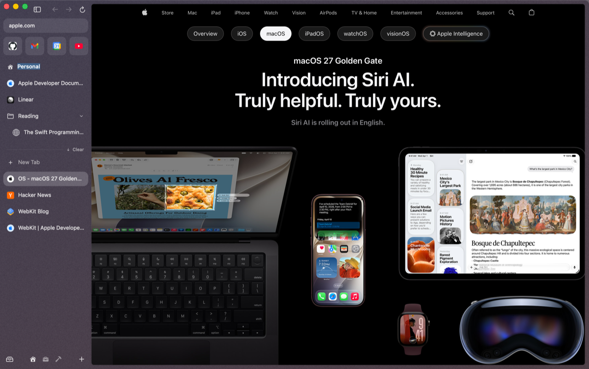
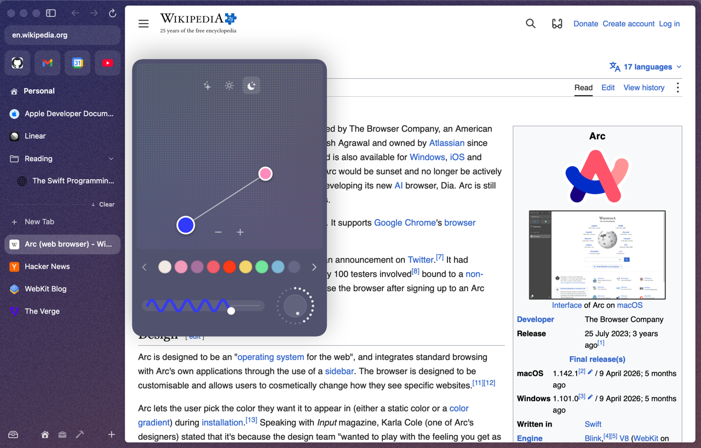
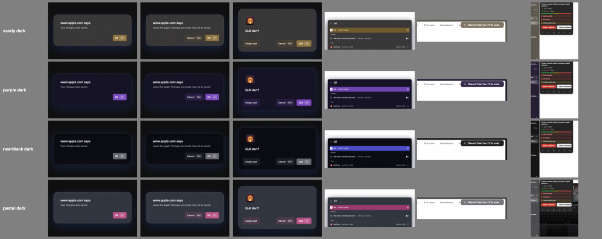

# Spaces & themes

A space is a separate sidebar: its own pinned tabs, folders and Today, its own colors, and optionally its own logins. Favorites are the one thing all spaces share.

First run gives you three: **Personal**, **Work** and **Side Project**, each with its own gradient. Their icons sit in the sidebar footer.

  
  

## Switching

| How | |
|---|---|
| **Two-finger swipe** sideways in the sidebar | the sidebar follows your fingers; your trackpad ticks as it lands |
| Click an icon in the footer | jump to that space (hover for its name) |
| ⌃1 … ⌃9 | space by position (also in the Spaces menu, by name) |
| ⌥⌘→ / ⌥⌘← | next / previous space |
| ⌃Tab | the last tab you used, even if it's in another space |

## Creating and arranging

- **+** in the footer, the space menu's **New Space**, or "New Space" in the command bar. It's called "Space N" until you rename it.
- **Drag a space icon sideways in the footer** to reorder. The others slide out of the way. Or use **Move Left** / **Move Right** in the space menu.
- **Drop a tab on a space icon** to move it to that space.

## The space menu

Right-click a space's icon in the footer, or its title at the top of the pinned tabs.

| Item | Does |
|---|---|
| **Rename Space** | edits the title in place. Faster: **double-click the space's title** |
| **Change Space Icon…** | an SF Symbol, or type or paste any emoji. **Remove** shows a dot |
| **Edit Theme Color…** | opens the theme picker |
| **Profile** ▸ | which set of logins and cookies this space uses (below) |
| **Duplicate Space** | a copy named "\<name\> Copy", with the same icon, theme and profile |
| **Move Left** / **Move Right** | reorder |
| **New Space** | |
| **Delete Space…** | asks first, then archives every tab and folder in it to the Library. You can't delete your last space |

  
  

## Profiles: separate logins per space

Every space starts on the **Default** profile. Space menu ▸ **Profile** ▸ **New Profile** gives the space its own profile, named after it. A profile is a separate WebKit data store: its own cookies, logins and site data. So you can be signed in to one Google account in Work and another in Personal. Several spaces can share a profile: pick an existing one from the same submenu.

> [!NOTE]
> A tab keeps the profile it was opened with. Tabs that were already open when you changed the profile switch over once they're reopened (for example after a relaunch). There's no screen for managing profiles yet.

## Themes

Every space has its own theme, and the whole window wears it: sidebar, dialogs, toasts, the command bar and hover cards, with text contrast kept readable.

Open the theme picker from **Edit Theme Color…** in the space menu, the **…** button that appears when you hover the space's title, or **Theme…** in the command bar.

- **Colors:** click or drag on the dot pad to pick the main color. **+** adds a second and third color (up to 3), **−** removes one. den keeps extra colors in harmony with the first.
- **Intensity** (the wavy slider) and **grain** (the dial).
- **Presets:** four pages of swatches (Brand, Pastel, Drab, Greyscale). Flip with the chevrons.
- **Appearance:** Automatic, Light or Dark. This one is global: it applies to every space.

The window previews every change live. **Click outside** (or switch spaces) to keep it. **Esc** throws it away.

Your last three themes are in the command bar as **Use Recent Theme 1/2/3**. For themes of your own, drop a file in `~/.den/themes` and it appears as **Theme: \<name\>** ([~/.den](den-home.md#themes)).

## Accent color

Buttons, selections and switches take their color from the current space. Prefer the macOS accent color? Settings ▸ General ▸ **Accent color** ▸ **System accent**.

## Translucent window

Settings ▸ General ▸ **Translucent window** lets your desktop show faintly through the space's colors, like macOS sidebars (the theme keeps 72% of its strength, so a space still looks like itself). Off by default, like Arc.
