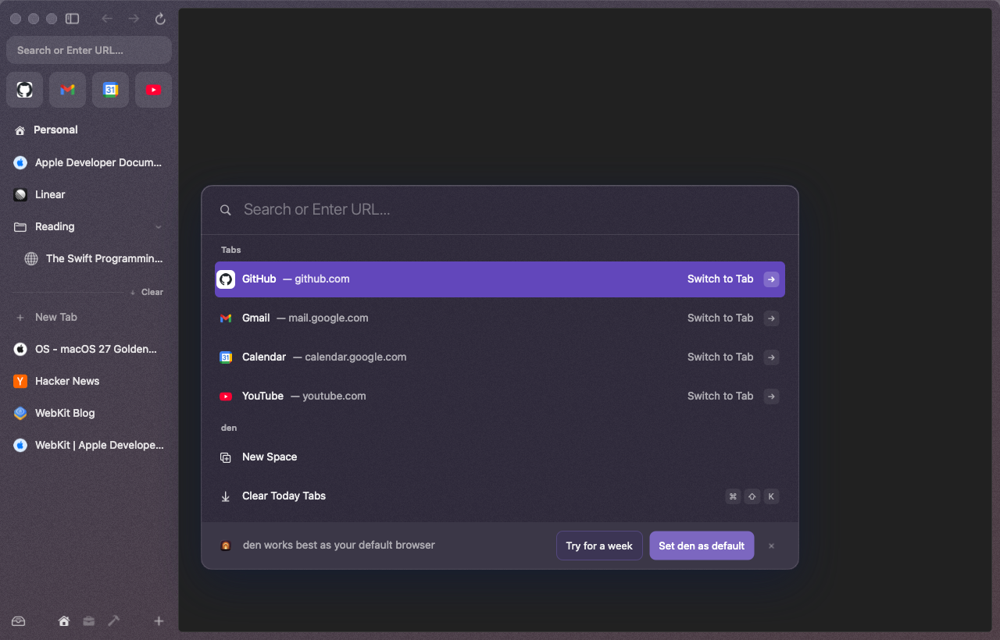
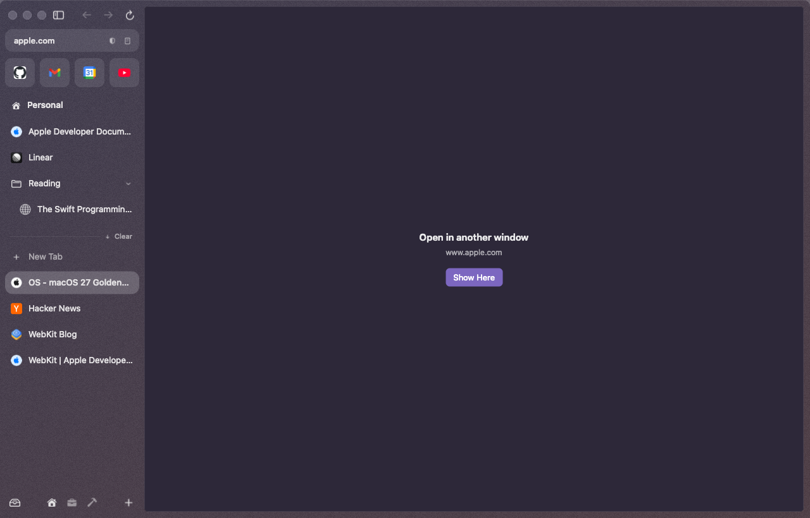

# Windows

den can have as many windows as you like. Like Arc, every window shows the same spaces and tabs: a tab you open in one window is in the sidebar of the others too. Each window keeps its own place, the space it's on and the tab it shows.

## New window

**⌘N** (File ▸ New Window) opens a window on the space you're in. It starts with nothing on screen and the command bar open, so you can type where to go or pick a tab from the sidebar.

Switch spaces in one window and the others stay where they are. Each window's space icons at the bottom of the sidebar show which space that window is on.

## One tab, one window

A tab shows in one window at a time. If you pick a tab that another window is showing, den brings that window forward instead of loading the page twice.

To show the tab where you are instead, turn on **Settings ▸ Tabs ▸ Let a tab open in two windows**. Picking the tab then moves it to your window, and the window it left says **Open in another window** with a **Show Here** button. Clicking back into that window brings the tab back. The page never reloads: it's the same page moving between windows.

## Private windows

**⇧⌘N** (File ▸ New Private Window) opens a private window. It's always dark, so you can't mistake it for a normal one.

- Its tabs are its own. They don't appear in your spaces, and your spaces' tabs don't appear in it.
- Cookies, logins and site data live only as long as the window. Each private window is separate from the others.
- Nothing is saved: no tabs, no archive, nothing in the command bar's history, no page pictures on disk, no remembered zoom. Files you download stay where you saved them, but they're left out of Library ▸ Downloads the next time den opens.
- Closing a private tab (⌘W) or the window closes it for good. ⇧⌘T doesn't bring it back.

A link you open from a private tab opens as another private tab in the same window.

## Closing and reopening

**⇧⌘W** or the red button closes a window. The tabs it showed stay in your spaces, since every window shares them.

Closed the wrong one? **⇧⌘T** right after closing a window reopens it on the space and tab it had (after that, ⇧⌘T goes back to reopening tabs). **File ▸ Reopen Closed Window** works any time during the session.

Closing your last window only hides it. Click den in the Dock to bring it back.

## After a restart

Quit den with several windows open and they all come back next time, each on its own space and tab. Private windows don't come back.

## Not there yet

- Extension buttons in the URL pill show in the first window only.
- Dragging a tab out of the sidebar into a new window, and Arc's independent Blank Window (⌃⌘N).
